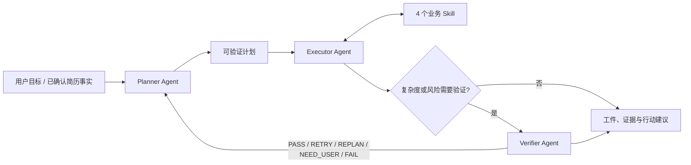

# Personal Career Agent

面向 AI 应用开发与 Agent 平台工程求职的证据优先个人求职助手。它不是职位运营后台，也不是一个把 LLM 节点串起来的演示：每次任务由三个独立 Agent 在受限预算内完成感知、决策、工具调用、观察和调整。

## 当前默认架构



- **Planner**：围绕目标自主读取最小上下文、制定或重规划计划；不直接执行业务 Skill。
- **Executor**：自主选择已授权 Skill、观察工具结果、调整方法或请求人工补充。
- **Verifier**：独立检查计划验收条件、公开证据与事实边界；可要求重试、重规划、人工补充或失败降级。
- **Harness**：只负责权限、Pydantic 契约、预算、持久化、审计和安全门，不替 Agent 选择业务动作。

主运行时位于 `backend/app/services/agent_runtime/`：Harness（计划、预算、验证路由、持久化）由普通 Python + Pydantic + 模型 SDK 实现；生产 Executor 使用 DeepAgents 工具调用循环（`deep_executor.py`），其余 Agent 由自建 PEV 状态机驱动。业务 Skill 的确定性逻辑以 `skill/<name>/runtime/` 为唯一来源，`backend/app/services/career_skills/` 只保留工具注册宿主与兼容别名。

`executor/` 是 Windows 端的执行器骨架与模拟器，用于人工审核的表单填写辅助：系统**不会**自动提交任何求职申请，所有 `READY_FOR_REVIEW` 之后的提交动作必须由用户完成。

## 四个业务 Skill

| Skill | 产出 | 事实与安全边界 |
| --- | --- | --- |
| `job-discovery` | 公开招聘页面证据、结构化 JD | 仅抓取公开 HTTP(S) 页面；逐跳重新校验重定向目标，拒绝内网/云元数据地址、登录、验证码和反爬绕过。 |
| `job-matching` | 带来源的岗位匹配排序 | 只对本 Run 已捕获的 JD 与已确认事实比较。 |
| `resume-tailoring` | 可审核简历修改操作 | 每项操作引用已确认事实字段和目标 JD；缺失能力只能提示补证，不能虚构。 |
| `career-planning` | JD 主题驱动的面试/行动计划 | 只围绕目标 JD 中存在的主题产生准备动作。 |

系统不会自动提交求职申请，也不把用户未确认的经历写入简历。

## 用户闭环

1. 上传简历并确认可用事实。
2. 在 `/assistant` 以自然语言说明目标，可选粘贴公开招聘 URL。
3. 查看 Planner 计划、Agent 活动、来源证据、结构化 JD 与 Skill 工件。
4. 当任务进入 `waiting_user`，补充城市、岗位、来源或偏好，或确认当前产出；同一 Run 会在**剩余模型/工具预算**内恢复，而不是新建任务。
5. 审核事实约束的简历修改和面试准备，再由用户自行决定后续投递。

## 安全门

平台遵循的 7 项硬性安全约束（与 [CLAUDE.md](CLAUDE.md#security-hard-gates) 同源）：

1. **绝不自动点击最终提交**：不存在 `task:submit` 权限作用域，GUI 执行器停在 `READY_FOR_REVIEW`，必须由人工提交。
2. **不绕过登录/验证码/反爬**：被阻断时一律 `needs_manual_review`，不尝试绕过。
3. **学生 API 只返回 `verified` 岗位**：在 SQL 层过滤，其他状态绝不外泄。
4. **不向仓库/日志/argv 写入密钥**：密码、token、API key、原始 payload 一律拒绝。
5. **不把 Redis 当作权威源**：MySQL 是唯一业务状态来源。
6. **不只信设备 token**：任务动作需要 task lease + scope 校验。
7. **岗位评审需版本检查**：`JobPosting` 完成/审核/决策写入会校验 `review_version`（乐观锁），并发写返回 409。

公开页面抓取逐跳重新校验重定向目标（方案、无凭据、全局 IP），重定向到内网或云元数据地址会被拒绝。

## 关键运行时保证

- MySQL 保存 Run、Plan、Step、Turn、Event 和不可变 Artifact；Redis 不作为不可恢复业务状态。
- 每个 Run 使用跨 Planner、Executor、Verifier 共享的模型调用与工具调用预算；崩溃恢复时按已持久化计划数恢复重规划预算（而非归零），已消耗预算不会因重启重复可用。
- 模型输出格式异常（`invalid_model_response`）或核验对同一步骤反复重试超限时，Run 安全降级为可恢复的 `waiting_user` 并给出人工可读说明；连续无进展的工具调用也会停下询问用户——不崩溃、不静默失败。
- 每次工具结果和 Agent 决策仅保存安全摘要，不保存推理过程、密钥或私有上下文；事件载荷按字节上限持久化，超限替换为有界存根。
- 所有 Run、事件和工件都按用户所有权访问控制。
- 已获取的公开证据会在模型/工具预算耗尽时保留，失败不会抹掉安全可返回结果。

## 技术栈

FastAPI、SQLAlchemy、Alembic、MySQL、Redis、MinIO/S3（应用层加密）、Vue 3、Vite、Pydantic、OpenAI-compatible 模型接口。

## 本地运行

1. 根据 `.env.example` 与 [平台运行手册](docs/runbooks/platform-foundation.md) 配置数据库、Redis、MinIO、认证和模型密钥。模型密钥缺失时应用正常启动，但 PEV API 会安全返回 `agent_harness_unavailable`。
2. 启动完整环境：

```powershell
docker compose up --build -d
```

3. 打开前端 `http://127.0.0.1:5173`（默认端口；当前开发机使用非默认端口，参见下表），登录后进入 `/assistant`。

### 当前开发机端口（已配置的覆盖）

```powershell
$env:MYSQL_HOST_PORT='3307'
$env:REDIS_HOST_PORT='6380'
$env:MINIO_HOST_PORT='19000'
$env:MINIO_CONSOLE_HOST_PORT='19001'
$env:BACKEND_HOST_PORT='18000'
$env:FRONTEND_HOST_PORT='15173'
docker compose -p platform-foundation up -d --build
```

未设置这些环境变量时，`docker-compose.yml` 会使用默认端口（3306/6379/9000/9001/8000/5173）。

## 验证

```powershell
# PEV、四 Skill 和 API 的定向回归
.\.venv\Scripts\python.exe -m pytest tests/unit/test_agent_runtime*.py tests/unit/test_planner_agent.py tests/unit/test_executor_agent.py tests/unit/test_verifier_agent.py tests/unit/test_*pev_skill.py tests/unit/test_job_matching_skill.py -q

# 前端
npm.cmd --prefix frontend run test
npm.cmd --prefix frontend run typecheck
npm.cmd --prefix frontend run build

# 健康检查
Invoke-RestMethod http://127.0.0.1:18000/api/health/ready

# Live PEV 端到端（需要模型密钥 + 真实数据库；简历 PDF 仅在内存中读取）
$env:RUN_LIVE_PEV_E2E='1'
.\.venv\Scripts\python.exe -m pytest tests/integration/test_pev_live_end_to_end.py -v

# 20 题 PEV 评估（真实 DeepSeek + 公开抓取；每题 JSON 输出到 --out-dir）
.\.venv\Scripts\python.exe -m tests.question.eval_runner --ids Q001 Q002 --out-dir tests/question/eval_results/round_1
```

> 自 2026-08-09 起，单次提交不再强制 100% 分支覆盖（关键点覆盖 + 安全不变量测试即可），但 `pyproject.toml` 中的 `fail_under = 100` 仍保留，可作为可选检查重新启用。完整覆盖策略与豁免列表见 [CLAUDE.md](CLAUDE.md#coverage-policy)。

完整架构要求、Agent 定义、安全边界和验收标准见 [自适应三 Agent PEV 设计](docs/superpowers/specs/2026-08-01-personal-career-agent-adaptive-pev-design.md)；结构图与时序图见 [PEV 架构文档](docs/pev-agent-architecture.zh-CN.md)。

## 项目结构

```text
backend/app/services/
  agent_runtime/        # PEV Harness、三个 Agent、模型/工具/预算边界（生产 Executor = deep_executor.py）
  career_skills/        # 13 个工具注册 + 4 个业务 Skill 入口
skill/<skill-name>/     # Skill 包（hyphenated），含 SKILL.md / scripts / references / runtime
frontend/src/features/
  agent-workspace/      # 自然语言任务、证据、工件与人工恢复（AgentWorkspace.vue）
  profile/              # 简历 / 事实管理工作台（ProfileWorkspace.vue）
executor/               # Windows 执行器骨架与模拟器（人工辅助填表；不会自动提交）
docs/superpowers/specs/
  2026-08-01-personal-career-agent-adaptive-pev-design.md
```
