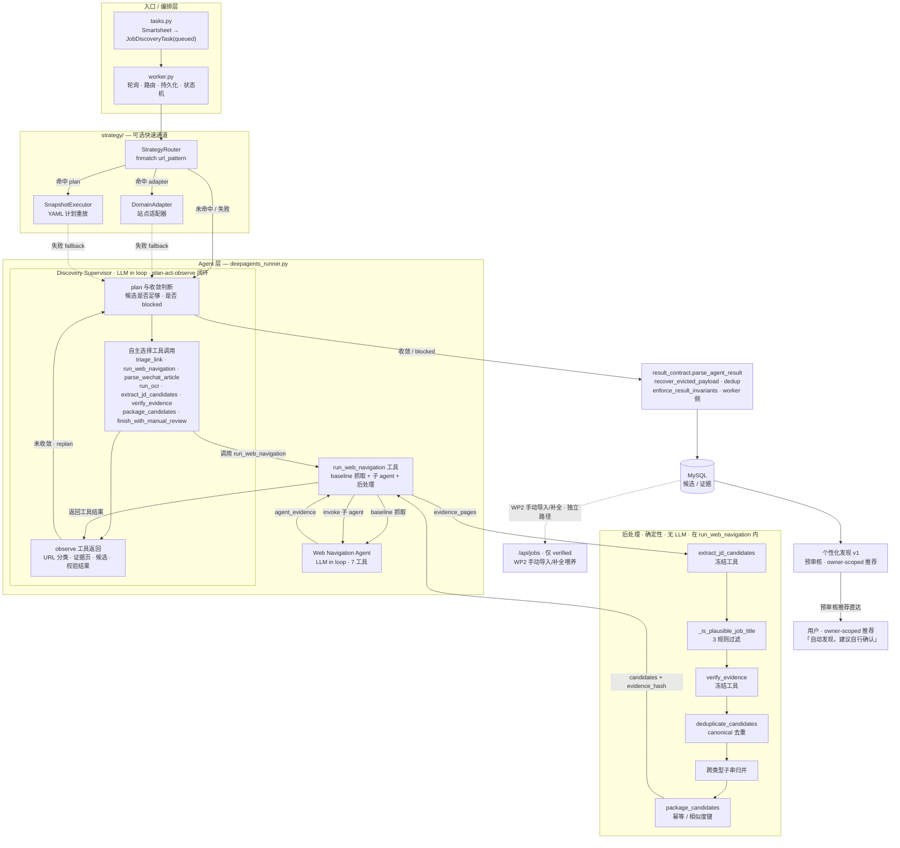
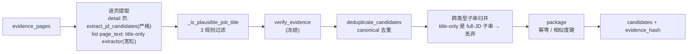
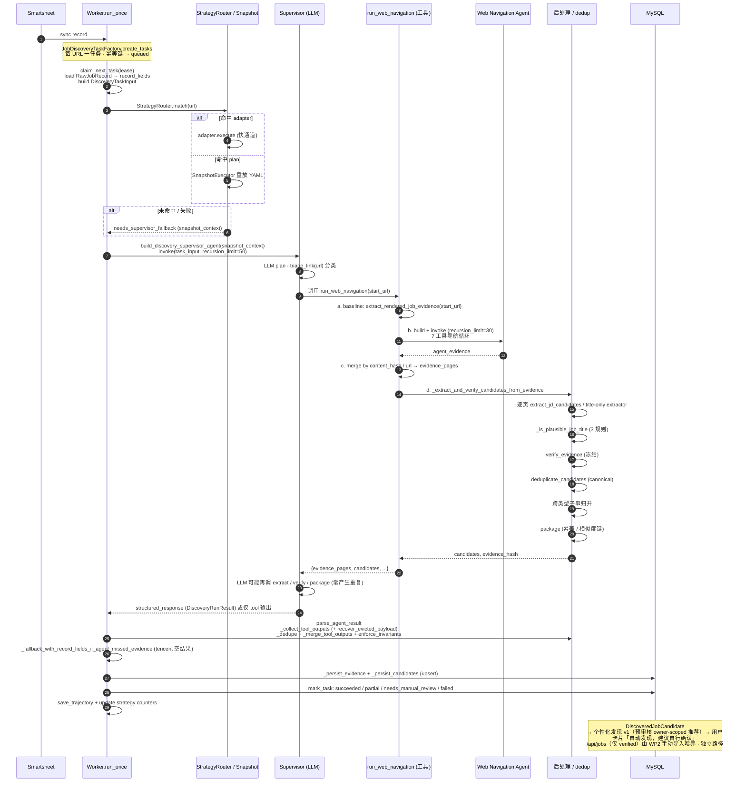
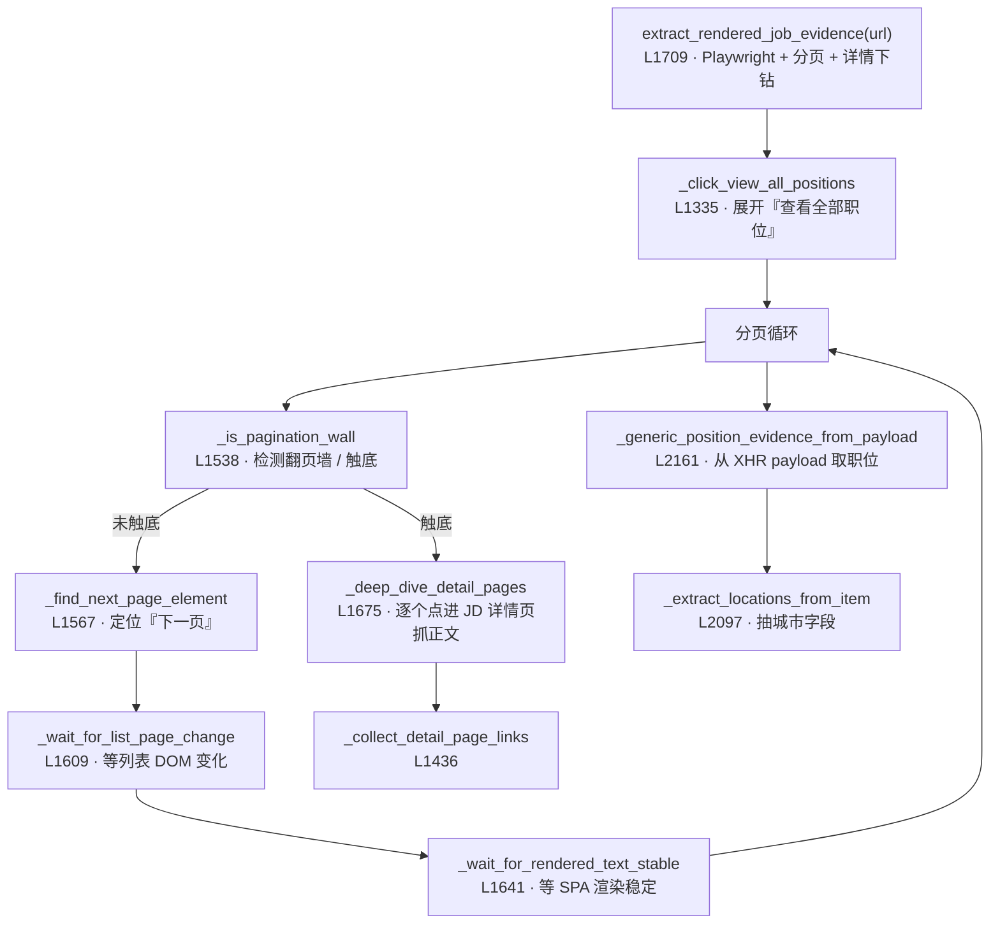

# Job Discovery Agent 系统

从腾讯文档（Tencent Smartsheet）同步的招聘 URL 出发，默认由 **Skill Discovery Runtime**（`create_deep_agent + job-discovery Skill + 受限工具 + JD Extractor 子 Agent`）完成公开页面浏览、逐页 JD 提取、去重与 coverage gate，产出 `DiscoveredJobCandidate`。候选不再经管理员审核晋升 `JobPosting(verified)`，而是经**个性化发现 v1**（预审核、owner-scoped 推荐直达用户，卡片标注「自动发现，建议自行确认」）送达用户；verified-only 的 `/api/jobs` 职位中心由 WP2 手动导入/补全流程喂养，与发现候选解耦。

> **目标态说明（2026-07-29）**：发现候选不经管理员审核、改为个性化发现 v1 送达，是本文档描述的目标架构。代码侧发现候选 admin approve/reject -> `JobPosting` 晋升与 `AdminJobReview.vue` 仍存在，迁移待跟进；本文与 [docs/job-discovery-legacy-architecture-summary.md](../../../../docs/job-discovery-legacy-architecture-summary.md) 一致以目标态为准。下方「二、两个 Agent 的边界与工具」等节描述的 Supervisor / Strategy / PEV 路径仅在显式关闭 `JOB_DISCOVERY_SKILL_RUNTIME_ENABLED` 时作为回滚代码保留。

## 当前默认运行时与审计存储（2026-07-29）

`JOB_DISCOVERY_SKILL_RUNTIME_ENABLED=true`（默认）时，`worker.py` 在任何
URL 策略匹配、Adapter 或旧 Supervisor 之前调用 Skill runtime，因此这些旧路径
不会参与该任务。它们仅在显式关闭该开关时作为回滚代码保留。

每个任务拥有隔离目录：`JOB_DISCOVERY_SKILL_ARTIFACT_ROOT/<task_id>/skill/job-discovery/`。
目录内的 `output/evidence/pages/*.txt`、截图、`tool_trace.jsonl`、
`browse_metadata.json`、`coverage_gate_result.json` 和
`output/candidates_merged.json` 不会与其他任务共享。Worker 将它们映射到既有
持久化模型：

| 内容 | 权威存储 | 细节 |
|---|---|---|
| 任务结论 / coverage / artifact 根路径 | `job_discovery_tasks.result_summary_json` | `execution_path=skill_agent`，不存原始模型消息 |
| JD 详细字段 | `discovered_job_candidates` | title、正文、职责、要求、地点、投递链接、证据引用等 |
| 页面证据与工具工件索引 | `job_discovery_evidence` | 摘要在 MySQL；`storage_uri` 指向任务隔离工件文件 |
| 工具调用轨迹 | `job_discovery_trajectories` | 经安全截断的工具名、状态、耗时；不写 token / 原始模型会话 |

当前 `storage_uri` 使用本机 `file:` URI。生产环境若需要跨主机长期留存，需由
部署层把该任务目录上传至已配置的加密对象存储，并把 URI 改写为对象存储 URI；
这不会改变 MySQL 表或 Worker 的持久化契约。

> 本文聚焦 `backend/app/services/job_discovery/` 子系统的 **agent 架构** 与 **URL → JDs 全过程**。整体平台架构、状态机、安全硬门见根目录 [CLAUDE.md](../../../../CLAUDE.md)。

---

## 一、架构总览

### 分层职责

| 层 | 模块 | 职责 |
|---|---|---|
| 入口 | [tasks.py](tasks.py) | `JobDiscoveryTaskFactory` 从同步后的 record 提取 URL，创建 `JobDiscoveryTask(queued)`，每 URL 一任务，带幂等键 |
| 编排 | [worker.py](worker.py) | `JobDiscoveryWorker` 轮询队列（claim + lease），策略路由，构造/调用 Supervisor，持久化证据与候选，推进状态机 |
| 快速通道 | [strategy/](strategy/) | `StrategyRouter` 按 `url_pattern` 匹配活跃策略；命中则走 `SnapshotExecutor`（YAML 重放）或 `DomainAdapter`（站点适配），失败回退 Supervisor |
| Agent | [deepagents_runner.py](deepagents_runner.py) | Supervisor 与 Web Navigation Agent 两个 DeepAgent，以及 `run_web_navigation` 工具 |
| 工具 | [tools/](tools/) | 确定性工具：triage / wechat / OCR / JD 提取 / 证据校验 / 打包（其中 `jd_extraction.py`、`evidence_verifier.py` 冻结，禁止修改） |
| 后处理 | [result_contract.py](result_contract.py) · [deduplication/](deduplication/) · [normalization/](normalization/) | 解析 Supervisor 输出、恢复被驱逐的大载荷、canonical 去重、标题/JD 正文归一化、不变量校验 |
| 存储 | `repositories/job_discovery` | `upsert_evidence` / `upsert_candidate`，MySQL 为唯一权威 |

---

## 二、两个 Agent 的边界与工具

|  | Discovery Supervisor | Web Navigation Agent |
|---|---|---|
| 构建 | [build_discovery_supervisor_agent](deepagents_runner.py#L3021) | [build_web_navigation_agent](deepagents_runner.py#L2926) / [create_web_navigation_subagent](deepagents_runner.py#L2433) |
| 角色 | LLM-in-the-loop：plan → triage → 委派 → 收尾 | LLM-in-the-loop：自主浏览页面抓证据 |
| 工具 | `triage_link`、`run_web_navigation`、`parse_wechat_article`、`run_ocr`、`extract_jd_candidates`、`standardize_from_record_fields`、`verify_evidence`、`package_candidates`、`finish_with_manual_review` | 7 个：`open_url`、`open_rendered_url`、`extract_rendered_job_evidence`、`read_dom`、`extract_links`、`click_link`、`go_back` |
| 结构化输出 | `_DiscoveryRunResultPydantic`（status / evidence / candidates / summary） | `_WebNavigationResultPydantic`（evidence_pages / navigation_path / page_count） |
| 递归上限 | 50（无 snapshot）/ 30（带 snapshot） | 30 |

**关键关系**：Web Nav Agent 不是由 Supervisor 通过 deepagents `subagents=[...]` 委派调度的，而是被包在 `run_web_navigation` **工具函数内部**——Supervisor 调 `run_web_navigation(start_url)`，该工具在 [deepagents_runner.py:461](deepagents_runner.py#L461) 自己 `build_web_navigation_agent` + `agent.invoke`。即一层**嵌套子 agent**。`create_web_navigation_subagent` 注册的 SubAgent 规格是给 Supervisor 的另一条委托路径，但实际运行走工具内嵌路径。

---

## 三、后处理管线（决定「无重复、数量准」的核心）

`run_web_navigation` 拿到证据后，由 [`_extract_and_verify_candidates_from_evidence`](deepagents_runner.py#L2751) 确定性处理：

### 标题过滤三规则

[`_is_plausible_job_title`](deepagents_runner.py#L2694)（无站点 / 数量 / 页数硬编码）：

1. **结构分隔符**：标题含 `|`（banner / 新闻标题）或 ASCII `,`（列表片段，如 `, 实习生`）→ 拒绝；
2. **裸泛化后缀**：标题恰为泛化后缀词（经理 / 主管 / 运营 …）且无修饰 → 视为章节标题，拒绝；裸具体岗位（产品经理 / 工程师 / 管培生 …）保留；
3. **侧栏 tab**：title-only 候选（无 JD 正文）的归一化标题在 2+ 个 `page_text` 捕获里作为整行出现 → 侧栏 tab，拒绝（full-JD 候选豁免）。

### canonical 去重身份键

[`deduplicate_candidates`](deduplication/canonical_job_deduplicator.py#L186)：

| 候选类型 | 身份键 | location 处理 | 语义 |
|---|---|---|---|
| full-JD（有 responsibilities/requirements） | `("jd", company, core_hash, loc_key)` | **含** location | 同一岗位在不同城市是**独立** listing，保持不合并（如 xiaomi 151） |
| title-only（无 JD 正文） | `("title", normalize_title(title))` | **不含** company/location | 一个岗位在多城投放计为**一个**岗位，合并（如 pdd 22） |

full-JD 组内再按 [`_cluster_by_title_substring`](deduplication/canonical_job_deduplicator.py#L129) 聚类，避免共享 JD 模板误并不同岗位（`算法工程师` vs `算法研究员` → 两个），同时合并层级 / 后缀变体（`算法工程师` vs `算法工程师-应届` → 一个）。合并时 `locations` / `evidence_refs` / `recruitment_types` / `industries` / `warnings` 取并集去重，首个 `title` / `apply_url` 保留。

### 归一化与 core_hash

[`normalize_title`](normalization/jd_normalizer.py)（仅影响比较键，不改存储标题）：NFKC → 剥零宽字符 → [`_strip_trailing_qualifiers`](normalization/jd_normalizer.py) 剥尾部 `（…）` / `(...)` / `【…】` → 小写 → 删空白 → 删结构标点。让 `AI Infra研发工程师` 与 `AI Infra研发工程师【2027届云弧计划】` 合并。

[`core_hash`](normalization/jd_normalizer.py) = `SHA-256(normalize_text(responsibilities) + "\n---requirements---\n" + normalize_text(requirements))`，**排除** location / job code / 投递时间。

### 结果契约

[`parse_agent_result`](result_contract.py#L45) 在 worker 侧再做一次：收集工具输出（含 [`_recover_evicted_payload`](result_contract.py#L197) 恢复 deepagents 把超大结果驱逐到 filesystem 的载荷——xiaomi ~166 页 / ~422k 字符会触发）→ 字典级 dedup → 合并 Supervisor 的 `structured_response` → [`enforce_result_invariants`](result_contract.py#L96)（`succeeded` 必须有 candidate，否则降级 `failed/parse_failed`）。

---

## 四、URL → JDs 全过程时序图

---

## 五、循环 / 预算守卫

四层防线逐层收紧，防止 LLM 死循环或卡死：

| 层级 | 函数 | 作用 |
|---|---|---|
| L1 提示级 | [supervisor_base.txt](prompts/) 要求 3 步收敛 | 无程序化工具调用计数器（[deepagents_runner.py:3068-3069](deepagents_runner.py#L3068) 注释：「no programmatic tool-call guard」） |
| L2 导航预算 | [`_nav_budget_check`](deepagents_runner.py#L1128) | 每个页面抓取工具入口检查**页数预算**（`_nav_page_count >= _nav_max_pages`）**+ 墙钟预算**（`elapsed > _nav_time_budget`，取自 `job_discovery_task_timeout_seconds`）。[`_reset_nav_state`](deepagents_runner.py#L1061) 用 `time.monotonic()` 启动计时器 |
| L3 HTTP 级 | [`_build_job_discovery_llm`](deepagents_runner.py#L65) `request_timeout=120, max_retries=2` | L2 只在**工具调用之间**触发，挡不住 in-flight 模型请求卡死，故在每次 LLM HTTP 调用 + 重试退避链上单独兜底 |
| L4 递归级 | [`invoke_supervisor_agent`](deepagents_runner.py#L2959) `stream_mode="values"` | `GraphRecursionError` 时保留 `last_state`（已抓候选不丢）；按异常名 / 消息字符串检测，不硬依赖 langgraph 版本 |

模块级导航状态（[deepagents_runner.py:1043-1057](deepagents_runner.py#L1043)）：`_nav_page_count` / `_nav_max_pages` / `_nav_history` / `_nav_current_url` / `_nav_start_time` / `_nav_time_budget` / `_page_cache`（每次 run 的 URL→内容缓存）。

---

## 六、`extract_rendered_job_evidence` 爬取机制

这是整个系统最重的函数（[L1709](deepagents_runner.py#L1709)，Playwright + 分页 + 详情下钻），xiaomi 的 16 页 / 151 岗位即靠它：

这解释了时序图 ④a baseline 与 ④b agent 两条路径为何产生**不同 `content_hash`**（lazy-load 时序差异导致同一页重渲染出不同字节），也正是 canonical 去重 [`_merge`](deduplication/canonical_job_deduplicator.py#L163) 与 `normalize_title` 尾部 `【…】` 剥离要处理的根本来源。

提示词侧：Supervisor 提示由 [build_supervisor_prompt](deepagents_runner.py#L119) 拼 `supervisor_base.txt` +（无 snapshot 用 `supervisor_clean_start.txt`，有 snapshot 用 `supervisor_snapshot_fallback.txt`）；Web Nav 的 `_WEB_NAVIGATION_SYSTEM_PROMPT`（[L2403](deepagents_runner.py#L2403)）是**硬编码字符串**，非文件加载。

---

## 七、关键要点

- **两条抓取路径合流**：`run_web_navigation` 内部同时跑①确定性 baseline（`extract_rendered_job_evidence` 直接抓起始页）和②LLM 导航子 agent；按 `content_hash or url` 去重合并。baseline 保证即使 LLM 误判「无法导航」也至少有公开渲染证据（[deepagents_runner.py:473-557](deepagents_runner.py#L473)）。
- **candidates 不依赖 Supervisor LLM 接线 `evidence_refs`**：`_extract_and_verify_candidates_from_evidence` 给每个候选挂了指向对应页的 `evidence_ref`，绕开 `verify_evidence` 对 refs 的强约束。
- **Supervisor 非收敛降级**：[invoke_supervisor_agent](deepagents_runner.py#L2959) 在 `GraphRecursionError` 时保留 partial state，让 `parse_agent_result` 从工具输出恢复已抓候选（xiaomi：supervisor 调一次 `run_web_navigation` 抓 ~138 候选后循环不收敛 → 仍判 `succeeded`）。
- **状态机终点**：task → `succeeded / partial_success / needs_manual_review / failed`；候选落 `DiscoveredJobCandidate`，经**个性化发现 v1**（预审核、owner-scoped 推荐）直达用户，不再经管理员审核晋升 `JobPosting`（安全硬门 #3：`/api/jobs` 仍仅返回 `verified`，由 WP2 手动导入喂养，与发现候选解耦）。

---

## 八、文件索引

| 文件 | 作用 |
|---|---|
| [tasks.py](tasks.py) | `JobDiscoveryTaskFactory`：record → `JobDiscoveryTask(queued)` |
| [worker.py](worker.py) | `JobDiscoveryWorker`：轮询 / 路由 / 持久化 / 状态机 |
| [deepagents_runner.py](deepagents_runner.py) | Supervisor + Web Nav Agent 构建、`run_web_navigation` 工具、提取/校验/打包后处理 |
| [schemas.py](schemas.py) | 数据类：`DiscoveryTaskInput` / `PageEvidence` / `NormalizedJobCandidate` / `DiscoveryRunResult` 等 |
| [result_contract.py](result_contract.py) | `parse_agent_result` / `enforce_result_invariants` / 驱逐载荷恢复 |
| [deduplication/canonical_job_deduplicator.py](deduplication/canonical_job_deduplicator.py) | canonical 身份去重（full-JD 含 loc_key / title-only 不含） |
| [normalization/jd_normalizer.py](normalization/jd_normalizer.py) | `normalize_title` / `core_hash`（纯函数，无 I/O / LLM） |
| [tools/](tools/) | 确定性工具链（`jd_extraction.py`、`evidence_verifier.py` 冻结） |
| [strategy/](strategy/) | `StrategyRouter` / `SnapshotExecutor` / 轨迹缓冲与标注 / 策略存储 |
| [adapters/](adapters/) | 站点适配器（`base.py` + `alibaba_spa.py`） |
| [prompts/](prompts/) | `supervisor_base.txt` / `supervisor_clean_start.txt` / `supervisor_snapshot_fallback.txt` |
