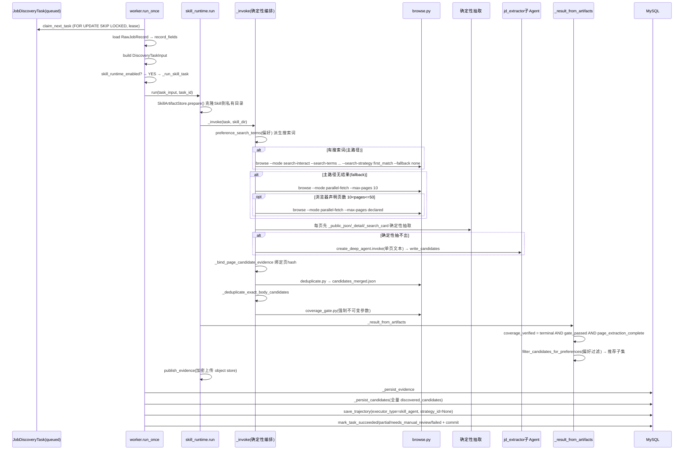
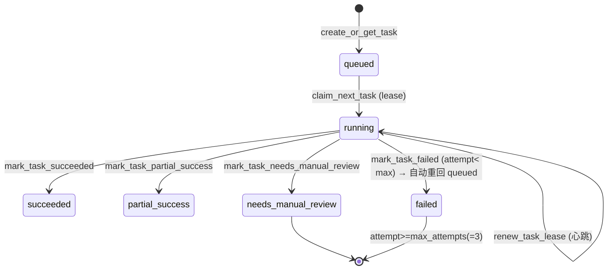

# Career Assistant · Job Discovery 子系统技术指南（从浅到深）

> 本文档只描述**当前默认运行路径**：Skill Discovery Runtime（`job_discovery_skill_runtime_enabled=true`）。
> 项目中存在大量历史/回滚代码（Supervisor、Web Navigation Agent、Strategy Router、PEV、adapters、`src/` CLI demo 等），它们在默认配置下**不会被执行**，本文只在必要时一句话点名，不深入。
> 这是本文档的核心取舍原则：**先判断代码是否真的在 Agent 运行路径中被调用，未调用者不展开**。

阅读约定：
- 每个结论都标 `文件路径:行号`，可点击跳转。
- 「**代码事实**」= 直接读源码确认；「**设计意图**」= 代码注释/文档声明的目标，未必等于实现；「**推断**」= 我基于代码合理推测、但未在源码中直接证实，会显式标注。
- 未能在当前代码中确认的内容，标注「未从当前代码中确认」。

---

## 0. 一页看懂项目

一句话：**把腾讯文档（Tencent Smartsheet）里的招聘 URL，自动爬取成结构化 JD（职位描述），再按用户偏好筛出一批「推荐岗位」，作为预审核、仅本人可见的发现结果交付给用户。**

默认路径的数据走向：

```
腾讯文档 → RawJobRecord → JobDiscoveryTask(queued)
  → Worker 认领(lease) → SkillDiscoveryRuntime.run()
      → 确定性编排器(Python) 调 browse.py 抓页面
      → 每页：先确定性抽取(正则) → 抽不出才交给 jd_extractor 子Agent(LLM)
      → deduplicate 去重 → coverage_gate 覆盖度校验
      → 按偏好过滤(role_preferences 三段式)
  → DiscoveredJobCandidate(全量) + 推荐子集 → 落库 MySQL
  → 个性化发现 v1（预审核、仅本人可见，卡片标注「自动发现，建议自行确认」）
```

关键事实（均已核实）：
- 默认开关：`job_discovery_skill_runtime_enabled: bool = True`（[config.py:92](backend/app/config.py#L92)）。
- 默认模型：`deepseek-v4-flash`（[config.py:95](backend/app/config.py#L95)）。
- 分发点：worker 在 [worker.py:806-809](backend/app/services/job_discovery/worker.py#L806-L809) 命中开关后**直接 return**，跳过其后约 490 行 legacy 代码。
- 「主 Agent」其实**不是 LLM 监督者**：编排器是确定性 Python；LLM 只用于「逐页 JD 抽取子 Agent」和「偏好判定 Judge」。见 [skill_runtime.py:160-163](backend/app/services/job_discovery/skill_runtime.py#L160-L163) 注释。
- 交付**不经过**管理员审核→JobPosting(verified)，而是预审核、owner-scoped 的发现卡片（见 CLAUDE.md「Default runtime」段）。

---

## 1. 项目是做什么的

这是一个**面向校招场景的多Agent求职助手平台**。本指南聚焦其中的 **Job Discovery（职位发现）子系统**：自动从招聘网站批量提取结构化 JD，并按用户偏好做个性化推荐。

它解决的工程问题：
1. **招聘站点形态繁多**（Moka、飞书招聘、zhiye.com、各自研 SPA、微信公众号文章），为每个站点写确定性爬虫极脆弱、维护成本高。本系统的应对：Playwright 渲染成纯文本 → 正则/LLM 提取 → 内容寻址缓存（[SKILL.md:23-34](skill/job-discovery/SKILL.md#L23-L34)）。
2. **LLM 自主调度不可靠**：让一个 LLM 监督者反复决定「是否派工」在实测中不稳定，于是把编排做成确定性，LLM 只负责**单页抽取**这种孤立的、可验证的子任务（[skill_runtime.py:160-162](backend/app/services/job_discovery/skill_runtime.py#L160-L162)）。
3. **安全合规**：绝不自动点最终提交、绝不绕过登录/验证码/反爬、绝不把密钥/原始 payload 写进日志、MySQL 为唯一业务权威（见 CLAUDE.md Security Hard Gates）。

**代码事实**：默认路径的产出是 `DiscoveredJobCandidate`（状态默认 `pending_review`，[models.py:1096-1104](backend/app/db/models.py#L1096-L1104)），落库后以「个性化发现 v1」交付，**不是** `JobPosting(verified)`。

> 设计意图 vs 实现：CLAUDE.md 把「admin approve/reject → JobPosting 晋升」描述为「code-side 仍存在、迁移另计」。这条路径在代码里确实存在，但**默认 discovery 不走它**；本文不展开晋升流程。

---

## 2. 如何运行项目

> 以下命令来自 [CLAUDE.md](CLAUDE.md)「Key Commands」段，未在本会话逐一实跑；环境变量要求来自同处。「未从当前代码中确认」= 具体端口/容器名以 CLAUDE.md 为准，本文不重复粘贴。

启动顺序（**代码事实**部分）：
- Worker 入口：`JobDiscoveryWorker.run_loop()`（[worker.py:1377](backend/app/services/job_discovery/worker.py#L1377)），单次处理 `run_once()`（[worker.py:753](backend/app/services/job_discovery/worker.py#L753)）。
- 触发任务创建：`JobSyncService.sync()` 拉腾讯文档 → `JobDiscoveryTaskFactory.create_tasks()`（[tasks.py:37](backend/app/services/job_discovery/tasks.py#L37)）。

运行前置（**代码事实**）：
- LLM 凭证经 `llm_factory` 间接依赖 `src/utils.py` 的 `get_api_key` / `get_base_url`（[llm_factory.py:14](backend/app/services/job_discovery/llm_factory.py#L14)、[:41](backend/app/services/job_discovery/llm_factory.py#L41)）。**推断**：运行前需配置 DeepSeek/OpenAI 兼容的 API key 与 base_url 环境变量；具体变量名未在 `llm_factory.py` 内展开（在 `src/utils.py`，本会话未读其实现，标注「未从当前代码中确认」）。
- 浏览器：Skill 的 `browse.py` 依赖 Playwright + Chromium（[SKILL.md:62-64](skill/job-discovery/SKILL.md#L62-L64)）。

---

## 3. 项目目录结构（含阅读优先级）

只列**默认路径真正涉及的**目录/文件，并标注阅读优先级。legacy 目录见末尾「不在本文范围」。

### S 级（先读这 5 个，就能讲清默认路径）

| 文件 | 作用 | 关键行 |
|------|------|--------|
| [skill_runtime.py](backend/app/services/job_discovery/skill_runtime.py) | Skill 运行时核心：编排、工具、子Agent、结果装配 | `run`:89, `_invoke`:131, `_script_tool`:485, `_result_from_artifacts`:584 |
| [worker.py](backend/app/services/job_discovery/worker.py) | 任务队列消费 + 分发 + 持久化 | 分发:806, `_run_skill_task`:1305, `run_once`:753 |
| [config.py](backend/app/config.py) | 所有开关与上限 | 开关:92, 模型:95, 上限:100/104/105 |
| [schemas.py](backend/app/services/job_discovery/schemas.py) | 默认路径数据结构 | `DiscoveryTaskInput`:8, `NormalizedJobCandidate`:56, `DiscoveryRunResult`:76 |
| [skill/job-discovery/SKILL.md](skill/job-discovery/SKILL.md) | Skill 的「调度中枢」说明文档 | — |

### A 级（理解偏好过滤与产物装配必读）

| 文件 | 作用 | 关键行 |
|------|------|--------|
| [role_preferences.py](backend/app/services/job_discovery/role_preferences.py) | 通用偏好三段式过滤 | `filter_candidates_for_preferences`:71, 默认偏好:46, Judge prompt:55 |
| [preference_expansion.py](backend/app/services/job_discovery/preference_expansion.py) | 从偏好串派生 search terms / keep tokens / role markers | `expand_preference`:88, `preference_search_terms`:144, 角色分类:40 |
| [skill_artifacts.py](backend/app/services/job_discovery/skill_artifacts.py) | 每任务克隆 Skill 目录 + 证据加密上传 | `SKILL_SOURCE`:17, `prepare`:46, `publish_evidence`:85 |
| [llm_factory.py](backend/app/services/job_discovery/llm_factory.py) | 构建抽取/判定用的 LLM | `build_job_discovery_llm`:12, `build_preference_judge_llm`:32 |
| [repositories/job_discovery.py](backend/app/repositories/job_discovery.py) | 数据访问层（纯 SQL） | `claim_next_task`:64, `upsert_candidate`:227 |

### B 级（入库与状态机）

| 文件 | 作用 | 关键行 |
|------|------|--------|
| [models.py](backend/app/db/models.py) | ORM：任务/证据/候选/轨迹 | `JobDiscoveryTask`:1001, `DiscoveredJobCandidate`:1070, 枚举:970/980/988 |
| [tasks.py](backend/app/services/job_discovery/tasks.py) | 同步后建任务 + 幂等键 | `_idempotency_key`:16, `create_tasks`:37 |
| [job_sync.py](backend/app/services/job_sync.py) | 拉文档→建任务 | `sync`:94, `create_tasks` 调用:178 |
| [strategy/trajectory_buffer.py](backend/app/services/job_discovery/strategy/trajectory_buffer.py) | 轨迹缓存（默认路径用，strategy_id=None） | 被 `worker.py:1326` 调用 |
| [strategy/trajectory_store.py](backend/app/services/job_discovery/strategy/trajectory_store.py) | 轨迹落库 | `save_trajectory` 被 `worker.py:1371` 调用 |

### C 级（Skill 脚本本体）

`skill/job-discovery/scripts/` 下 9 个被运行时**白名单允许**执行的脚本（[skill_runtime.py:38-41](backend/app/services/job_discovery/skill_runtime.py#L38-L41)）：

| 脚本 | 作用 | 调用点 |
|------|------|--------|
| [browse.py](skill/job-discovery/scripts/browse.py) | Playwright 抓页面文本/截图 | `_invoke` 主路径:176/190/204 |
| [write_candidates.py](skill/job-discovery/scripts/write_candidates.py) | 写每页候选 JSON | 逐页写入:240 |
| [deduplicate.py](skill/job-discovery/scripts/deduplicate.py) | 合并去重 | :303 |
| [coverage_gate.py](skill/job-discovery/scripts/coverage_gate.py) | 覆盖度校验 | :308 |
| [validate.py](skill/job-discovery/scripts/validate.py) | 校验 | 白名单内 |
| [normalize.py](skill/job-discovery/scripts/normalize.py) | 标准化 | 白名单内 |
| [read_evidence.py](skill/job-discovery/scripts/read_evidence.py) | 读证据 | 白名单内 |
| [state.py](skill/job-discovery/scripts/state.py) | 状态查询 | 白名单内 |
| [ocr_image.py](skill/job-discovery/scripts/ocr_image.py) | OCR（**占位实现**） | 白名单内但默认 `ocr_enabled=false` |

> **代码事实**：`adapter_supervisor.py`（[SKILL.md:38](skill/job-discovery/SKILL.md#L38) 提到）**不在** `_ALLOWED_SCRIPTS` 白名单内，默认运行时不调用，属冗余代码。

### 不在本文范围（legacy / 回滚专用，默认不执行）

`deepagents_runner.py`、`result_contract.py`、`planning/crawl_plan_agent.py`、`crawling/`、`adapters/`、`strategy/strategy_router.py`、`strategy/snapshot_executor.py`、`strategy_store.py`、`error_classifier.py`、`trajectory_annotator.py`、`deduplication/`、`normalization/`、`src/` CLI demo（`agents.py`/`graph.py`/`prompts.py`，但 `src/utils.py` **被**默认路径经 `llm_factory` 间接使用）。详见 [docs/job-discovery-legacy-architecture-summary.md](docs/job-discovery-legacy-architecture-summary.md)。

---

## 4. 整体架构

```mermaid
flowchart LR
    subgraph 入库侧
      TS[腾讯文档 Smartsheet] --> SYNC[job_sync.JobSyncService.sync]
      SYNC --> REC[(RawJobRecord)]
      SYNC --> FACT[tasks.JobDiscoveryTaskFactory.create_tasks]
      FACT --> TASK[(JobDiscoveryTask status=queued)]
    end

    subgraph 运行侧
      TASK -->|claim_next_task FOR UPDATE SKIP LOCKED| W[worker.run_once]
      W -->|skill_runtime_enabled=true 分发| SKILL[skill_runtime.SkillDiscoveryRuntime.run]
      SKILL --> INVOKE[_invoke 确定性编排器]
      INVOKE -->|subprocess| BROWSE[scripts/browse.py]
      BROWSE --> PAGES[(output/evidence/pages)]
      PAGES --> DET[_public_json / _detail_evidence / _search_card 确定性抽取]
      DET -->|抽不出的页| SUB[jd_extractor 子Agent LLM]
      DET --> BIND[_bind_page_candidate_evidence]
      SUB --> BIND
      BIND --> DEDUP[deduplicate.py + _deduplicate_exact_body]
      DEDUP --> GATE[coverage_gate.py]
      GATE --> RES[_result_from_artifacts 装配]
      RES --> PREF[role_preferences 三段式过滤]
    end

    subgraph 落库与交付
      PREF --> CAND[(DiscoveredJobCandidate 全量)]
      PREF --> REC_SUB[推荐子集 result.candidates]
      W --> EV[(JobDiscoveryEvidence)]
      W --> TRAJ[(JobDiscoveryTrajectory executor=skill_agent)]
      CAND --> DELIV[个性化发现 v1 预审核 owner-scoped]
    end

    W -.持久化.-> CAND
    W -.持久化.-> EV
    W -.持久化.-> TRAJ
```



**代码事实**要点：
- 分发是「开关命中即 return」，legacy 路径整段被跳过（[worker.py:806-809](backend/app/services/job_discovery/worker.py#L806-L809)）。
- 编排器是确定性 Python（`_invoke`），不是 LLM Agent（[skill_runtime.py:131](backend/app/services/job_discovery/skill_runtime.py#L131)）。
- LLM 出现两处：逐页 `jd_extractor_subagent`（[:256](backend/app/services/job_discovery/skill_runtime.py#L256)）、偏好 Judge（[role_preferences.py:71](backend/app/services/job_discovery/role_preferences.py#L71)）。
- 全量候选与推荐子集分别保留：`discovered_candidates`（全量）≠ `result.candidates`（推荐子集）（[skill_runtime.py:616-621](backend/app/services/job_discovery/skill_runtime.py#L616-L621)、[worker.py:1321-1323](backend/app/services/job_discovery/worker.py#L1321-L1323)）。

---

## 5. 四个核心概念：Agent / Skill / Tool / Subagent

> 这是最容易踩坑的一节。本项目对「Agent」的用法与一般「单 LLM 监督者」直觉不同，务必看清。

### 5.1 Agent

**代码事实**：默认路径下**没有一个全局 LLM 监督 Agent**。编排器 `_invoke` 是纯 Python，按固定顺序调用 browse → 逐页抽取 → dedup → gate（[skill_runtime.py:131-308](backend/app/services/job_discovery/skill_runtime.py#L131-L308)）。代码注释明确说明原因：「An LLM supervisor repeatedly deciding whether to dispatch its workers proved unreliable in live runs; page-level extraction remains an isolated Agent subtask.」（[skill_runtime.py:160-162](backend/app/services/job_discovery/skill_runtime.py#L160-L162)）。

实际在跑的 LLM Agent 只有一个：**逐页 JD 抽取子 Agent**（见 5.4）。legacy 的 `DiscoverySupervisorAgent` / `WebNavigationAgent`（`deepagents_runner.py`）默认不执行。

### 5.2 Skill

**代码事实**：Skill 是一个**目录资产包**，位于 `skill/job-discovery/`（[skill_artifacts.py:17](backend/app/services/job_discovery/skill_artifacts.py#L17) 的 `SKILL_SOURCE`）。包含：
- `SKILL.md`：调度说明（dispatch hub），[SKILL.md:19-21](skill/job-discovery/SKILL.md#L19-L21)。
- `scripts/`：9 个可执行脚本。
- `references/`：`extraction-guide.md`、`site-catalog.md`、`wechat-image-handling.md`、`schema.md`。
- `evals/evals.json`：评测用例。

**每任务隔离**：每个任务获得一份私有克隆，路径 `var/job-discovery-skill/<task_id>/runs/<run_id>/skill/job-discovery/`，克隆时忽略 `output/`、`__pycache__`、`*.pyc`（[skill_artifacts.py:44-57](backend/app/services/job_discovery/skill_artifacts.py#L44-L57)）。`task_id`/`run_id` 被校验为单一路径段，防穿越（[:36-39](backend/app/services/job_discovery/skill_artifacts.py#L36-L39)）。

deepagents 加载 Skill：子 Agent 构造时 `skills=["/"]`（[skill_runtime.py:258](backend/app/services/job_discovery/skill_runtime.py#L258)）。

> **设计意图 vs 实现**：`SKILL.md` 原本面向「pi-agent 手动 LLM 编排」设计（LLM 自己读 SKILL.md 决定加载哪个 reference）。但后端运行时**并不让 LLM 读 SKILL.md 自主编排**，而是 Python 编排器直接 `subprocess` 调 `scripts/*.py`。`SKILL.md` 在默认路径里更像「给人读的文档 + 给 deepagents 的 skill 元数据」，而非 LLM 的运行时指令。这是重要的认知校准。

### 5.3 Tool

**代码事实**：默认路径只给子 Agent **一个**可执行工具——`run_skill_script`，一个 `StructuredTool`（[skill_runtime.py:485-567](backend/app/services/job_discovery/skill_runtime.py#L485-L567)）。它的实现是一个闭包 `run_skill_script(script, cli_args="", stdin="")`，把请求转成对白名单脚本的 `subprocess.run`（[:536-541](backend/app/services/job_discovery/skill_runtime.py#L536-L541)）。

工具内的硬约束（**代码事实**）：
1. 脚本必须在 `_ALLOWED_SCRIPTS` 白名单内（[:490](backend/app/services/job_discovery/skill_runtime.py#L490)）。
2. `cli_args` 用 `shlex.split` 解析，Windows 下用非 posix 模式（[:493](backend/app/services/job_discovery/skill_runtime.py#L493)）。
3. 路径安全：拒绝 `..` 与绝对路径（[:496](backend/app/services/job_discovery/skill_runtime.py#L496)）；输出路径需通过 `_valid_output_args`（[:514](backend/app/services/job_discovery/skill_runtime.py#L514)）。
4. `browse` 调用数上限 `max_browse_calls=3`（[:498-502](backend/app/services/job_discovery/skill_runtime.py#L498-L502)）。
5. `coverage_gate` 的参数被**强制改写**为不可变 manifest + candidates_merged，防止 Agent 自证覆盖（[:503-513](backend/app/services/job_discovery/skill_runtime.py#L503-L513)）。

### 5.4 Subagent

**代码事实**：唯一的子 Agent 是 `jd_extractor_subagent`，用 `create_deep_agent` 构造（[skill_runtime.py:256-260](backend/app/services/job_discovery/skill_runtime.py#L256-L260)）：
- `model = build_job_discovery_llm(self.settings)`（温度 0、禁 deepseek-v4 thinking，见 [llm_factory.py:12](backend/app/services/job_discovery/llm_factory.py#L12)）。
- `tools=[tool]`——只有上面那个 `run_skill_script`。
- `backend=FilesystemBackend(root_dir=str(skill_dir.parent), virtual_mode=True)`（虚拟文件系统沙箱，[:155](backend/app/services/job_discovery/skill_runtime.py#L155)）。
- `permissions`：读 `/job-discovery/**`，写 `/job-discovery/**` 设为 `deny`（[:156-159](backend/app/services/job_discovery/skill_runtime.py#L156-L159)）。
- `name="jd_extractor_subagent"`，`system_prompt=extractor_prompt`（[:219-228](backend/app/services/job_discovery/skill_runtime.py#L219-L228)）。

它的任务边界（prompt 约束）：只处理编排器喂给它的**单页文本**，不得 browse/read_evidence，只能调 `write_candidates` 写出 JSON 数组（[:220-227](backend/app/services/job_discovery/skill_runtime.py#L220-L227)）。多页用 `ThreadPoolExecutor(max_workers=min(4, ...))` 并发，每页一个独立 Agent 实例以防跨页消息污染（[:279-283](backend/app/services/job_discovery/skill_runtime.py#L279-L283)）。

---

## 6. 一次完整任务怎么执行



**代码事实**对应行：
- 认领：[worker.py:769](backend/app/services/job_discovery/worker.py#L769)。
- 装输入：[worker.py:794-802](backend/app/services/job_discovery/worker.py#L794-L802)。
- 分发：[worker.py:806-809](backend/app/services/job_discovery/worker.py#L806-L809)。
- 克隆 Skill：[skill_runtime.py:90-91](backend/app/services/job_discovery/skill_runtime.py#L90-L91)。
- 主路径 browse：[:176-184](backend/app/services/job_discovery/skill_runtime.py#L176-L184)。
- fallback browse：[:189-211](backend/app/services/job_discovery/skill_runtime.py#L189-L211)。
- 确定性抽取：[:230-249](backend/app/services/job_discovery/skill_runtime.py#L230-L249)。
- 子 Agent：[:256-283](backend/app/services/job_discovery/skill_runtime.py#L256-L283)。
- 去重 + gate：[:303-308](backend/app/services/job_discovery/skill_runtime.py#L303-L308)。
- 结果装配：[:584-638](backend/app/services/job_discovery/skill_runtime.py#L584-L638)。
- 持久化：[worker.py:1317-1374](backend/app/services/job_discovery/worker.py#L1317-L1374)。

---

## 7. 调用链分析

### 7.1 外部触发 → 任务创建

```
JobSyncService.sync (job_sync.py:94)
  → discovery_factory.create_tasks (job_sync.py:178)
    → JobDiscoveryTaskFactory.create_tasks (tasks.py:37)
      → extract_discovery_urls(record, source_key) (tasks.py:55)  # 从记录字段抽URL
      → for url: _url_hash (tasks.py:12-13) + _idempotency_key (tasks.py:16-27)
        → create_or_get_task (repositories/job_discovery.py:23)
```

幂等键 = `SHA-256(source_id::external_record_id::url_hash::payload_hash::agent_version)`（[tasks.py:23-27](backend/app/services/job_discovery/tasks.py#L23-L27)）。**代码事实**：`create_or_get_task` 按 5 元组 `(source_id, external_record_id, url_hash, payload_hash, agent_version)` 查重（[repositories/job_discovery.py:36-44](backend/app/repositories/job_discovery.py#L36-L44)），与 `agent_version` 绑定——**推断**：升版本会重跑同 URL（旧任务视为不同任务）。

### 7.2 Worker 消费 → 运行时

```
run_once (worker.py:753)
  → claim_next_task (repositories/job_discovery.py:64)   # SELECT FOR UPDATE SKIP LOCKED
  → db.commit()  # 释放行锁，lease靠心跳续 (worker.py:780)
  → load RawJobRecord (worker.py:786-791)
  → build DiscoveryTaskInput (worker.py:794-802)
  → if skill_runtime_enabled: _run_skill_task (worker.py:806-809)
      → SkillDiscoveryRuntime.run (skill_runtime.py:89)
          → SkillArtifactStore.prepare (skill_artifacts.py:46)
          → _invoke (skill_runtime.py:131)
          → _result_from_artifacts (skill_runtime.py:584)
          → store.publish_evidence (skill_artifacts.py:85)
      → _persist_evidence (worker.py:129)
      → _merge_recommendation_apply_urls (worker.py:1321)
      → _persist_candidates (worker.py:166)
      → TrajectoryBuffer + save_trajectory (worker.py:1326,1371)
      → mark_task_* (worker.py:1362-1369)
      → db.commit (worker.py:1374)
```

### 7.3 运行时内部（`_invoke` 调用顺序）

逐行见 [skill_runtime.py:131-308](backend/app/services/job_discovery/skill_runtime.py#L131-L308)：
1. 构造唯一工具 `tool = _script_tool(...)`（[:139](backend/app/services/job_discovery/skill_runtime.py#L139)）。
2. 派生搜索词 `preference_search_terms`（[:164](backend/app/services/job_discovery/skill_runtime.py#L164)）。
3. **主路径**：若派生出搜索词 → `browse --mode search-interact ... --search-strategy first_match --fallback none`（[:176-184](backend/app/services/job_discovery/skill_runtime.py#L176-L184)）。
4. **fallback**：主路径无页 → `browse --mode parallel-fetch --max-pages 10`（[:189-197](backend/app/services/job_discovery/skill_runtime.py#L189-L197)）；若浏览器声明页数 10<N≤50 → 追加一次扩展抓取（[:203-211](backend/app/services/job_discovery/skill_runtime.py#L203-L211)）。
5. 逐页：确定性抽取（`_public_json_candidates` → `_detail_evidence_candidates` → `_search_card_candidates`，[:231-235](backend/app/services/job_discovery/skill_runtime.py#L231-L235)）；抽不出才入 `agent_pages` 交子 Agent（[:249](backend/app/services/job_discovery/skill_runtime.py#L249)）。
6. 子 Agent 并发抽取 + 一次补抽（[:279-296](backend/app/services/job_discovery/skill_runtime.py#L279-L296)）。
7. `_bind_page_candidate_evidence`（[:302](backend/app/services/job_discovery/skill_runtime.py#L302)）→ `deduplicate`（[:303](backend/app/services/job_discovery/skill_runtime.py#L303)）→ `_deduplicate_exact_body_candidates`（[:307](backend/app/services/job_discovery/skill_runtime.py#L307)）→ `coverage_gate`（[:308](backend/app/services/job_discovery/skill_runtime.py#L308)）。

---

## 8. Prompt 系统

默认路径只有**两类** prompt，都很短、很克制：

### 8.1 JD 抽取子 Agent prompt（`extractor_prompt`）

[skill_runtime.py:219-228](backend/app/services/job_discovery/skill_runtime.py#L219-L228)。要点：
- 强调「编排器已在消息里给你单页全文，不要 browse/read_evidence/task」。
- 只能调 `run_skill_script(write_candidates)`，`cli_args` 指定输出路径，`stdin` 为 JD 的 JSON 数组。
- 每个对象必须有 `title` 和 `responsibilities` 或 `requirements`。
- `company_name` 仅当页面/任务上下文显式给出时才用，否则 `null`（防 `source_key` 被当公司，见 [:327-345](backend/app/services/job_discovery/skill_runtime.py#L327-L345)）。
- 默认 `[校园招聘]`；无 JD 写 `[]`；写完不得再调工具。

### 8.2 偏好 Judge prompt（`_JUDGE_SYSTEM_PROMPT`）

[role_preferences.py:55-68](backend/app/services/job_discovery/role_preferences.py#L55-L68)。关键合规点：**prompt 里只注入用户给的偏好串本身，不含任何角色列表/AI-dev 专属词**（[:52-54](backend/app/services/job_discovery/role_preferences.py#L52-L54)）。判定规则：核心工作本身就是该偏好才 match；只是「提到/使用/支持/测试/评估」该主题不算。输出单行 JSON `{"relevant": true|false}`。

> 这是「不作弊」的代码级保证：把 `AI应用开发/Agent开发` 换成 `AI产品经理`，Judge 仍只看偏好串本身，不存在内置 dev 倾向。

### 8.3 legacy prompt

`src/prompts.py`、`deepagents_runner.py` 内的 Supervisor/WebNav prompt 默认不执行，本文不展开。

---

## 9. 状态 / 上下文 / 数据流

### 9.1 任务状态机

`JobDiscoveryTaskStatus`（[models.py:970-977](backend/app/db/models.py#L970-L977)）：



**代码事实**：
- `max_attempts` 默认 3（[models.py:1036](backend/app/db/models.py#L1036)）。
- `claim_next_task` 条件：`attempt_count < max_attempts` 且 (queued 且 lease 过期/无 lease) 或 (running 且 lease 过期)，`FOR UPDATE SKIP LOCKED`（[repositories/job_discovery.py:72-92](backend/app/repositories/job_discovery.py#L72-L92)）。
- 失败重试：`mark_task_failed` 在未达 `max_attempts` 时把状态回退为 `queued`（[repositories/job_discovery.py:178-182](backend/app/repositories/job_discovery.py#L178-L182)）。
- lease 续约只认「仍有效且属本 worker」的 lease，防僵尸 worker 复活已被他人认领的任务（[:106-125](backend/app/repositories/job_discovery.py#L106-L125)）。

### 9.2 候选状态机

`DiscoveredJobCandidateStatus`（[models.py:980-985](backend/app/db/models.py#L980-L985)）：`pending_review`（默认，[:1102](backend/app/db/models.py#L1102)）→ `approved`/`rejected`/`merged`/`needs_manual_review`。

> **代码事实**：默认 discovery 路径写入的候选一律 `pending_review`；`approved/rejected` 的转换属「admin pre-review 流程」（[repositories/job_discovery.py:289-317](backend/app/repositories/job_discovery.py#L289-L317) 的 `list_review_groups`），**默认个性化发现 v1 不依赖它**。

### 9.3 数据流（字段级）

```mermaid
flowchart TB
  subgraph 输入
    RF[record_fields: list-of-dict] --> TI[DiscoveryTaskInput]
    SU[source_url] --> TI
    TI --> RT[skill_runtime]
  end
  subgraph 运行时产物(文件)
    PAGES[output/evidence/pages/page_*.txt]
    META[output/evidence/browse_metadata.json]
    CAN[output/candidates/page_*.json]
    MERGED[output/candidates_merged.json]
    GATEF[output/evidence/coverage_gate_result.json]
    TRACE[output/evidence/tool_trace.jsonl]
  end
  subgraph 结果对象
    RR[DiscoveryRunResult: status/block_reason/evidence/candidates/summary]
    SRR[SkillRuntimeResult: coverage_verified/preferred_candidates/discovered_candidates]
  end
  subgraph 持久化
    DBEV[(JobDiscoveryEvidence)]
    DBC[(DiscoveredJobCandidate: 全量)]
    DBT[(JobDiscoveryTrajectory: executor=skill_agent)]
    DBS[(result_summary_json on task)]
  end
  RT --> PAGES --> CAN --> MERGED --> RR
  RT --> META --> RR
  RT --> GATEF --> RR
  RT --> TRACE --> DBT
  RR --> SRR
  SRR --> DBEV
  SRR --> DBC
  SRR --> DBS
```

**代码事实**：
- 运行时内部状态全在**文件系统**（`output/` 下），不在内存长驻；最终从文件读回装配（`_read_candidates`/`_read_evidence`/`_read_json`，[skill_runtime.py:592-593](backend/app/services/job_discovery/skill_runtime.py#L592-L593)）。
- `result.candidates` = 偏好推荐子集；`discovered_candidates` = 全量证据背书的 JD（[skill_runtime.py:616-621](backend/app/services/job_discovery/skill_runtime.py#L616-L621)）。worker 落库的是 `_merge_recommendation_apply_urls(discovered_candidates, result.candidates)`（[worker.py:1321-1323](backend/app/services/job_discovery/worker.py#L1321-L1323)）——**代码事实**：全量落库，推荐子集只写进 `summary_json` 的 `preferred_candidate_*` 字段（[worker.py:1352-1358](backend/app/services/job_discovery/worker.py#L1352-L1358)）。
- `summary_json.execution_path="skill_agent"`（[worker.py:1343](backend/app/services/job_discovery/worker.py#L1343)）用于区分 legacy 结果。

---

## 10. 核心数据结构

### 10.1 输入：`DiscoveryTaskInput`（[schemas.py:8-16](backend/app/services/job_discovery/schemas.py#L8-L16)）

7 个字段：`source_id, raw_record_id, external_record_id, source_key, source_url, url_hash, record_fields`。其中 `record_fields` 是腾讯文档原始字段列表（list[dict]），`_task_company_name` 从中按 label 抽公司（[skill_runtime.py:327-345](backend/app/services/job_discovery/skill_runtime.py#L327-L345)）。

### 10.2 候选：`NormalizedJobCandidate`（[schemas.py:56-73](backend/app/services/job_discovery/schemas.py#L56-L73)）

16 字段。决定「是否完整 JD」的关键：`responsibilities` 或 `requirements` 非空（`_read_candidates` 据此过滤，[skill_runtime.py:647](backend/app/services/job_discovery/skill_runtime.py#L647)）。`evidence_refs` 是证据指针列表（含 `content_hash`、`relative_path`）。

### 10.3 运行结果：`DiscoveryRunResult`（[schemas.py:76-92](backend/app/services/job_discovery/schemas.py#L76-L92)）

`status` 取值：`succeeded / partial_success / needs_manual_review / failed`。`block_reason` 取自 `DiscoveryBlockReason` 枚举（[models.py:988-998](backend/app/db/models.py#L988-L998)）：`login_required, captcha, anti_bot, wechat_unavailable, permission_denied, invalid_url, timeout, budget_exceeded, parse_failed, unknown`。

### 10.4 运行时结果：`SkillRuntimeResult`（[skill_runtime.py:44-54](backend/app/services/job_discovery/skill_runtime.py#L44-L54)）

比 `DiscoveryRunResult` 多出 `coverage_verified, role_preferences, preferred_candidates, discovered_candidates, artifact_root, trace_steps`——把「全量」与「推荐」分离的关键容器。

### 10.5 ORM 三张表

- `JobDiscoveryTask`（[models.py:1001-1043](backend/app/db/models.py#L1001-L1043)）：唯一约束 5 元组（[:1004-1007](backend/app/db/models.py#L1004-L1007)）、lease 字段、`attempt_count`/`max_attempts`、`budget_json`、`result_summary_json`。
- `JobDiscoveryEvidence`（[models.py:1046-1067](backend/app/db/models.py#L1046-L1067)）：唯一约束 `(task_id, evidence_type, content_hash)`（[:1049-1052](backend/app/db/models.py#L1049-L1052)）；`storage_uri` 形如 `object://...` 表示已加密上传（`has_durable_evidence` 据此判断，[repositories/job_discovery.py:351-357](backend/app/repositories/job_discovery.py#L351-L357)）。
- `DiscoveredJobCandidate`（[models.py:1070-1120](backend/app/db/models.py#L1070-L1120)）：`idempotency_key` 唯一（[:1092-1094](backend/app/db/models.py#L1092-L1094)）、`similarity_group_key`、状态默认 `pending_review`。
- `JobDiscoveryTrajectory`（[models.py:1165-1199](backend/app/db/models.py#L1165-L1199)）：**默认路径写入**，`executor_type="skill_agent"`、`strategy_id=None`（[worker.py:1326](backend/app/services/job_discovery/worker.py#L1326)）。`JobDiscoveryStrategy` 表（[:1128](backend/app/db/models.py#L1128)）属 legacy strategy router，默认路径不写。

### 10.6 候选幂等键

`build_candidate_idempotency_key(company, title, location, apply_url, evidence_hash)`（worker 持久化时构造，[worker.py:186-192](backend/app/services/job_discovery/worker.py#L186-L192)）；`similarity_group_key` 由 `build_similarity_group_key(company, title, recruitment_type, source_family)` 构造（[worker.py:193-198](backend/app/services/job_discovery/worker.py#L193-L198)）。两者来自 `tools` 模块（worker 顶部 import，[worker.py:84-87](backend/app/services/job_discovery/worker.py#L84-L87)）。

---

## 11. 配置系统

全部在 [config.py](backend/app/config.py) 的 `Settings`（pydantic-settings）。默认路径相关项：

| 字段 | 默认值 | 行 | 含义 |
|------|--------|----|------|
| `job_discovery_enabled` | `False` | [88](backend/app/config.py#L88) | 总开关（关则不建任务） |
| `job_discovery_skill_runtime_enabled` | `True` | [92](backend/app/config.py#L92) | **默认走 Skill Runtime** |
| `job_discovery_skill_artifact_root` | `var/job-discovery-skill` | [93](backend/app/config.py#L93) | 私有克隆根目录 |
| `job_discovery_agent_version` | `1.0.0` | [94](backend/app/config.py#L94) | 进幂等键，升版重跑 |
| `job_discovery_model` | `deepseek-v4-flash` | [95](backend/app/config.py#L95) | 抽取/判定模型 |
| `job_discovery_max_pages_per_task` | `50` (1..100) | [100](backend/app/config.py#L100) | 页数硬上限 |
| `job_discovery_max_candidates_per_task` | `500` (1..1000) | [104](backend/app/config.py#L104) | 候选硬上限（非推荐上限） |
| `job_discovery_task_timeout_seconds` | `600` (30..3600) | [105](backend/app/config.py#L105) | 任务 lease 时长 |
| `job_discovery_ocr_enabled` | `False` | [107](backend/app/config.py#L107) | OCR 默认关（占位实现） |

legacy 开关（默认全 False，本文不展开）：`job_discovery_pev_enabled`[:110](backend/app/config.py#L110)、`job_discovery_planner_enabled`[:111](backend/app/config.py#L111)、`job_discovery_legacy_path_c_enabled`[:112](backend/app/config.py#L112)、`job_discovery_llm_extraction_enabled`[:118](backend/app/config.py#L118)、`job_discovery_strategy_enabled`[:129](backend/app/config.py#L129)。

`SkillToolPolicy` 运行时上限（[skill_runtime.py:57-59](backend/app/services/job_discovery/skill_runtime.py#L57-L59)、调用处 [:139-154](backend/app/services/job_discovery/skill_runtime.py#L139-L154)）：`max_browse_calls=3`、`max_coverage_gate_calls=1`、`max_pages=min(50, 设置值)`、`script_timeout_seconds=max(30, min(240, timeout//2))`、`interaction_browse_timeout_seconds`（interact/search-interact 模式额外封顶，[:534-535](backend/app/services/job_discovery/skill_runtime.py#L534-L535)）。

---

## 12. 深入源码

### 12.1 `run_skill_script` 闭包——唯一的工具实现（[skill_runtime.py:485-567](backend/app/services/job_discovery/skill_runtime.py#L485-L567)）

执行模型：**不是 LangChain Tool 直跑 Python，而是 `subprocess.run([sys.executable, script_path, *args], cwd=skill_dir, ...)`**（[:536-541](backend/app/services/job_discovery/skill_runtime.py#L536-L541)）。即子 Agent 调工具 → 闭包把请求转成命令行 → 起子进程跑 `scripts/*.py`。stdout+stderr 截断后回传给 Agent（[:542](backend/app/services/job_discovery/skill_runtime.py#L542)）。`browse`/`coverage_gate` 调用后额外把输出落成 manifest 文件（[:549-553](backend/app/services/job_discovery/skill_runtime.py#L549-L553)），并追加 trace（[:554-564](backend/app/services/job_discovery/skill_runtime.py#L554-L564)）。

`write_candidates` 的 stdin 走 ASCII JSON 传输 + `json.loads` 还原 Unicode，绕开 Windows 子进程 text-mode surrogate 损坏（[:520-527](backend/app/services/job_discovery/skill_runtime.py#L520-L527)）。

### 12.2 三条确定性抽取路径（无 LLM）

按优先级（[skill_runtime.py:231-235](backend/app/services/job_discovery/skill_runtime.py#L231-L235)）：
1. `_public_json_candidates`（[:398](backend/app/services/job_discovery/skill_runtime.py#L398)）：匹配 `=== PUBLIC JOB n ===\n{...}` 正则块（[:311-314](backend/app/services/job_discovery/skill_runtime.py#L311-L314)），解析 JSON。
2. `_detail_evidence_candidates`（[:434](backend/app/services/job_discovery/skill_runtime.py#L434)）：匹配 `=== DETAIL n (url) ===` 块（[:315-318](backend/app/services/job_discovery/skill_runtime.py#L315-L318)），从 `职位描述` 起截正文，`confidence=0.8`。
3. `_search_card_candidates`（[:348](backend/app/services/job_discovery/skill_runtime.py#L348)）：卡片格式兜底，要求 title 含角色关键词（`_ROLE_TITLE_HINT`，[:322](backend/app/services/job_discovery/skill_runtime.py#L322)）且 body≥20 字。

**设计意图**（[:297-301](backend/app/services/job_discovery/skill_runtime.py#L297-L301) 注释）：确定性路径与 LLM 路径受同一证据契约约束——都要被 `_bind_page_candidate_evidence` 绑定页 hash，防子 Agent 伪造/遗漏证据引用（[:653-661](backend/app/services/job_discovery/skill_runtime.py#L653-L661)）。

### 12.3 `_result_from_artifacts` 的状态分派（[skill_runtime.py:584-638](backend/app/services/job_discovery/skill_runtime.py#L584-L638)）

覆盖度三条件全为「读文件」：
- `terminal = browse.terminal_evidence or terminal_signal`（[:594](backend/app/services/job_discovery/skill_runtime.py#L594)）。
- `gate_passed = gate.passed or coverage_verified`（[:595](backend/app/services/job_discovery/skill_runtime.py#L595)）。
- `page_extraction_complete = _all_evidence_pages_extracted`（[:596](backend/app/services/job_discovery/skill_runtime.py#L596)）。
- `coverage_verified = terminal and gate_passed and page_extraction_complete`（[:597](backend/app/services/job_discovery/skill_runtime.py#L597)）——三者全真才算覆盖已验证。

状态分派顺序（[:613-633](backend/app/services/job_discovery/skill_runtime.py#L613-L633)）：候选超 `max_candidates` → `needs_manual_review(candidate_limit_exceeded)`；有推荐 → `succeeded`；页抽取未完成 → `needs_manual_review(page_extraction_incomplete)`；覆盖未验证 → `needs_manual_review(coverage_unverified)`；有候选但无推荐 → `succeeded`（覆盖已验证）；空 → `partial_success`。

### 12.4 `_run_skill_task` 持久化（[worker.py:1305-1375](backend/app/services/job_discovery/worker.py#L1305-L1375)）

`_persist_evidence`（[:1317](backend/app/services/job_discovery/worker.py#L1317)）支持 `PageEvidence` 对象或 dict 两种输入（[worker.py:139-163](backend/app/services/job_discovery/worker.py#L139-L163)）。`_persist_candidates`（[:1324](backend/app/services/job_discovery/worker.py#L1324)）对每条候选构造幂等键与相似组键后 `upsert_candidate`（[worker.py:176-203](backend/app/services/job_discovery/worker.py#L176-L203)）。`save_trajectory` 用 try/except 包裹，失败只记日志不中断（[worker.py:1370-1373](backend/app/services/job_discovery/worker.py#L1370-L1373)）。最后 `db.commit()`（[:1374](backend/app/services/job_discovery/worker.py#L1374)）。

---

## 13. 注册机制

默认路径的「注册」是**白名单 + 静态克隆**，无运行时动态注册表：

1. **脚本白名单**：`_ALLOWED_SCRIPTS`（[skill_runtime.py:38-41](backend/app/services/job_discovery/skill_runtime.py#L38-L41)）硬编码 9 个名字。子 Agent 只能调这些，否则返回 `ERROR: unsupported Skill script`（[:490-491](backend/app/services/job_discovery/skill_runtime.py#L490-L491)）。
2. **工具注册**：`StructuredTool.from_function(run_skill_script, name="run_skill_script", ...)`（[:567](backend/app/services/job_discovery/skill_runtime.py#L567)）——单一工具，静态构造。
3. **Skill 装载**：`SkillArtifactStore.prepare` 静态 `shutil.copytree`（[skill_artifacts.py:46-57](backend/app/services/job_discovery/skill_artifacts.py#L46-L57)）；子 Agent `skills=["/"]`（[:258](backend/app/services/job_discovery/skill_runtime.py#L258)）。
4. **权限注册**：`FilesystemPermission` 读允许/写拒绝（[:156-159](backend/app/services/job_discovery/skill_runtime.py#L156-L159)）。
5. **任务注册**：`create_or_get_task` 唯一约束 5 元组（[repositories/job_discovery.py:36-44](backend/app/repositories/job_discovery.py#L36-L44)）。

> **代码事实**：CLAUDE.md 明确「'Skill' is a design term here, not a separate runtime registry」——本仓库没有独立的 skill 运行时注册表插件机制，所谓「Skill」就是 `skill/job-discovery/` 目录 + 白名单。

---

## 14. 框架做了什么（deepagents）

默认路径用 deepagents 的三个能力（[skill_runtime.py:133-137](backend/app/services/job_discovery/skill_runtime.py#L133-L137)）：

1. `create_deep_agent(model, tools, backend, skills, permissions, name, system_prompt)`（[:256-260](backend/app/services/job_discovery/skill_runtime.py#L256-L260)）：构造一个带工具循环、文件系统后端、权限控制的 Agent。
2. `FilesystemBackend(root_dir, virtual_mode=True)`（[:155](backend/app/services/job_discovery/skill_runtime.py#L155)）：虚拟文件系统沙箱，Agent 的文件操作被限制在 `skill_dir.parent` 下。
3. `FilesystemPermission`（[:156-159](backend/app/services/job_discovery/skill_runtime.py#L156-L159)）：声明读/写权限边界。

LangChain/LangChain-OpenAI 侧：`StructuredTool`（[:19](backend/app/services/job_discovery/skill_runtime.py#L19)）、`HumanMessage`（[:136](backend/app/services/job_discovery/skill_runtime.py#L136)）、`ChatOpenAI` 经 `llm_factory` 构造（`abatch` 批判用，[role_preferences.py:197-199](backend/app/services/job_discovery/role_preferences.py#L197-L199)）。

> **推断**：deepagents 负责 Agent 循环（消息→工具调用→观察→再消息）、工具调度、文件系统权限隔离；但「跑哪个脚本、抓哪几页、何时去重、何时 gate」这些**业务编排不在 deepagents**，而在 `_invoke` 的确定性 Python 里。deepagents 在默认路径里只服务「单页抽取」这一件事。

---

## 15. 异常处理

**代码事实**（按发生层）：

1. **运行时顶层**：`_invoke` 抛异常 → `run` 捕获，返回 `failed(skill_runtime_error)`（[skill_runtime.py:94-98](backend/app/services/job_discovery/skill_runtime.py#L94-L98)）。
2. **证据上传失败**：`publish_evidence` 抛异常 → 返回 `needs_manual_review(artifact_upload_failed)`（[:107-121](backend/app/services/job_discovery/skill_runtime.py#L107-L121)）。
3. **lease 丢失**：`_run_skill_task` 检查 `lease_lost.is_set()` → `raise RuntimeError("job_discovery_lease_lost")`（[worker.py:1315-1316](backend/app/services/job_discovery/worker.py#L1315-L1316)）。
4. **轨迹落库失败**：`save_trajectory` try/except，仅 `logger.exception`（[worker.py:1370-1373](backend/app/services/job_discovery/worker.py#L1370-L1373)）。
5. **子 Agent 异常**：`extract_page` 内 `try/except Exception: pass`——保留已写批次，让 manifest gate 做权威完整性判定（[skill_runtime.py:271-275](backend/app/services/job_discovery/skill_runtime.py#L271-L275)）。
6. **脚本超时**：`subprocess.TimeoutExpired` → 标记 `script_failed`，trace 记 `ERROR: ... timed out`（[:546-548](backend/app/services/job_discovery/skill_runtime.py#L546-L548)）。
7. **Judge LLM 不可用**：`_build_preference_judge_llm` try/except → `None`（[:577-581](backend/app/services/job_discovery/skill_runtime.py#L577-L581)）；`llm=None` 时 stage-b 候选被**保守过滤**（precision over recall，[role_preferences.py:81-83](backend/app/services/job_discovery/role_preferences.py#L81-L83)）。
8. **Judge 调用异常**：`_judge_relevance_async` catch → 返回空集（保守过滤全部歧义项，[role_preferences.py:200-201](backend/app/services/job_discovery/role_preferences.py#L200-L201)）。

**安全硬门**（CLAUDE.md Security Hard Gates，代码级体现）：被 `login_required/captcha/anti_bot` 拦截 → `needs_manual_review`，绝不绕过（`DiscoveryBlockReason` 枚举，[models.py:989-991](backend/app/db/models.py#L989-L991)）。无 `task:submit` scope，绝不自动点提交。

---

## 16. 测试体系

> 「未从当前代码中确认」：以下为测试文件清单（Glob 结果），具体断言未逐个读。CLAUDE.md 给出的运行命令见同处。

默认路径相关单测（`tests/unit/`）：
- [test_job_discovery_skill_runtime.py](tests/unit/test_job_discovery_skill_runtime.py)——运行时核心。
- [test_job_discovery_skill_artifacts.py](tests/unit/test_job_discovery_skill_artifacts.py)——克隆与证据。
- [test_job_discovery_role_preferences.py](tests/unit/test_job_discovery_role_preferences.py)——偏好过滤。
- [test_preference_expansion.py](tests/unit/test_preference_expansion.py)——偏好派生（含 `AI产品经理` 反转）。
- [test_job_discovery_repository.py](tests/unit/test_job_discovery_repository.py)——数据访问层。
- [test_job_discovery_tasks.py](tests/unit/test_job_discovery_tasks.py)——任务/幂等键。
- [test_job_discovery_worker.py](tests/unit/test_job_discovery_worker.py)——worker。
- [test_job_discovery_tools.py](tests/unit/test_job_discovery_tools.py)——工具键构造。

集成/E2E（`tests/integration/`、`tests/e2e/`）：
- [test_job_discovery_deepagents.py](tests/integration/test_job_discovery_deepagents.py)（mocked，无 live LLM）。
- [test_job_discovery_data_flow.py](tests/integration/test_job_discovery_data_flow.py)、[test_job_discovery_e2e.py](tests/e2e/test_job_discovery_e2e.py)。
- live smoke：[test_job_discovery_readgzh_smoke.py](tests/integration/test_job_discovery_readgzh_smoke.py)（需 `RUN_LIVE_TENCENT_DISCOVERY=1`）。

> 注意 [test_job_discovery_result_contract.py](tests/unit/test_job_discovery_result_contract.py)、[test_job_discovery_worker_strategy.py](tests/integration/test_job_discovery_worker_strategy.py) 名字含 legacy 概念（result_contract / strategy），默认路径未必触发其主路径，阅读时留意。

---

## 17. 如何修改项目

按「改哪一层」给出最小改动指引（**代码事实**+常识）：

- **加一个偏好**（如「AI产品经理」）：无需改代码。`role_preferences` 是泛化的，偏好串经 `expand_preference` 派生 keep tokens/role markers（[preference_expansion.py:88](backend/app/services/job_discovery/preference_expansion.py#L88)）。运行时传新偏好即可。**禁止**在 prompt/过滤里硬编码 dev 角色词作弊（合规约束）。
- **调抓取规模**：改 [config.py:100/104/105](backend/app/config.py#L100) 或 `SkillToolPolicy`（[skill_runtime.py:139-154](backend/app/services/job_discovery/skill_runtime.py#L139-L154)）。注意 `max_browse_calls=3` 是硬上限（[:153](backend/app/services/job_discovery/skill_runtime.py#L153)）。
- **加一个可执行脚本**：①在 `skill/job-discovery/scripts/` 加 `xxx.py`；②加入 `_ALLOWED_SCRIPTS`（[skill_runtime.py:38-41](backend/app/services/job_discovery/skill_runtime.py#L38-L41)）；③在 `_invoke` 里 `tool.invoke({"script":"xxx", ...})` 调用。注意路径安全检查（[:496](backend/app/services/job_discovery/skill_runtime.py#L496)）会拒绝 `..`/绝对路径。
- **改状态机**：改 [models.py](backend/app/db/models.py) 枚举 + 加 Alembic 迁移 + 改 `mark_task_*`（[repositories/job_discovery.py:128-188](backend/app/repositories/job_discovery.py#L128-L188)）+ 改 `_result_from_artifacts` 分派（[skill_runtime.py:613-633](backend/app/services/job_discovery/skill_runtime.py#L613-L633)）。
- **切回 legacy 路径**：`job_discovery_skill_runtime_enabled=false`（[config.py:92](backend/app/config.py#L92)）。本文不覆盖该路径。

三层分离约束（CLAUDE.md）：API→Service→Repository，新流程别在 routes 写 SQL。`routes/job_discovery.py` 的直接写库是已知债务，别当模板。

---

## 18. Top 10 核心知识点

1. **默认路径 = Skill Runtime**，开关 `job_discovery_skill_runtime_enabled=True`（[config.py:92](backend/app/config.py#L92)），worker 命中即 return 跳过 legacy（[worker.py:806-809](backend/app/services/job_discovery/worker.py#L806-L809)）。
2. **编排器是确定性 Python，不是 LLM 监督者**（[skill_runtime.py:160-162](backend/app/services/job_discovery/skill_runtime.py#L160-L162)）。LLM 只在逐页抽取子 Agent + 偏好 Judge。
3. **唯一工具 `run_skill_script`**，本质是白名单脚本 + `subprocess`（[skill_runtime.py:485-567](backend/app/services/job_discovery/skill_runtime.py#L485-L567)）。
4. **确定性抽取优先于 LLM**：三条正则路径，抽不出才交子 Agent（[skill_runtime.py:231-249](backend/app/services/job_discovery/skill_runtime.py#L231-L249)）。
5. **分层抓取**：search-interact 主路径 → parallel-fetch fallback → 声明页数扩展（[skill_runtime.py:173-211](backend/app/services/job_discovery/skill_runtime.py#L173-L211)）。
6. **偏好过滤三段式且泛化**：(a) keep_token+role_marker 确定保留 → (b) LLM judge（无则保守过滤）→ (c) 过滤（[role_preferences.py:71-90](backend/app/services/job_discovery/role_preferences.py#L71-L90)）；prompt 无角色词作弊（[:52-54](backend/app/services/job_discovery/role_preferences.py#L52-L54)）。
7. **覆盖度 = terminal AND gate_passed AND page_extraction_complete**，三者皆读文件、不可自证（[skill_runtime.py:594-597](backend/app/services/job_discovery/skill_runtime.py#L594-L597)、[:503-513](backend/app/services/job_discovery/skill_runtime.py#L503-L513)）。
8. **全量落库 + 推荐子集**：`discovered_candidates` 入库，`preferred_candidates` 进 summary（[worker.py:1321-1358](backend/app/services/job_discovery/worker.py#L1321-L1358)）。
9. **每任务私有 Skill 克隆**，`task_id`/`run_id` 防穿越，证据加密上传 object store（[skill_artifacts.py:36-57](backend/app/services/job_discovery/skill_artifacts.py#L36-L57)、[:85-101](backend/app/services/job_discovery/skill_artifacts.py#L85-L101)）。
10. **交付是预审核 owner-scoped 发现**，不经 admin→JobPosting(verified)（CLAUDE.md Default runtime 段）。

---

## 19. 容易误解的地方

1. **「这是多 Agent 系统」→ 默认路径只有一个 LLM Agent**（逐页抽取子 Agent）。编排是确定性的，监督者 Agent 是 legacy。([skill_runtime.py:160-162](backend/app/services/job_discovery/skill_runtime.py#L160-L162))
2. **「SKILL.md 驱动 LLM 编排」→ 默认路径不让 LLM 读 SKILL.md 自主编排**；SKILL.md 是文档 + deepagents skill 元数据，编排器是 Python 直接调脚本。
3. **「Tool 就是 Python 函数」→ 工具是 `subprocess` 桥**，跑的是独立 `scripts/*.py` 子进程（[:536-541](backend/app/services/job_discovery/skill_runtime.py#L536-L541)）。
4. **「覆盖已验证 = 抓完了」→ 不是**。`coverage_verified` 三条件全真才算，且推荐结果**不要求**覆盖已验证——有完整 JD+apply link 即可推荐（[:598-601](backend/app/services/job_discovery/skill_runtime.py#L598-L601) 注释）。
5. **「偏好过滤会删候选」→ 不会**。过滤只产出推荐子集，全量 `discovered_candidates` 照样落库（[role_preferences.py:1-7](backend/app/services/job_discovery/role_preferences.py#L1-L7) 模块 docstring、[skill_runtime.py:616-621](backend/app/services/job_discovery/skill_runtime.py#L616-L621)）。
6. **「默认偏好是 AI应用开发/Agent开发」→ 那只是示例默认值**（[role_preferences.py:46](backend/app/services/job_discovery/role_preferences.py#L46)），可换成任意偏好；过滤逻辑是泛化的、从偏好串派生的（[preference_expansion.py:1-8](backend/app/services/job_discovery/preference_expansion.py#L1-L8)）。
7. **「strategy/ 目录全是 legacy」→ 不全是**。`trajectory_buffer.py`/`trajectory_store.py` 被默认路径用（worker [:1326](backend/app/services/job_discovery/worker.py#L1326)/[:1371](backend/app/services/job_discovery/worker.py#L1371)），但 `strategy_id=None`。
8. **「worker 顶部 import 的就都在用」→ 不是**。[worker.py:41-101](backend/app/services/job_discovery/worker.py#L41-L101) import 了大量 legacy 模块，默认路径只用到其中 `SkillDiscoveryRuntime`、`TrajectoryBuffer`、`save_trajectory`、`schemas`、`repositories`、`tools`。`_parse_agent_result`（[:117](backend/app/services/job_discovery/worker.py#L117)）是死代码。
9. **「OCR 能用」→ 占位实现**，`ocr_image.py` 默认 `ocr_enabled=false`（[config.py:107](backend/app/config.py#L107)）。

---

## 20. 当前问题（确定 vs 可能）

### 确定的问题（代码事实）

1. **冗余 import**：worker 顶部 import 了默认路径不用的 legacy 模块（[worker.py:41-101](backend/app/services/job_discovery/worker.py#L41-L101)），增加阅读与启动开销（虽不执行 legacy 逻辑，但 import 副作用仍发生）。
2. **死代码**：`_parse_agent_result`（[worker.py:117](backend/app/services/job_discovery/worker.py#L117)）默认路径无调用方。
3. **未接线的 Skill 脚本**：`adapter_supervisor.py` 在 SKILL.md 提及但不在白名单，默认运行时不调用（[skill_runtime.py:38-41](backend/app/services/job_discovery/skill_runtime.py#L38-L41)）。
4. **OCR 占位**：`ocr_image.py` 实际 OCR 未实现，图片密集文章只能转人工审核。
5. **已知架构债**：`routes/job_discovery.py` 直接写库（CLAUDE.md 明示），违反三层分离。

### 可能的问题（推断，需进一步验证）

1. **`src/utils.py` 依赖耦合**：默认路径经 `llm_factory` 依赖 legacy `src/utils.py` 的 `get_api_key/get_base_url`（[llm_factory.py:14/41](backend/app/services/job_discovery/llm_factory.py#L14)）。**推断**：若 `src/` 被清理，默认路径会断；该依赖未在本文深入核实其实现。
2. **`coverage_gate` 参数被强制改写**（[:503-513](backend/app/services/job_discovery/skill_runtime.py#L503-L513)）可能掩盖 Agent 传入的真实意图——**推断**：这是有意的安全设计（防自证），但意味着 Agent 对 gate 完全无控制权。
3. **`max_browse_calls=3` 是否够用**：主路径 search-interact 算 1 次，fallback parallel-fetch 算 1 次，声明页数扩展算 1 次——正好用满（[:150-153](backend/app/services/job_discovery/skill_runtime.py#L150-L153)）。**推断**：复杂站点可能在第 3 次后无法补救，但这是有意封顶。
4. **子 Agent 递归上限 `recursion_limit=24`**（[:269](backend/app/services/job_discovery/skill_runtime.py#L269)）——**推断**：超大单页可能提前耗尽循环预算，但 `extract_page` 的 `try/except` 会保留已写批次。

> 标注「推断」的均**未从当前代码中直接证实**实际运行影响，仅基于代码结构推测。

---

## 21. 5 分钟复习卡

```
默认路径一句话：腾讯文档URL → 任务队列 → Skill Runtime(确定性编排+子Agent抽取) → 偏好过滤 → 预审核发现卡片

3 个开关：  skill_runtime_enabled=True(默认) | model=deepseek-v4-flash | max_pages=50/max_cand=500/timeout=600s

1 个分发点： worker.py:806 命中开关即 return，跳过 ~490 行 legacy

1 个工具：   run_skill_script = 白名单脚本 + subprocess (skill_runtime.py:485)
            白名单9个: browse/validate/normalize/deduplicate/ocr_image/state/read_evidence/write_candidates/coverage_gate

1 个子Agent： jd_extractor_subagent (create_deep_agent, 仅单页抽取, FilesystemBackend沙箱)

2 个 LLM：   ①逐页抽取子Agent  ②偏好Judge(prompt无角色词,泛化)

3 段偏好过滤：(a)keep_token+role_marker确定保留 → (b)LLM judge(无则保守过滤) → (c)过滤
            偏好串→expand_preference派生 keep_tokens/role_markers/search_terms

覆盖度：     coverage_verified = terminal AND gate_passed AND page_extraction_complete (全读文件)

全量 vs 推荐：discovered_candidates(全量)落库  ≠  preferred_candidates(推荐子集,进summary)

状态机：     queued→running→succeeded/partial_success/needs_manual_review/failed
            失败attempt<3自动回queued；lease靠心跳续

5 张表：     JobDiscoveryTask / JobDiscoveryEvidence / DiscoveredJobCandidate
            / JobDiscoveryTrajectory(默认写,executor=skill_agent) / [JobDiscoveryStrategy=legacy]

安全硬门：   不绕登录/验证码/反爬→needs_manual_review | 不自动点提交 | MySQL为权威 | 密钥不入日志

legacy(默认不执行)：deepagents_runner / result_contract / crawling / adapters /
            strategy_router / snapshot_executor / PEV / src demo(但src/utils.py被用)

一句话原则： 先确认代码在默认路径被调用，再写进文档；未调用者不展开。
```

---

> 本文档基于 2026-07-29 的代码状态编写。所有 `文件:行号` 均为当时核实。若代码演进，以源码为准；标注「未从当前代码中确认」「推断」的部分请在使用前复核。
