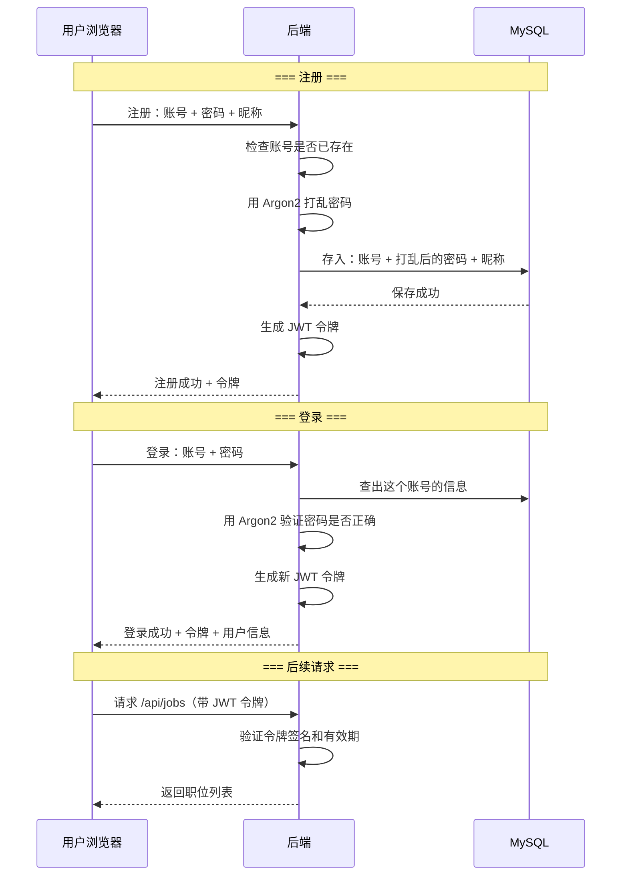
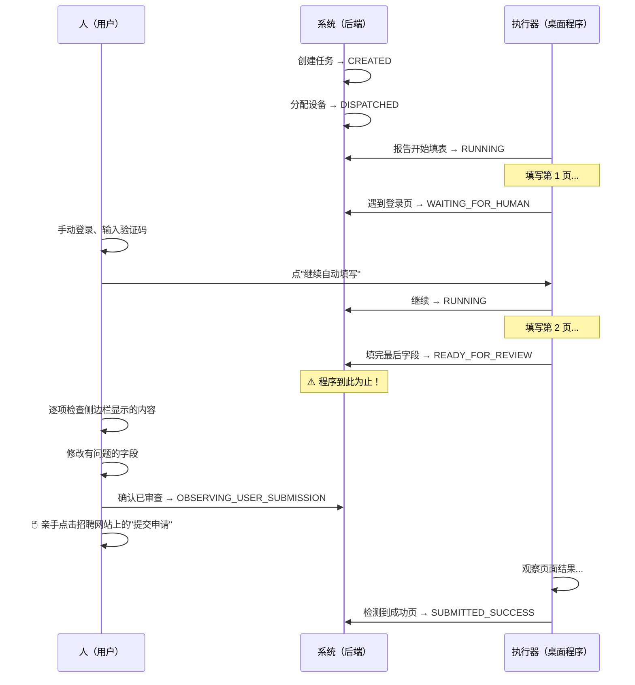

# WP1：平台基础 — 从零开始理解

> 这篇文章写给刚接触本项目的开发者。每个概念都会先解释"为什么需要它"，再说明"它是怎么做到的"。

---

## 0. 先讲一个故事

假设你想做一款帮大学生找实习的 Web 应用。你打开电脑，写了几行 Python，用 `uvicorn` 跑起来——看起来能用了。

但很快你会遇到一连串问题：

1. **用户怎么注册和登录？** 你得存账号密码，但不能存明文——万一数据库泄露呢？
2. **数据存哪里？** 用文件？一个 JSON？万一两个请求同时写同一个文件，数据就坏了。
3. **怎么区分学生和管理员？** 学生只能看职位，管理员才能审核职位。
4. **怎么限制恶意请求？** 有人写脚本一秒钟注册 1000 个账号，你的服务就崩了。
5. **将来要对接 Windows 桌面程序怎么办？** 桌面程序怎么证明"我是合法的设备"？
6. **用户上传的简历文件存哪里？** 存本地硬盘？万一文件里含身份证号，泄露了怎么办？
7. **服务如果挂了怎么监控？** 半夜服务挂了没人知道。

WP1 就是一次性解决这 7 个问题的基础设施。它不是用户能"看到"的功能，但没有它，任何业务功能（职位、档案、匹配）都做不了。

---

## 1. 整体结构：系统长什么样？

```
用户浏览器 ──→ 前端页面 (Vue) ──→ 后端服务 (Python FastAPI)
                                        │
                    ┌───────────────────┼───────────────────┐
                    ▼                   ▼                   ▼
              MySQL (数据库)      Redis (缓存/临时数据)   MinIO (文件存储)
              存用户、职位        存临时登录状态、        存加密后的简历文件
              等永久数据          限流计数器
```

**MySQL**：永久保存的数据（用户信息、职位信息）。就像 Excel 表格，但支持多人同时读写。
**Redis**：只保存临时数据（限流计数、登录验证码）。速度极快，重启后数据可以丢。
**MinIO**：存文件（简历 PDF、附件）。本质是"自己搭建的网盘"，兼容 Amazon S3 协议。

**为什么用三个存储而不是一个？**
- MySQL 适合"有关系的数据"（用户关联多个职位），但不适合存大文件
- Redis 适合"高频读写、丢了也没事"的数据，MySQL 做同样的事太慢
- MinIO 适合存文件，数据库存文件又慢又贵

---

## 2. 功能一：用户注册和登录

### 为什么需要它？

如果不做登录，任何人都能调用你的接口——删别人的数据、看别人的简历。所以需要一套"证明你是谁"的机制。

### 怎么做的？

**注册时**，密码不是直接存进数据库的，而是用一种叫 **Argon2** 的算法"打乱"后再存。Argon2 的特点：
- 同一个密码每次"打乱"的结果不同（加随机盐）
- 不可逆——拿到打乱后的结果，也算不出原始密码
- 故意做得慢——防止攻击者每秒尝试百万个密码

```
用户输入密码 "mypassword123"
        │
        ▼
    Argon2 算法（加入随机盐）
        │
        ▼
   "$argon2id$v=19$m=65536,t=3,p=4$abc...xyz"
   （这是存进数据库的内容，不是 "mypassword123"）
```

**登录时**，后端生成一个叫 **JWT** 的令牌给前端。JWT 本质上是一张"加密的身份证"：
- 里面写了你是谁（用户ID）、什么角色（学生/管理员）、什么时候过期
- 前端每次请求都带着它，后端验证签名后就知道是谁在操作
- 不需要每次请求都查数据库验证密码



**关于 JWT 的几个关键点**：
- 有效期 7 天，过期需要重新登录
- 令牌里包含 `sub`（用户ID）和 `role`（学生/管理员），后端靠 role 判断权限
- 签名密钥 `APP_AUTH_SECRET` 是一个 ≥32 字符的随机字符串，生产环境绝对不能泄露

### 限流保护

如果有人写脚本暴力破解密码怎么办？后端用 Redis 做了两层限流：

- **IP 级别**：同一 IP，每分钟最多尝试 120 次登录
- **账号级别**：同一账号，每分钟最多尝试 8 次登录

两层同时生效。即使黑客换了 100 个 IP，每个 IP 对同一个账号也只能试 8 次/分钟。

```
Redis Key: "auth-rate:login-ip:abc123def456..."  → 计数器，60 秒过期
           "auth-rate:login-account:user@example.com" → 计数器，60 秒过期
```

---

## 3. 功能二：数据库设计和迁移

### 为什么需要它？

代码改了，数据库表结构也要跟着改。比如今天加了"设备表"，明天加了"职位表"。如果没有管理工具，你需要手动写 SQL 去每个环境（开发/测试/生产）执行，很容易出错。

### 怎么做的？

使用 **Alembic**（Python 的数据库迁移工具）。它的核心概念：

```
你写一个"迁移文件" → Alembic 执行它 → 数据库结构变更

迁移文件示例（alembic/versions/20260714_0001_platform_foundation.py）:
  def upgrade():    # 正向：创建表
    op.create_table("users", ...)
    op.create_table("analysis_sessions", ...)

  def downgrade():  # 反向：删除表
    op.drop_table("analysis_sessions")
    op.drop_table("users")
```

**好处**：
- 所有环境用同样的迁移文件，不会"开发环境 OK 生产环境少一列"
- 可以回退（`downgrade`），出错了能恢复
- 迁移文件本身就在 Git 里，谁改了数据库一目了然

**当前项目有 8 个迁移文件**，按时间顺序编号（`0001` → `0008`），每个对应一次数据库结构变更。

每个数据库表在代码中都有对应的 **ORM 模型**（在 `backend/app/db/models.py`），例如：

```python
# 不用写 SQL，直接用 Python 对象操作数据库
class User(Base, UUIDPrimaryKeyMixin, TimestampMixin):
    __tablename__ = "users"
    account: Mapped[str]       # 账号
    nickname: Mapped[str]      # 昵称
    password_hash: Mapped[str] # Argon2 打乱后的密码
    role: Mapped[UserRole]     # student / admin
    is_active: Mapped[bool]    # 是否启用
```

---

## 4. 功能三：分层架构

### 为什么需要它？

想象你把所有代码写在一个文件里：处理 HTTP 请求的代码直接写 SQL、业务逻辑混在路由里。两周后你就看不懂自己写了什么。三层架构就是把代码按职责分开：

```
用户请求
   │
   ▼
┌─────────────┐
│  API 层     │  只做三件事：接收请求参数 → 调用 Service → 返回 JSON
│  (routes/)  │  绝不做：写 SQL、复杂业务判断
└──────┬──────┘
       │
       ▼
┌─────────────┐
│  Service 层 │  所有业务逻辑在这里：密码怎么验证、职位怎么审核
│  (services/)│  绝不做：写 SQL、解析 HTTP 请求
└──────┬──────┘
       │
       ▼
┌─────────────┐
│  Repository层│  只做一件事：读写数据库
│  (repositories/)│ 绝不做：业务判断
└──────┬──────┘
       │
       ▼
    MySQL
```

**举个例子——用户注册**：

| 层 | 做了什么 |
|---|---|
| API 层 | 接收 `{account, password, nickname}` → 调限流 → 调 `AuthService.register()` → 返回 `{token, profile}` |
| Service 层 | 检查账号是否重复 → Argon2 哈希密码 → 调 `create_for_user` 创建默认会话 → 发 JWT |
| Repository 层 | `SELECT ... WHERE account = ?`、`INSERT INTO users ...` |

所以当你追代码时，路径是固定的：`api/routes/xxx.py → services/xxx.py → repositories/xxx.py`。

---

## 5. 功能四：ApplicationTask 状态机

### 为什么需要它？

这是整个项目**最核心的安全机制**。背景是：将来要做一个 Windows 桌面程序，帮学生在招聘网站上自动填表。但有一个铁律：**最终提交按钮必须由人亲自点击，程序永远不能点**。

怎么在代码里保证这点？答案是一个严格的"状态机"——用一系列明确的状态和规则，限制程序在每个状态下能做什么、不能做什么。

### 状态机是什么？

就像一个交通灯：红灯只能变绿灯，红灯不能直接变黄灯。每个状态的转换有严格规则。

任务（投递任务）有 11 个状态：

```
CREATED           —— 任务已创建，等待分配设备
WAITING_FOR_DEVICE —— 等待设备上线
DISPATCHED        —— 已派发给设备，可以开始填表
RUNNING           —— 正在填表中
WAITING_FOR_HUMAN —— 遇到登录/验证码，等人处理
READY_FOR_REVIEW  —— 填表完成，等人审查 ⚠️
OBSERVING_USER_SUBMISSION —— 人已点提交，程序只观察结果
SUBMITTED_SUCCESS / FAILED / UNKNOWN —— 最终结果
CANCELLED         —— 用户取消了
```

⚠️ **关键的安全边界在 `READY_FOR_REVIEW` 状态**：从这个状态往后，程序**只能观察**，不能再做任何页面操作。只有人能从 `READY_FOR_REVIEW` 推进到 `OBSERVING_USER_SUBMISSION`。

### 三个角色，各有限制

| 角色 | 能做什么 | 绝对不能做什么 |
|---|---|---|
| **SYSTEM**（系统自动） | 创建任务、分配给设备 | 填表、提交 |
| **EXECUTOR**（桌面程序） | 填表、报告进度、观察提交结果 | 点击最终提交按钮 |
| **HUMAN**（用户） | 处理登录验证码、点击提交、取消任务 | — |

代码里用一张"转换白名单"表来强制执行：

```python
# 只有这些转换是允许的（节选）
ALLOWED_TRANSITION_ACTORS = {
    (DISPATCHED, RUNNING):        {EXECUTOR},     # 程序可以开始填表
    (DISPATCHED, WAITING_FOR_HUMAN): {EXECUTOR},  # 遇到登录，暂停等人
    (DISPATCHED, CANCELLED):      {HUMAN},         # 用户可以取消
    (READY_FOR_REVIEW, OBSERVING_USER_SUBMISSION): {HUMAN},  # 只有人能提交
    (OBSERVING_USER_SUBMISSION, SUBMITTED_SUCCESS): {EXECUTOR}, # 程序观察结果
    ...
}
```

**不在白名单上的转换，代码直接拒绝执行**。这不是"建议"，是代码级的硬限制。

### 状态转换的一次完整流程



如你所见：**程序自始至终没有点击"提交"按钮**。从审查到提交，全是人的操作。

---

## 6. 功能五：设备配对

### 为什么需要它？

WP4 要做 Windows 桌面程序（"本地执行器"），它能自动打开 Chrome 帮你填招聘表单。但这个程序要先"认主"——证明"我是你授权的设备，不是别人的恶意软件"。

### 怎么配对？

整个过程像一个"验证码 + 授权码"的流程：

```
第 1 步：你在网页上点"添加设备"，网页给你一个随机配对码（32字符，10分钟有效，存 Redis）
第 2 步：你在桌面程序里输入这个配对码
第 3 步：桌面程序把配对码发给后端，后端验证通过 → 生成一个长期设备令牌 → 返回桌面程序
第 4 步：以后桌面程序每次请求都带着这个设备令牌
```

**配对码的安全保证**：
- 存储在 Redis 中，设置了 10 分钟自动过期
- 被使用后立即从 Redis 中删除（`GETDEL` 原子操作），绝不可能重复使用
- 配对成功后，桌面程序获得的是一个**长期令牌**，这个令牌：
  - 本身是 32 字节随机字符串
  - 数据库里只存它的 **SHA-256 哈希值**，不存原文
  - 90 天过期
  - 用户可以在网页上随时撤销

**设备令牌存哈希的好处**：哪怕数据库泄露了，攻击者拿到的也只是 SHA-256 哈希值，无法反推出原始令牌去冒充设备。

### Task Lease：比设备令牌更严格的短期授权

设备令牌证明"你是谁"，但在做具体的填表动作时，还需要一个更严格的**短期授权**——Task Lease。

区别：
| | 设备令牌 | Task Lease |
|---|---|---|
| 作用 | 证明"我是合法设备" | 证明"我有权做这个具体操作" |
| 有效期 | 90 天 | 5 分钟 |
| 范围 | 整个设备 | 单个 task + 单个操作类型 |
| 能做什么 | 查看任务列表、发心跳 | 报告填表进度 或 报告最终结果 |

**Task Lease 中有个关键的 scope 字段**：只允许 `task:progress`（报告进度）和 `task:result`（报告结果）。**系统中不存在 `task:submit` 这个 scope**——没有任何代码路径能为"提交"操作签发授权。

---

## 7. 功能六：加密文件存储

### 为什么需要它？

用户上传的简历文件需要保存。但直接存进 MinIO 是不安全的——万一 MinIO 被攻击，所有简历都暴露了。所以在存进 MinIO **之前**先加密。

### 怎么加密？

使用 **AES-256-GCM**（一种军用级对称加密算法）。加密密钥存在后端，MinIO 里只有密文：

```
原始简历 PDF（明文）
    │
    ▼
后端用 AES-256-GCM 加密（密钥: OBJECT_ENCRYPTION_KEY, 随机 nonce）
    │
    ▼
加密后的数据（密文） → 上传到 MinIO
```

下载时反过来：

```
从 MinIO 下载密文
    │
    ▼
后端用 AES-256-GCM 解密（同样的密钥）
    │
    ▼
原始简历 PDF（明文） → 返回给用户
```

**GCM 模式的额外好处**：如果有人篡改了 MinIO 中的密文（哪怕改一个字节），解密时会自动检测到并报错——这叫"认证加密"。

**密钥丢了怎么办？** 没有密钥，密文就永远解不开了。所以 `OBJECT_ENCRYPTION_KEY` 必须安全备份。这是一个运维问题，代码层面做了密钥格式的严格校验（必须是 Base64 编码的 32 字节）。

---

## 8. 功能七：健康检查

### 为什么需要它？

你的服务部署在 Docker 里，Docker 需要知道服务是否"真的能用"——不只是进程还在跑，而且能连上数据库、能连上 Redis、能连上 MinIO。

后端提供两个端点：

| 端点 | 含义 | 用途 |
|---|---|---|
| `GET /api/health/live` | 进程还活着吗？ | Docker 判断要不要重启容器 |
| `GET /api/health/ready` | 能正常工作吗？ | Docker 判断能不能把流量引过来 |

`ready` 检查比 `live` 更严格：它会实际执行 `SELECT 1`（测 MySQL）、`PING`（测 Redis）、`head_bucket`（测 MinIO）。三个都通过才返回 200。

```json
// 三个都正常时
{"status": "ready", "dependencies": {"mysql": "up", "redis": "up", "object_store": "up"}}

// Redis 挂了
{"status": "not_ready", "dependencies": {"mysql": "up", "redis": "down", "object_store": "up"}}
```

---

## 9. 一份 Docker Compose 全部启动

以上所有组件（MySQL、Redis、MinIO、后端、前端）都通过 `docker-compose.yml` 统一编排：

```
docker compose up -d
```

这一条命令会按顺序启动：
1. MySQL → 等待 healthy
2. Redis、MinIO → 并行启动
3. migrate（执行数据库迁移）→ 依赖 MySQL 健康后运行
4. Backend（FastAPI 后端）→ 依赖 migrate 完成 + Redis + MinIO
5. Frontend（Vue 前端）→ 依赖 Backend 健康

启动后，访问 `http://localhost:5173` 就能看到前端页面。

---

## 10. WP1 的"成绩单"

WP1 做完后，项目具备了这些能力：

| 能力 | 状态 |
|---|---|
| 用户注册、登录、JWT 身份验证 | ✅ |
| 学生和管理员角色区分 | ✅ |
| 登录限流（IP + 账号双重） | ✅ |
| 数据库表结构管理（Alembic 迁移） | ✅ |
| 三层分层架构（API → Service → Repository） | ✅ |
| 投递任务状态机（11 状态 3 角色，硬限制） | ✅ |
| 设备配对 + Token + Task Lease 授权链 | ✅ |
| AES-256-GCM 加密文件存储 | ✅ |
| Docker 一键部署 + 健康检查 | ✅ |

**没有 WP1 就没有后续的一切**——职位同步、档案管理、匹配引擎、桌面执行器，全部依赖这些基础设施。

---

## 11. 如果你想自己跑起来

按 `docs/runbooks/platform-foundation.md` 操作，核心步骤：

```powershell
# 1. 确保 Docker 正常运行
docker version

# 2. 启动全部服务
docker compose up -d --build

# 3. 验证
Invoke-RestMethod http://127.0.0.1:8000/api/health/ready

# 4. 打开浏览器
# http://localhost:5173
```

---

## 12. 关键代码文件：按阅读顺序

从头了解 WP1，建议按这个顺序读源码：

| 序号 | 文件 | 读什么 |
|---|---|---|
| 1 | `docker-compose.yml` | 6 个服务怎么编排的 |
| 2 | `backend/entrypoint.py` | 容器启动时怎么从环境变量构造数据库 URL |
| 3 | `backend/app/config.py` | 所有配置项和校验规则 |
| 4 | `backend/app/main.py` | FastAPI 怎么初始化、lifespan 怎么管理资源 |
| 5 | `backend/app/db/base.py` | 只有 30 行，看懂 UUID + 时间戳 Mixin |
| 6 | `backend/app/services/auth.py` | 注册、登录、JWT 签发/验证 |
| 7 | `backend/app/services/devices.py` | 设备配对码 + Task Lease |
| 8 | `backend/app/services/applications.py` | 状态机的转换白名单 |
| 9 | `backend/app/services/storage.py` | AES-256-GCM 加密存储 |
| 10 | `backend/app/services/rate_limit.py` | 固定窗口限流 |
| 11 | `backend/app/api/dependencies.py` | 所有鉴权依赖注入 |
| 12 | `backend/app/api/routes/auth.py` | 注册/登录 API 的完整实现 |

每个文件都只有 60~400 行，逐个读下来，半天就能对 WP1 建立完整的心理地图。
