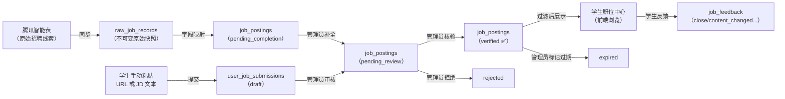
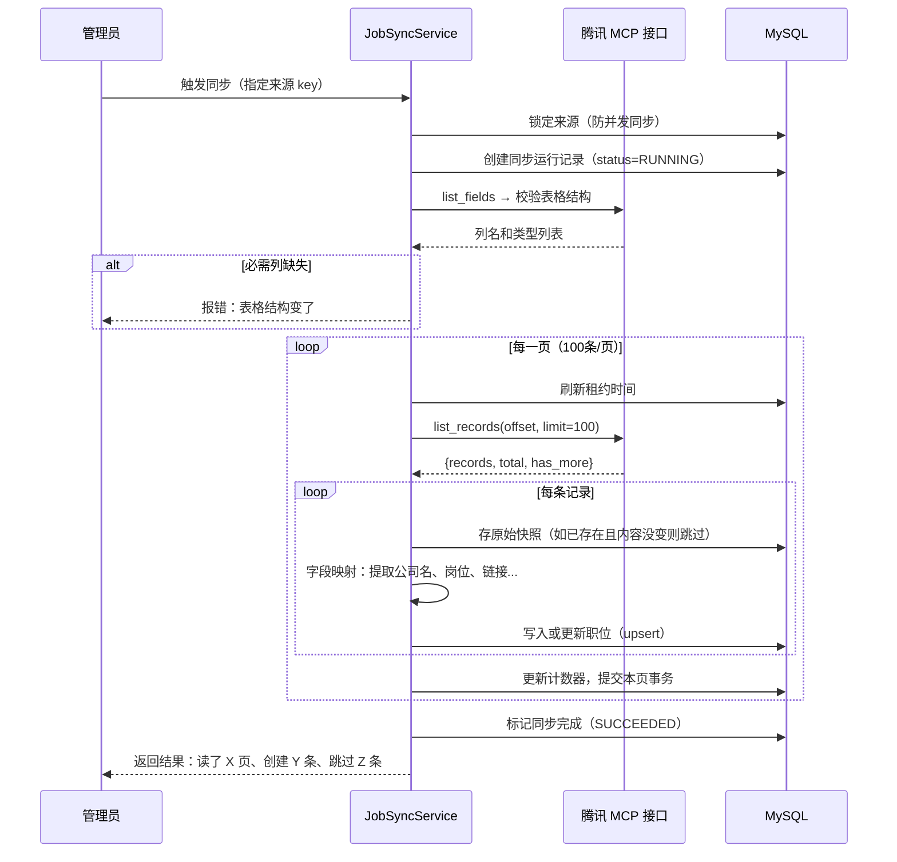
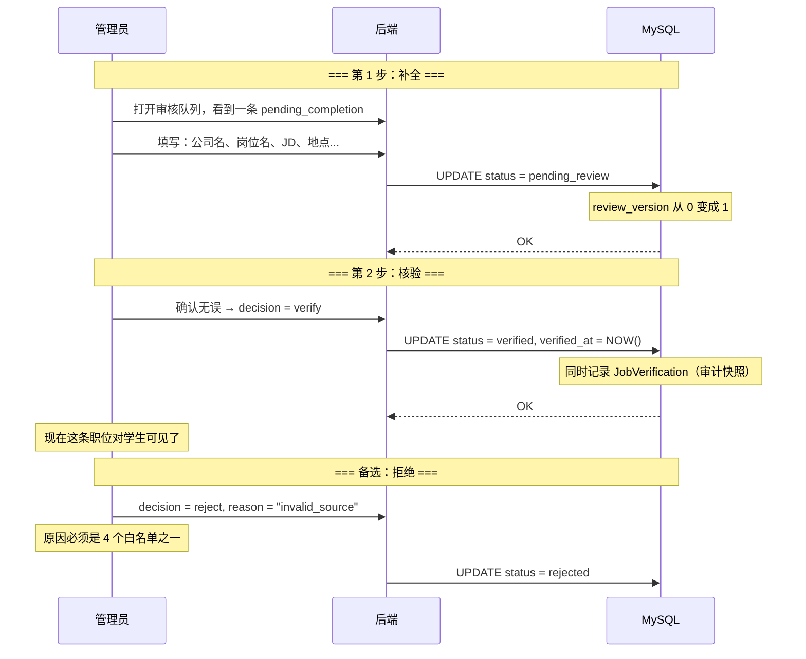

# WP2：真实职位同步与核验 — 从零开始理解

> 这篇文章写给刚接触本项目的开发者。每个概念都会先解释"为什么需要它"，再说明"它是怎么做到的"。
> 建议先读完 WP1 文档再看这篇。

---

## 0. 先讲一个故事

WP1 把"骨架"搭好了——能注册登录、有数据库、有权限。但这时候你去打开前端页面，会发现职位中心**空的**，一条职位都没有。

问题出在哪？之前的数据来自 `data/jobs.json`，里面只有 7 条**编出来的演示数据**（"星河智能""云启科技"这些不存在的公司）。

真实校招场景下，职位的来源是什么？我们的需求文档里写了——**腾讯智能表**。就是这两张在线表格：

| 表格 | 内容 |
|---|---|
| [27届内推信息](https://docs.qq.com/smartsheet/DZkdPVGtGb1ZvaG5R?tab=t00i2h) | 各公司内推汇总，以公司+招聘文章链接为主 |
| [实习内推汇总](https://docs.qq.com/smartsheet/DY3pHYkNvb0ZRSHdi?tab=BB08J2) | 含直接投递链接的实习岗位 |

这两张表是活的——腾讯文档里随时有人在更新。WP2 的目标就是：**把这两张表里的招聘信息自动读进来，经过管理员审核后，展示给学生**。

但真实数据有一堆麻烦：

1. **格式不统一**：有的公司名写在"企业名称"列，有的在"公司名称"列；有的岗位叫"招聘岗位"，有的没有岗位列
2. **数据不完整**：很多行只有公司名没有岗位名，或者链接打不开
3. **不能直接给学生看**：原始数据可能有错误、过期的、甚至不是招聘信息的行
4. **学生也想自己提交**：看到朋友圈里的招聘链接，想直接粘贴进来让系统识别
5. **职位会过期**：截止日期过了、官网链接失效了，需要有人标记
6. **学生会反馈**："这个职位已经关了""链接打不开了"——需要一条反馈通道

WP2 解决的就是这 6 个问题。

---

## 1. 整体数据流：一条职位的一生



**关键规则**：学生永远只能看到 **verified** 状态的职位。`pending_completion`、`pending_review`、`rejected`、`expired` 这些中间状态，学生是看不到的。

---

## 2. 功能一：从腾讯智能表同步数据

### 为什么需要它？

手动从腾讯文档一条条复制到数据库，200 条数据可能花一整天。而且数据在持续更新——今天复制完了，明天又加了新行。需要自动化。

### 怎么读腾讯智能表？

腾讯提供了 **MCP**（Model Context Protocol）接口。可以理解为腾讯给了一个"只读 API"——你可以查询表格有哪些列、有哪些行，但不能修改表格内容。

后端通过 `TencentSmartsheetGateway` 这个类去调 MCP 接口，只做两件事：
- `list_fields(file_id, sheet_id)` → 拿到表格的列名和类型（如"公司名称:text", "投递链接:url"）
- `list_records(file_id, sheet_id, offset=0, limit=100)` → 分页拿到每一行的数据

### 同步的完整过程

```
管理员点"同步"按钮
    │
    ▼
第 1 步：验证表格结构没变
    └── 用 list_fields 检查必需列是否存在
        例：实习内推表必须有"公司名称""招聘岗位""投递链接"三列
        如果列被删了或改了类型 → 报错停止，通知管理员

第 2 步：逐页读取（每页 100 条）
    └── offset=0 → 读第 1 页
    └── offset=100 → 读第 2 页
    └── ...
    └── 直到 has_more=false

第 3 步：每条记录的处理
    └── 先存一份"原始快照"到 raw_job_records 表（永久保留，不可修改）
    └── 分析原始数据 → 提取出公司名、岗位名、地点、链接等
    └── 写入 job_postings 表（状态 = pending_completion）
```

关键设计：**每页独立提交**。如果第 3 页失败了，前 2 页的数据不会丢——状态标记为 `PARTIAL`（部分成功），而不是全部回滚。



---

## 3. 功能二：字段映射——从杂乱的表格到规整的职位

### 为什么需要它？

两张腾讯智能表的列名不一样，数据质量也不同：

**表 1（27届内推信息）**：只有"企业名称"和"内推链接"两列。表示的是"某公司有招聘"，没有具体岗位名。目前 Mapper 会跳过这类记录，标记为 `missing_title`，进入人工审核。

**表 2（实习内推汇总）**：列更丰富——公司名称、招聘岗位、投递链接、工作地点、招聘类型、内推码、截止日期。

### Mapper 做了什么？

Mapper 是一个"翻译器"，把腾讯的原始格式翻译成系统的标准格式：

```
腾讯原始数据（一堆嵌套 JSON）:                系统标准格式（扁平的 Python 对象）:
{                                            NormalizedJobCandidate(
  "record_id": "r123",                         company_name: "大疆",
  "field_values": [                            title: "嵌入式软件工程师",
    {                                          locations: ["深圳"],
      "field": "公司名称",                      recruitment_types: ["实习"],
      "text_value": {                          industries: ["硬件"],
        "items": [{"text": "大疆"}]            apply_url: "https://...",
      }                                        referral_code: "DSYdQvMt",
    },                                         ...
    {                                        )
      "field": "招聘岗位",
      "text_value": {
        "items": [{"text": "嵌入式软件工程师"}]
      }
    },
    ...
  ]
}
```

翻译过程中还会做安全检查，例如：

- **URL 验证**：链接格式对不对？是不是 http/https？有没有嵌入用户名密码？
- **地点分割**：原始数据可能是"深圳、上海、北京"，分割成 `["深圳", "上海", "北京"]`
- **选项去重**：同一个选项出现两次，只保留一个
- **空值处理**：必填字段缺失 → 标记为 `SkippedRecord`，不写入职位表

---

## 4. 功能三：管理员审核——从原始数据到学生可见

### 为什么需要它？

同步进来的数据只是"线索"，质量参差不齐。比如公司名可能是缩写、岗位描述可能为空、链接可能有误。需要一个人（管理员）来补全信息并确认"这条可以给学生看了"。

### 职位的 5 种状态

```
pending_completion（待补全）  ← 同步进来的初始状态
    │
    ▼ 管理员填写：公司名、岗位名、JD、地点、行业...
pending_review（待审核）
    │
    ├──► verified（已核验）  ← 学生可以看到的状态！
    ├──► rejected（已拒绝）  ← 信息不对、来源无效
    └──► expired（已过期）   ← 截止日期过了、链接失效（只能从 verified 变过来）
```

### 管理员的操作



### 防并发冲突：乐观锁

如果两个管理员同时打开同一条职位，各自做了不同的修改，后提交的那个人会收到 **409 错误**："版本已过期，请重新加载"。

这靠的是 `review_version` 字段——每次修改后版本号 +1。提交时必须带上当前看到的版本号，如果数据库里的版本号已经变了，就拒绝。

```
管理员A | 管理员B
───────┼────────
打开职位 (version=0)    |
                    | 打开职位 (version=0)
补全 + 提交 (version=0)  |
→ 成功！version 变成 1  |
                    | 补全 + 提交 (version=0)
                    | → 409！请重新加载
```

### 重同步保护

当腾讯表又更新了（来了新数据），对已经进入人工审核流程的职位：
- **不覆盖**管理员手填的字段（公司名、JD 等）
- 只更新 `source_candidate` 字段（原始数据的最新版本）
- 设置一个标记 `source_changed_since_review = true`，提醒管理员"来源数据变了，要不要再看看"

---

## 5. 功能四：学生职位中心

### 为什么需要它？

做完前三个功能后，MySQL 里终于有 verified 的职位了。现在需要让登录的学生能看到它们。

### 做了什么？

两个字：**过滤**。后端保证学生 API 只返回 verified 状态的职位：

```
GET /api/jobs?company=大疆&recruitment_type=实习&limit=20&offset=0

后端做的事：
  1. JWT 验证 → 确认是合法学生
  2. SQL 查询：SELECT ... FROM job_postings WHERE status = 'verified'
  3. 加上可选过滤条件：公司名、招聘类型、来源
  4. 按更新时间倒序排列
  5. 分页返回（每页最多 100 条）
```

**前端页面**（`frontend/src/features/jobs/JobCenter.vue`）展示成卡片列表：
- 每条显示：公司名、岗位名、地点、类型、投递链接
- 支持按公司名、招聘类型过滤
- 点击卡片展开详情（完整 JD、内推码等）
- 学生可以在此提交反馈（"职位已关闭""链接打不开"等）

**管理员看到的详情比学生多**——管理员的 API 还会返回 `source_candidate`（原始数据的当前版本）、`review_version`（版本号）、`source_changed_since_review`（来源是否变化了）。

---

## 6. 功能五：学生手动提交职位

### 为什么需要它？

不是所有好职位都在腾讯表格里。学生在朋友圈、微信群、牛客网看到的招聘信息，也想加进系统。

### 怎么提交？

```
学生在页面上选两种方式之一：
  方式 A：粘贴招聘链接（如 https://app.mokahr.com/.../jobs）
  方式 B：粘贴 JD 文本（直接复制岗位描述内容）

系统收到后：
  → 先暂存为 DRAFT（草稿），只有本人可见
  → 学生可以继续编辑草稿
  → 确认无误后点"提交审核" → 变成 SUBMITTED
  → 管理员在后台看到这条提交，决定怎么处理
```

### URL 规范化（去重的关键）

同一个招聘链接，不同人分享的 URL 可能不一样：

```
原始 URL A:  https://app.mokahr.com/m/campus-recruitment/dji/143359?recommendCode=DSYdQvMt&utm_source=wechat#/jobs
原始 URL B:  https://app.mokahr.com/m/campus-recruitment/dji/143359?recommendCode=WXQK9B2P
                                                   ^^^^^^^^^^^^^^^^^^^^^^^^^^^^^^^^
                                                   这部分相同 → 是同一个职位！
```

系统会把 URL 拆开，做标准化处理：

1. **去追踪参数**：移除 `utm_source`、`utm_medium` 等营销追踪参数
2. **去 fragment**：移除 `#` 后面的部分（页面内锚点）
3. **转小写**：hostname 统一小写
4. **去掉默认端口**：`:443` 对于 https、`:80` 对于 http 是冗余的
5. **安全检查**：不能是内网地址、不能包含用户名密码、必须是 http/https

规范化后，两个看起来不同的 URL 如果指向同一个职位，会拿到相同的"指纹"（SHA-256 哈希）。

### 去重算法：Jaccard 相似度

如果学生粘贴的是 JD 文本（没有链接），怎么判断和已有职位是不是同一个？用 **Jaccard 相似度**：

```
学生粘贴的 JD          已有职位的 JD
"大疆招聘嵌入式          "大疆创新2026届
软件工程师实习生         嵌入式软件工程师
base深圳..."            实习生岗位base深圳..."
      │                       │
      ▼                       ▼
  提取词集合 A             提取词集合 B
  {"大疆", "招聘",          {"大疆", "创新", "2026届",
   "嵌入式", "软件",         "嵌入式", "软件",
   "工程师", "实习生",       "工程师", "实习生",
   "base", "深圳"}           "base", "深圳"}
      │                       │
      └───────────┬───────────┘
                  ▼
          交集: {"大疆", "嵌入式", "软件", "工程师", "实习生", "base", "深圳"} = 7 个
          并集: {"大疆", "招聘", "创新", "2026届", "嵌入式", "软件", "工程师", "实习生", "base", "深圳"} = 10 个
          相似度 = 7/10 = 70% → 低于 72% 阈值 → 不算重复
```

去重阈值设为 **72%**（即 7200 个基点）。Jaccard ≥ 72% 的系统会提示"可能和已有职位重复"。

### 管理员的三种处理方式

学生提交了职位后，管理员在后台会看到。管理员有三种选择：

| 操作 | 什么时候用 | 结果 |
|---|---|---|
| **link_existing** | 提交的职位和某个 verified 职位是同一个 | 提交被链接到已有职位，状态变 PROMOTED |
| **create_pending** | 提交的是新职位，信息有效 | 系统创建一个新的 pending_completion 职位，进入正常审核流程 |
| **reject** | 不是招聘信息、链接不安全、重复提交 | 标记为 REJECTED，带原因码 |

---

## 7. 功能六：职位反馈闭环

### 为什么需要它？

即使管理员核验通过的职位，过几周可能就变了——公司关闭了招聘、链接失效了、职位内容改了。学生在浏览和投递过程中最有发言权。所以需要一个"学生报告 → 管理员处理"的闭环。

### 学生能报告什么？

| 反馈类别 | 含义 |
|---|---|
| `closed` | 这个职位已经关闭/停止招聘了 |
| `application_channel_unavailable` | 投递链接打不开/失效了 |
| `content_changed` | JD 内容和我看到的不一样 |
| `incorrect_information` | 职位信息有误（公司名不对等） |

### 反馈的生命周期

```
学生提交反馈
    │
    ▼
  OPEN ──── 管理员 accept ────► ACCEPTED ──── 管理员 resolve ────► RESOLVED
    │                               │
    │ 管理员 reject                 │ 学生 withdraw（撤回）
    ▼                               ▼
  REJECTED                        WITHDRAWN
```

学生可以在反馈处于 OPEN 或 ACCEPTED 状态时撤回。

### 防重复提交：幂等键

一个常见问题：网络超时，学生以为没提交成功，又点了一次。如果不用特殊处理，数据库里会有两条相同的反馈。

解决方案：**幂等键**（Idempotency Key）。

前端每次提交前，用 `crypto.randomUUID()` 生成一个唯一 ID，放在 `Idempotency-Key` 请求头里。后端收到请求后：

```
1. 先查：有没有人用同一个 idempotency_key 提交过？
   ├── 有 → 直接返回上次的结果（不会产生新记录）
   └── 没有 → 正常处理
2. 处理完后，把这个 key + 请求指纹 + 响应快照一起存进数据库
3. 下次同样的 key 来，SHA-256 比对请求指纹：
   ├── 指纹相同 → 返回上次响应（幂等重放）
   └── 指纹不同 → 拒绝（key 碰撞）
```

---

## 8. 管理员前端界面一览

管理员在页面顶部能看到三个管理入口（普通学生看不到）：

| 管理面板 | 能做什么 |
|---|---|
| **职位审核** (`AdminJobReview.vue`) | 按状态筛选审核队列 → 点开详情补全信息 → 核验通过/拒绝/标记过期 |
| **提交审核** (`AdminJobSubmissions.vue`) | 查看学生提交的职位 → 链接到已有职位 / 创建新 pending 职位 / 拒绝 |
| **反馈管理** (`AdminJobFeedback.vue`) | 查看学生反馈 → 接受 / 标记已解决 / 拒绝 |

管理界面的关键交互细节：
- **dirty 状态保护**：如果填了半天的表单没保存，切页面时会弹窗确认"真的要离开吗？"
- **串行化请求**：不会同时发送两个写操作，防止数据混乱
- **409 冲突提示**：如果版本过期，提示"请重新加载"而不是静默失败

---

## 9. WP2 的"成绩单"

做完 WP2 后，项目多了这些能力：

| 能力 | 对应需求 ID | 状态 |
|---|---|---|
| 从两张腾讯智能表自动同步职位 | JOB-001 | ✅ |
| 分页增量同步、部分失败容错 | JOB-002 | ✅ |
| 字段映射和归一化 | JOB-003 | ✅ |
| 学生手动粘贴 URL 或 JD 提交职位 | JOB-004 | ✅ |
| 管理员补全和核验（5 状态流转） | JOB-105 | ✅ |
| 学生职位中心（分页、过滤、只展示 verified） | — | ✅ |
| Jaccard 72% 文本去重 + URL 规范化去重 | JOB-104 | ✅ |
| 学生反馈闭环（4 类反馈 + 幂等提交） | — | ✅ |
| 管理员三个管理面板 | — | ✅ |
| 来源重同步不覆盖人工字段 | — | ✅ |
| 操作审计（JobVerification + AuditEvent） | — | ✅ |

**还未完成的部分**（属于后续 Wave）：
- 链接自动分类（区分官网/公众号/二维码）——目前需要人工判断
- 智能补全（从链接自动抓取 JD 内容）——目前需要管理员手动填写
- 图片型公众号文章 OCR——目前直接进入人工审核

---

## 10. 关键代码文件：按阅读顺序

从头了解 WP2，建议按这个顺序读源码：

| 序号 | 文件 | 读什么 | 大约行数 |
|---|---|---|---|
| 1 | `backend/app/domain/job_review.py` | 拒绝和过期原因码白名单（只有 20 行！） | 20 |
| 2 | `backend/app/domain/job_feedback.py` | 反馈的状态定义和转换规则 | 67 |
| 3 | `backend/app/domain/job_submissions.py` | URL 规范化 + Jaccard 去重算法的核心逻辑 | 208 |
| 4 | `backend/app/api/job_schemas.py` | 前端和后端之间的"数据格式约定" | 116 |
| 5 | `backend/app/services/job_mappers.py` | 两个 Mapper 怎么把腾讯格式翻译成标准格式 | ~270 |
| 6 | `backend/app/services/job_sync.py` | 同步编排：Schema 校验 → 分页循环 → 容错 | 387 |
| 7 | `backend/app/services/job_review.py` | 补全→核验→拒绝→过期，四个操作的状态机 | 391 |
| 8 | `backend/app/services/job_submissions.py` | 学生提交的管理流程 | ~260 |
| 9 | `backend/app/services/job_feedback.py` | 学生反馈 + 管理员决策 + 幂等键处理 | 262 |
| 10 | `backend/app/api/routes/jobs.py` | 所有职位相关 API 端点（最外层） | 347 |
| 11 | `frontend/src/features/jobs/JobCenter.vue` | 前端：学生看职位 | — |
| 12 | `frontend/src/features/jobs/AdminJobReview.vue` | 前端：管理员审核职位 | — |

**阅读技巧**：从 `domain/` 目录开始，这些文件只定义"规则"（枚举、白名单、纯函数），不涉及数据库操作，最易懂。然后再看 `services/`，了解规则怎么被调用。最后看 `routes/` 和前端，了解 HTTP 接口和页面。
