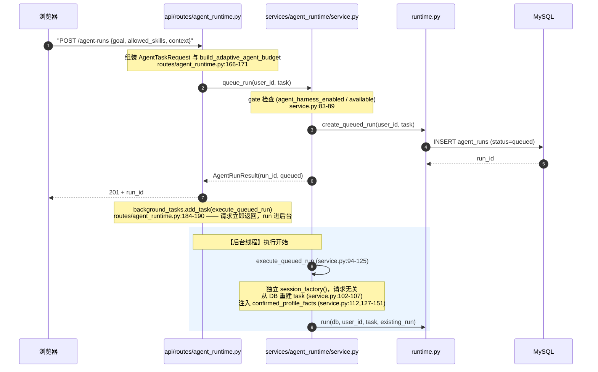
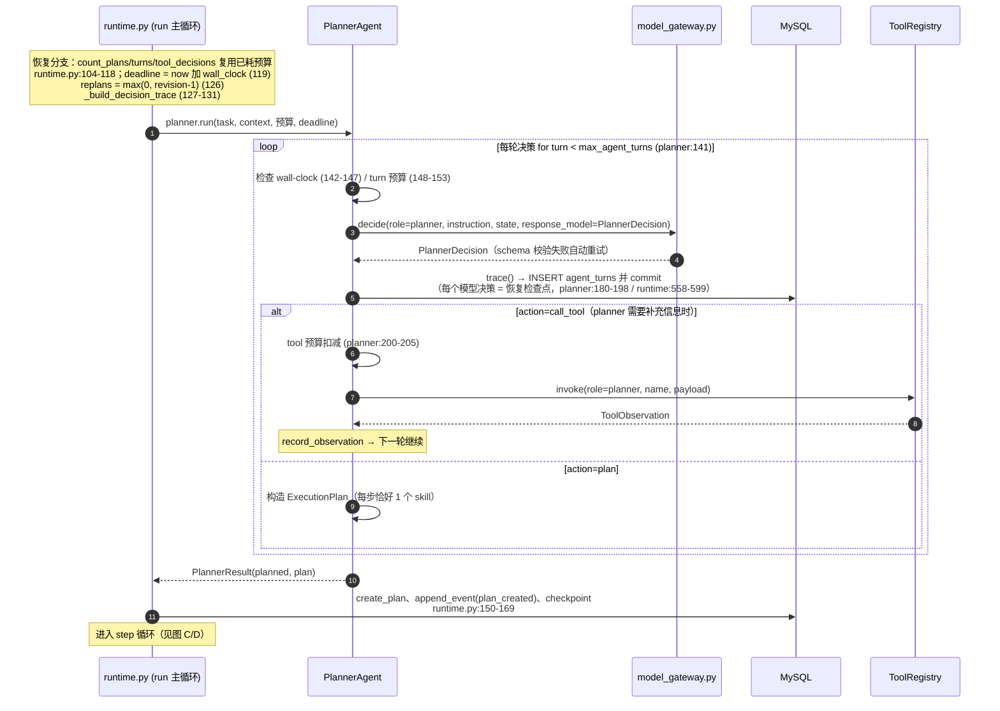
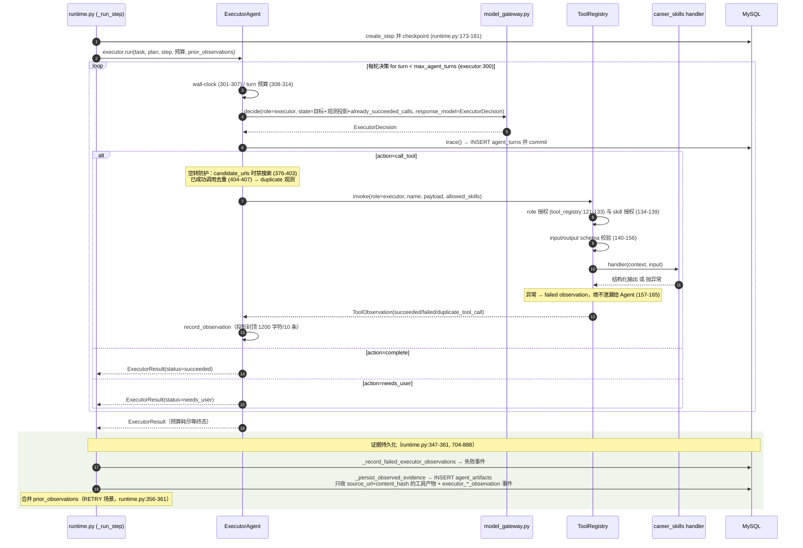
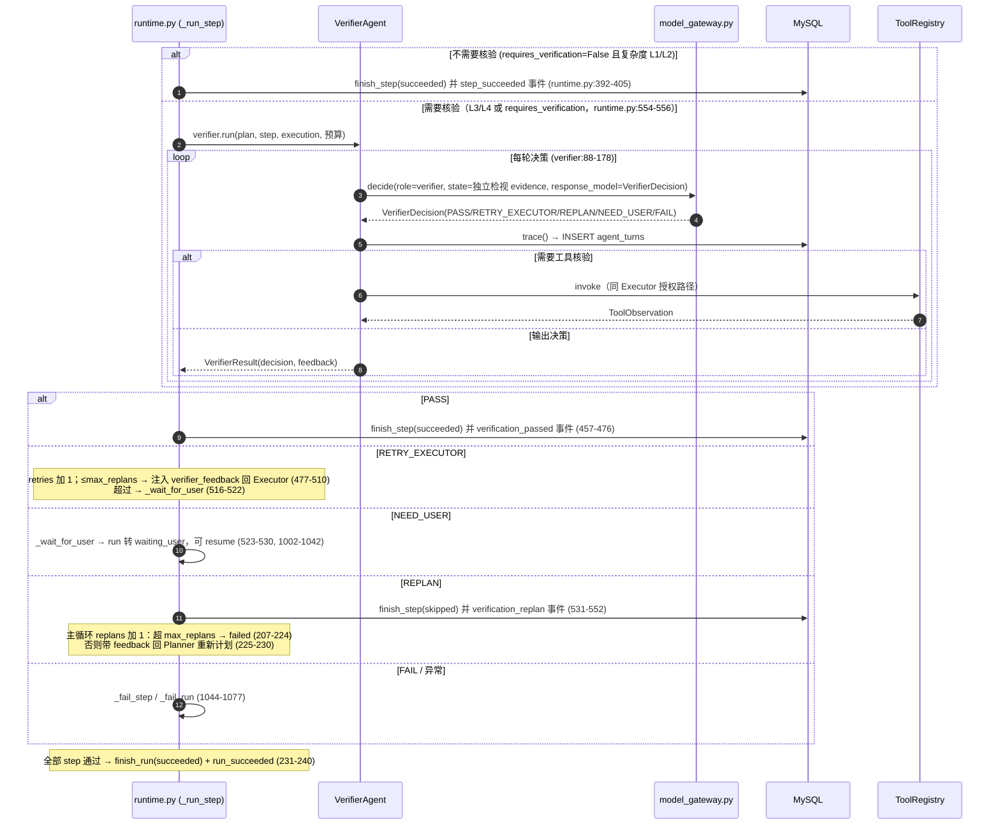
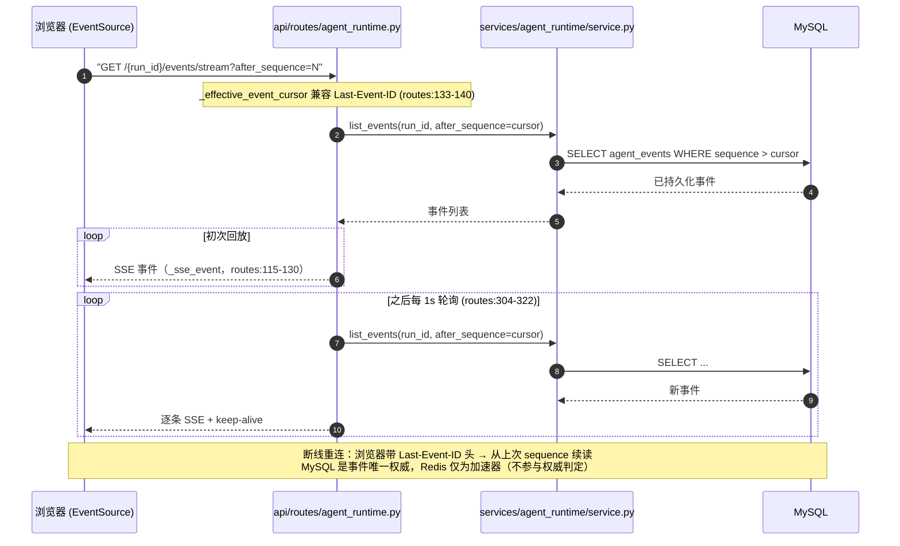

# Agent Runtime 完整调用链（时序图）

> 本文用 Mermaid 时序图绘制 `backend/app/services/agent_runtime/`（**自研 PEV Harness + DeepAgents Executor**）的完整调用链：API 请求 → Service → Runtime → 三个 Agent → 工具 → MySQL / SSE。
>
> - 架构总述见 [pev-agent-architecture.zh-CN.md](pev-agent-architecture.zh-CN.md)
> - 所有行号以 `master` 当前代码为准

## 0. 总体结构

```
浏览器(Vue)
   │  REST / SSE
   ▼
api/routes/agent_runtime.py        ← 解析请求、返回 JSON、开 SSE 流（不写 SQL、无业务逻辑）
   │
   ▼
services/agent_runtime/service.py  ← feature gate、所有权、注入已确认画像事实
   │
   ▼
services/agent_runtime/runtime.py  ← 主循环：planner → 逐步执行 → verifier → 路由（唯一调度者）
   │              │              │
   ▼              ▼              ▼
PlannerAgent   ExecutorAgent   VerifierAgent     ← 各自的 turn 循环（自主决策，语义都在这里）
   │              │              │
   └──────────────┼──────────────┘
                  ▼
      AgentModelGateway (model_gateway.py)        ← LLM 边界：schema-first + json_mode + 重试
                  │
                  ▼
        ToolRegistry (tool_registry.py)           ← role+skill 双授权、异常不泄漏
                  │
                  ▼
     career_skills/* 工具 handler（fetch/extract/match/…）
                  │
                  ▼
   repositories/agent_runtime.py ──► MySQL（Run/Plan/Step/Turn/Event/Artifact 唯一权威）
```

**三条硬规则贯穿全程**：
1. Agent 只做**决策**，harness（runtime）只做**编排**——工具序列从不被预计算；
2. 每个模型决策 = 一个 MySQL 检查点（`db.commit()`），崩溃后可恢复；
3. 只有工具产物（带 `source_url` + `content_hash`）能成为证据落库，模型提议的 URI 永不信任。

---

## 1. 图 A — 请求入口与后台调度（同步部分）



**要点**：run 记录先落库（`queued`）再返回 201，SSE 立刻有持久化目标；真正执行在 `BackgroundTasks` 的独立 session 里，不占 HTTP 线程。

---

## 2. 图 B — 主循环：Planner 阶段（runtime.py:132-169）



---

## 3. 图 C — Step 阶段：Executor 内部循环 + 工具调用



---

## 4. 图 D — Verifier 与五路路由（runtime.py:392-552）



**降级语义**（模型输出异常 ≠ 业务失败）：
| 触发点 | 处理 |
|---|---|
| Planner 输出非法 | `invalid_model_response` → `waiting_user`（[runtime.py:142-147](backend/app/services/agent_runtime/runtime.py#L142-L147)） |
| Executor 输出非法 | → `waiting_user`（[runtime.py:336-345](backend/app/services/agent_runtime/runtime.py#L336-L345)） |
| Verifier 输出非法 | 降级为 NEED_USER（[runtime.py:419-425](backend/app/services/agent_runtime/runtime.py#L419-L425)） |
| wall-clock 耗尽（任一 Agent 边界） | → `waiting_user`，resume 刷新时间窗（[runtime.py:370-383](backend/app/services/agent_runtime/runtime.py#L370-L383)） |
| 预算语义 | turn/tool/replan **不**重置，只有 wall-clock 窗口刷新（[runtime.py:104-126](backend/app/services/agent_runtime/runtime.py#L104-L126)） |

---

## 5. 图 E — SSE 消费（routes/agent_runtime.py:279-328）



---

## 6. 行号速查表

| 层 | 关键点 | 位置 |
|---|---|---|
| API 入口 | `create_agent_run`（组装 task+budget → queue → 后台执行） | [routes/agent_runtime.py:155-196](backend/app/api/routes/agent_runtime.py#L155-L196) |
| API 恢复 | `resume` / `recover`（waiting_user / running 中断恢复） | [routes/agent_runtime.py:199-276](backend/app/api/routes/agent_runtime.py#L199-L276) |
| API SSE | 轮询流 + 断线续传（1s 间隔） | [routes/agent_runtime.py:279-328](backend/app/api/routes/agent_runtime.py#L279-L328) |
| Service | `queue_run` gate + 建 run | [service.py:84-92](backend/app/services/agent_runtime/service.py#L84-L92) |
| Service | `execute_queued_run`（后台线程入口，独立 session） | [service.py:94-125](backend/app/services/agent_runtime/service.py#L94-L125) |
| Service | 注入已确认画像事实（private_context，不落库） | [service.py:127-151](backend/app/services/agent_runtime/service.py#L127-L151) |
| Runtime 主循环 | planner → plan 落库 → step 循环 → replan 预算 → succeeded | [runtime.py:132-240](backend/app/services/agent_runtime/runtime.py#L132-L240) |
| Runtime step | executor → 证据持久化 → verifier → 五路路由 | [runtime.py:302-552](backend/app/services/agent_runtime/runtime.py#L302-L552) |
| Runtime 证据 | 只持久化带 `source_url`+`content_hash` 的工具产物 | [runtime.py:704-888](backend/app/services/agent_runtime/runtime.py#L704-L888) |
| Runtime 上下文 | 证据预算 48k 字符（最新保持全文，旧证据折叠为指针） | [runtime.py:606-675](backend/app/services/agent_runtime/runtime.py#L606-L675) |
| Runtime 降级 | `_wait_for_user` / `_finish_planner_waiting` / `_fail_run` | [runtime.py:966-1077](backend/app/services/agent_runtime/runtime.py#L966-L1077) |
| Planner 循环 | turn 循环 → decide → trace →（可选工具）→ plan | [planner_agent.py:141-216](backend/app/services/agent_runtime/planner_agent.py#L141-L216) |
| Executor 循环 | turn 循环 → decide → trace → 去重/空转计数 → 工具 | [executor_agent.py:300-407](backend/app/services/agent_runtime/executor_agent.py#L300-L407) |
| Executor 空转上限 | `_MAX_CONSECUTIVE_STALLS=3` / `_MAX_TOTAL_WASTED_TURNS=3` | [executor_agent.py:189-224](backend/app/services/agent_runtime/executor_agent.py#L189-L224) |
| Verifier 循环 | turn 循环 → decide → trace →（可选工具）→ 决策 | [verifier_agent.py:88-178](backend/app/services/agent_runtime/verifier_agent.py#L88-L178) |
| 工具授权 | role/skill 双授权 + schema 校验 + 异常不泄漏 | [tool_registry.py:111-170](backend/app/services/agent_runtime/tool_registry.py#L111-L170) |
| LLM 边界 | schema-first + json_mode + 2 次重试 + 本地校验 | [model_gateway.py:38-68](backend/app/services/agent_runtime/model_gateway.py#L38-L68) |

---

## 7. 阅读建议

1. **入口**：先看 [图 A](#1-图-a--请求入口与后台调度同步部分) 掌握「请求立即返回、run 进后台」的模型，再看 [routes/agent_runtime.py:155-196](backend/app/api/routes/agent_runtime.py#L155-L196)；
2. **主循环**：[图 B](#2-图-b--主循环planner-阶段runtimepy132-169) + [runtime.py:132-240](backend/app/services/agent_runtime/runtime.py#L132-L240)——全部调度逻辑都在这个 while 循环里；
3. **最复杂的决策树**：[图 D](#4-图-d--verifier-与五路路由runtimepy392-552) + [runtime.py:302-552](backend/app/services/agent_runtime/runtime.py#L302-L552)——Executor 产出怎么被验证、怎么路由到 5 个终点；
4. **自主性所在**：三个 Agent 的 turn 循环结构完全同构（decide → trace → act），从 [executor_agent.py:300](backend/app/services/agent_runtime/executor_agent.py#L300) 读一遍即可类推其余两个；
5. **安全边界**：[tool_registry.py:111-170](backend/app/services/agent_runtime/tool_registry.py#L111-L170) 是任何工具调用的必经之路——授权、校验、异常隔离都在这里。
