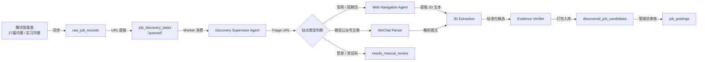

# Job Discovery Agent — 架构与工作流

> 本文档描述 Agent 是如何从腾讯智能表的两张 sheet 中读取招聘线索，创建发现任务，调用 Deep Agents 进行网页发现，以及为什么登录/验证码页面会导致 `needs_manual_review`。

---

## 1. 整体流程



## 2. 两个腾讯智能表来源

系统内置两个数据源，对应 `JobSourceProvider.TENCENT_SMARTSHEET`：

| 来源 Key | 说明 | 字段特点 |
|---|---|---|
| `tencent-27-referrals` | 27 届内推信息 | 企业名称 + 内推链接为主，无独立岗位名 |
| `tencent-intern-referrals` | 实习内推汇总 | 字段更完整，含岗位、投递链接、地点、招聘类型等 |

URL 提取由 `extract_discovery_urls()` 完成，按来源 Key 匹配不同字段规则（内推链接、官网、文章链接、投递链接）。

## 3. 什么是 Agent vs Tool / Skill

**Discovery Supervisor Agent** 是一个 `deepagents.create_deep_agent` 构建的 LangGraph 编译图：

- **Agent** = Discovery Supervisor，负责"思考"：根据输入 URL，决定下一步调哪个工具，循环直到产出结果。
- **Tool** = 确定性 Python 函数，Agent 通过 LLM 调用它们：`triage_link`、`run_web_navigation`、`parse_wechat_article`、`run_ocr`、`extract_jd_candidates`、`verify_evidence`、`package_candidates`、`finish_with_manual_review`。
- **SubAgent** = Web Navigation Agent，一个专门的子 Agent，有独立的 `open_url`、`read_dom`、`extract_links`、`click_link` 等工具，负责网页浏览。

Agent 与 Tool 的区别：Agent 做决策（调用哪个工具、何时终止）；Tool 做执行（幂等、可重入、无副作用）。

## 4. 任务生命周期

```
queued → running → succeeded
                  → partial_success
                  → needs_manual_review
                  → failed
```

定义在 `JobDiscoveryTaskStatus` 枚举中：

- `queued`: 任务等待 Worker 领取
- `running`: Worker 已领取，正在处理
- `succeeded`: 全部成功
- `partial_success`: 部分成功（部分 URL 不可达）
- `needs_manual_review`: 遇到验证码、登录墙或反爬
- `failed`: 连续失败超过 `max_attempts`（默认 3 次）

Worker 通过 `claim_next_task()` 领取任务，带 lease 机制防止并发冲突。

## 5. 为什么登录/验证码变成 `needs_manual_review`

Supervisor Agent 的 System Prompt 明确约束：

> "Do not bypass login, captcha, anti-bot, permission, or paywall barriers. If blocked by login, captcha, anti-bot, unavailable WeChat content, or permission limits, finish as needs_manual_review with a precise reason."

对应的 `DiscoveryBlockReason` 枚举：

- `login_required` — 需要登录
- `captcha` — 验证码拦截
- `anti_bot` — 反爬机制
- `wechat_unavailable` — 微信公众号内容不可访问
- `permission_denied` — 权限不足

Agent 通过 `finish_with_manual_review()` 工具返回 `needs_manual_review` 状态，Worker 调用 `mark_task_needs_manual_review()` 持久化。管理端看到"待人工审核"标记，可手动处理或重试。

## 6. 相似分组机制

`DiscoveredJobCandidate` 的 `similarity_group_key` 由 `build_similarity_group_key()` 生成，基于：

- `company` — 公司名称（归一化后）
- `title` — 岗位名称关键词
- `recruitment_type` — 招聘类型（全职/实习/校招）
- `source_family` — 来源系列

相同 key 的候选取 `pending_review` 状态出现在同一个审核分组中，`GET /admin/job-discovery/groups` 按 key 聚合返回。

## 7. 关键模型

| 模型 | 用途 |
|---|---|
| `JobDiscoveryTask` | 每个 URL 的发现任务，含状态、lease、重试 |
| `JobDiscoveryEvidence` | 发现的证据（页面截图、文本摘录等） |
| `DiscoveredJobCandidate` | 标准化后的候选岗位，待管理员审核 |
| `JobSource` | 数据源配置（智能表来源 Key、file_id、sheet_id） |
| `RawJobRecord` | 同步后的原始记录快照 |

---

## 8. PEV 灰度迁移与执行路径

第 1 节的流程描述的是 **Legacy PATH C**（Supervisor Agent，LLM-in-the-loop）。灰度迁移
引入三条带完整性证明的执行路径，Legacy PATH C 降级为"覆盖率未验证"的兼容兜底：

| 路径 | 含义 | 覆盖率 | 触发条件 |
|------|------|--------|----------|
| **PATH A** | 认证站点驱动 / adapter（`DomainAdapter`，如 Moka、飞书、汇川、小红书、阿里 SPA） | 已验证 | 匹配的 `JobDiscoveryStrategy` 带有 `adapter` 且 `enabled=True`、PEV 开启 |
| **PATH B** | 确定性执行器回放 `SnapshotPlan` + `CrawlPlan`（`SnapshotExecutor` / `CrawlExecutor`） | 已验证 | 匹配的策略带 `plan_yaml`、PEV 开启 |
| **PATH C** | `CrawlPlan` 生成 / 修复 Agent（planner） | 已验证 | 无策略匹配、PEV + planner 开启 |
| **Legacy PATH C** | Supervisor Agent | **未验证** | PEV 关闭、planner 不可用、或 adapter/执行器失败兜底 |

关键约束：

- **CoverageVerifier 是唯一的完成权威**：只有 `verify_coverage` 给出正向终止证据
  （`completion_evidence`）才算完成。Legacy Supervisor 无覆盖率，因此始终
  `coverage-unverified`。
- **Legacy 结果单列，不计入 PEV pass rate**。Worker summary 固定写入
  `execution_path`（`path_a_adapter` / `path_b_crawl_plan` / `legacy_path_c`）、
  `coverage_verified`（bool）、`coverage`（dict | None）、`legacy_fallback_reason`
  （str | None），供管理端 / 评估输出区分。
- **PEV PASS 定义**：`coverage_verified=true` 且 `coverage_complete=true` 且
  `failed_detail_count=0` 且 `candidate_count == unique_listing_count` 且
  `count_apply_url_is_listpage=0` 且正文覆盖率 100%（合法鉴权墙除外）。
- `enforce_result_invariants` 全局行为**不变**：仍只把 `succeeded`（无候选）转
  `failed`、`partial_success`（无候选）转 `needs_manual_review`。PEV 完整性由
  `run_post_crawl_pipeline -> verify_coverage` 强制，不靠全局 invariant。

### 灰度启用与回滚

四个站点 adapter 在 `scripts/seed_strategies.py` 中以 `enabled=False` 发布。满足**三次
连续 coverage-verified live smoke** 后，按 `GRAY_ROLLOUT_ORDER` 顺序逐站启用：

1. Moka → 2. 飞书 → 3. 汇川 → 4. 小红书

每次只把对应 `JobDiscoveryStrategy.enabled` 切为 `True`，其余站点仍走 legacy。单站出现
计数漂移 / 正向终止字段消失 / `failed_detail_count>0` / `count_apply_url_is_listpage>0` /
新出现 blocked marker / 三次计数不一致（`GRAY_ROLLBACK_TRIGGERS`）时，只禁用该站策略，
不删除新契约、不改全局 invariant、不影响已稳定站点。

### 相关文档

- [Job Discovery Operations](job-discovery-agent-operations.md) - 启动、配置、PEV flags、live smoke 命令
- [PEV Gray Migration Plan](../plan.md) Task 8 - 灰度发布与回滚完整步骤
- `backend/app/services/job_discovery/README.md` - 路径定义、flags、回滚规则速查

