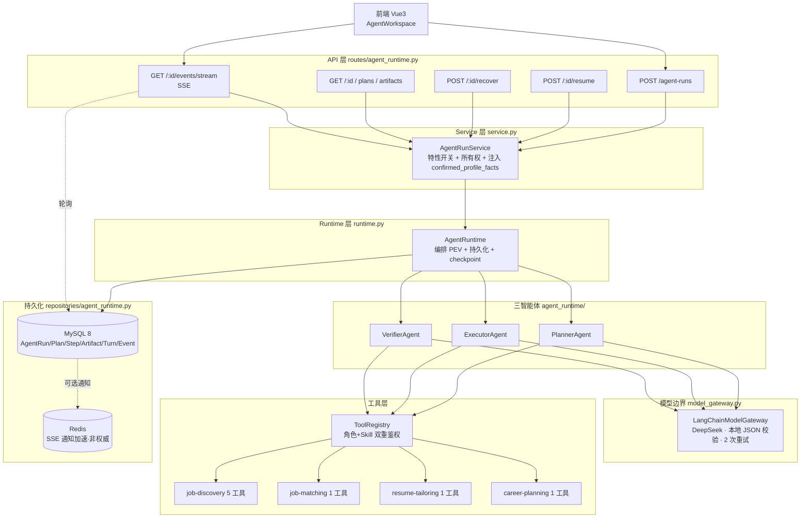
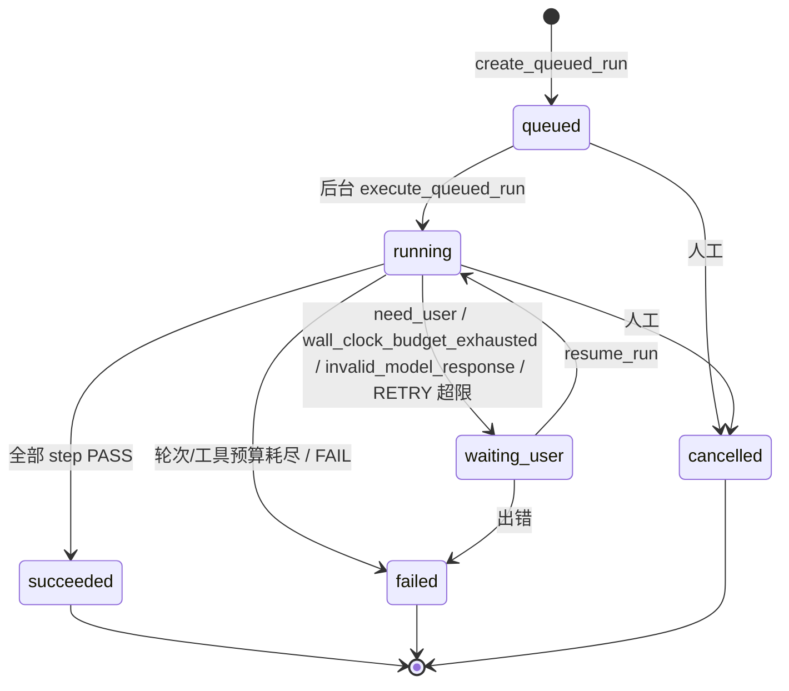
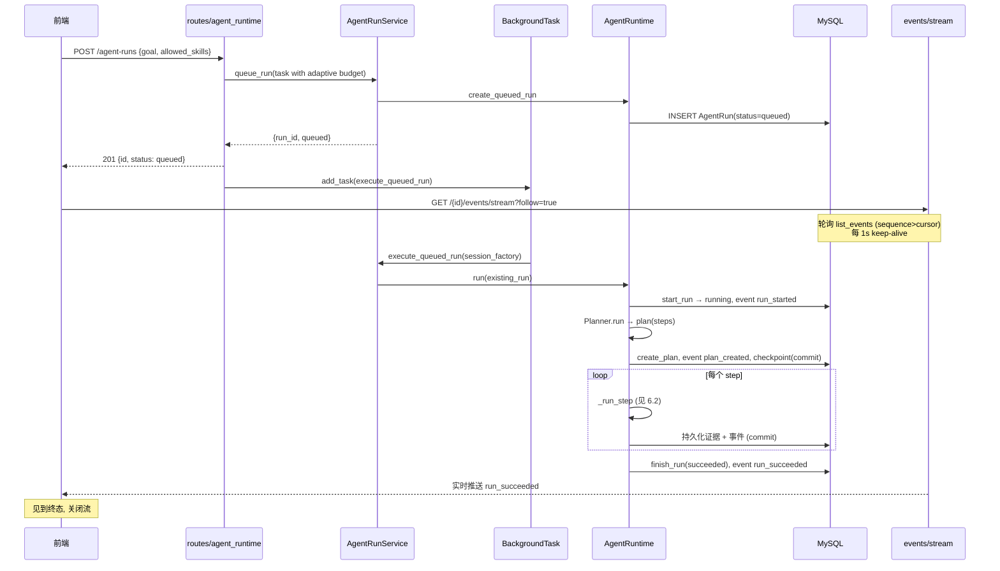
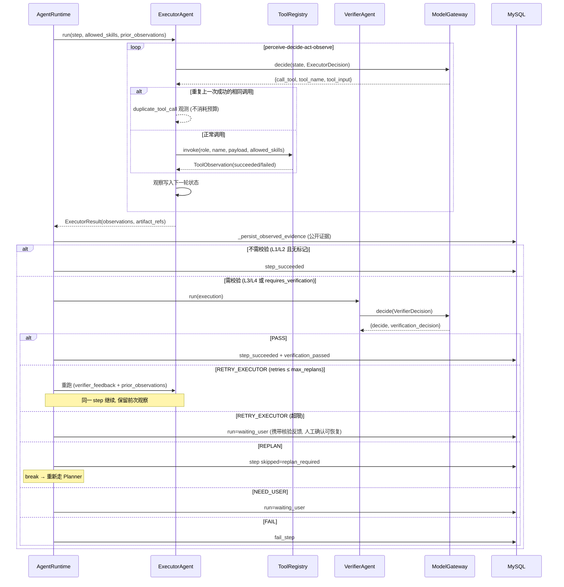
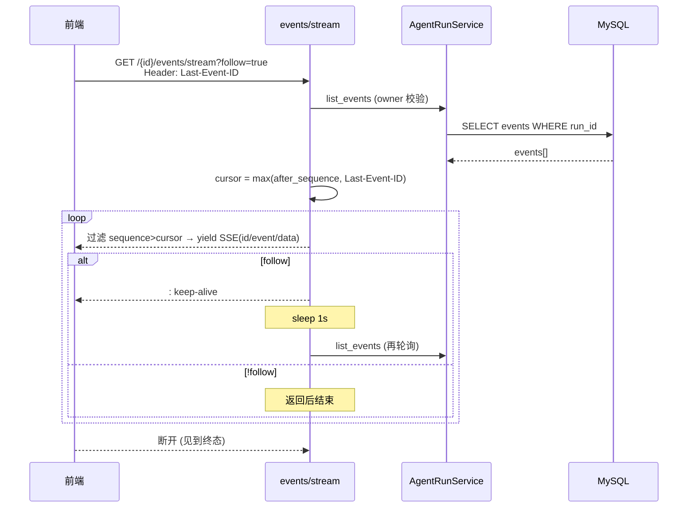
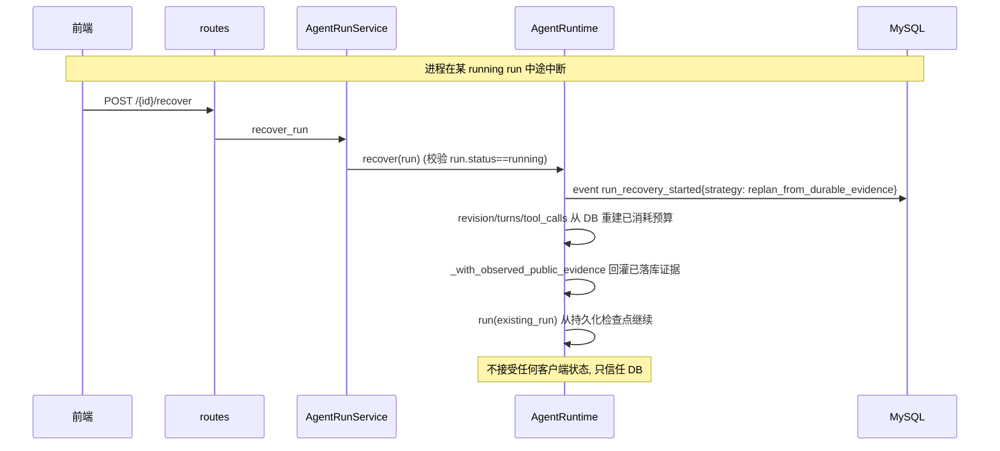
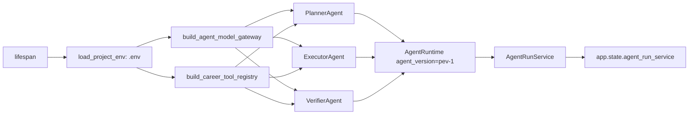

# 三智能体 PEV 架构与时序文档

> 适用范围：当前默认运行的 **自适应 Planner–Executor–Verifier（PEV）运行时**，位于 [backend/app/services/agent_runtime/](../../backend/app/services/agent_runtime/)，由 [backend/app/services/career_skills/](../../backend/app/services/career_skills/) 提供 4 个职业 Skill 工具。
>
> 本文描述的是「个人职业助手（Personal Career Assistant）」的当前活跃系统。仓库中同时保留的 Supervisor / Web Navigation Agent / Strategy Router / 旧 `src/` CLI demo 等属于历史回滚路径，不在本文范围内（见各 Skill 的 legacy-architecture 归档）。

---

## 1. 概述

三智能体系统由三个自治角色组成，围绕一个**确定性的生命周期宿主（harness）**协作：

| 角色 | 职责 | 决策动作 |
|------|------|----------|
| **Planner（规划器）** | 观察用户上下文与已有证据，产出**基于结果**的执行计划（`ExecutionPlan`），每一步绑定**单一 Skill 权限** | `call_tool` / `plan` / `need_user` |
| **Executor（执行器）** | 在单步权限内自主感知—决策—行动—观察，调用允许的工具产出证据 | `call_tool` / `complete` / `need_user` |
| **Verifier（校验器）** | **独立**审视证据与产物，不轻信执行器的声明，给出机器可读的下一步路由 | `call_tool` / `decide` |

核心设计取舍：**宿主只强制硬性的生命周期边界（预算、状态机、持久化、所有权），所有语义化的工具选择都由三个 Agent 自主决定。** 宿主不预编排工具调用序列，不替 Agent 选 Skill。

三个角色共享同一个 `LangChainModelGateway`（DeepSeek，OpenAI 兼容）与同一个 `ToolRegistry`，但在每一轮只能看到当前权限内的工具目录。

---

## 2. 系统结构图

### 2.1 分层总览



### 2.2 模块清单（`backend/app/services/agent_runtime/`）

| 文件 | 作用 |
|------|------|
| [runtime.py](../../backend/app/services/agent_runtime/runtime.py) | `AgentRuntime`：编排 Planner→Executor→Verifier，持久化、checkpoint、证据投影、重试/重规划 |
| [planner_agent.py](../../backend/app/services/agent_runtime/planner_agent.py) | `PlannerAgent`：感知上下文→产出 `ExecutionPlan`，每步绑定单一 Skill |
| [executor_agent.py](../../backend/app/services/agent_runtime/executor_agent.py) | `ExecutorAgent`：单步感知—决策—行动—观察循环；含**连续重复调用去重** |
| [verifier_agent.py](../../backend/app/services/agent_runtime/verifier_agent.py) | `VerifierAgent`：独立审视证据，返回 PASS/RETRY/REPLAN/NEED_USER/FAIL |
| [model_gateway.py](../../backend/app/services/agent_runtime/model_gateway.py) | `LangChainModelGateway`：schema 优先；本地 JSON 校验回退；`invalid_model_response` 边界 |
| [tool_registry.py](../../backend/app/services/agent_runtime/tool_registry.py) | `ToolRegistry`：只执行已注册、角色授权、schema 合法的工具，异常转为 `ToolObservation` |
| [tool_context.py](../../backend/app/services/agent_runtime/tool_context.py) | `ToolContext`：工具收到的最小权限（`user_id`、`run_id`、已脱敏 metadata） |
| [tool_budget.py](../../backend/app/services/agent_runtime/tool_budget.py) | `ToolCallBudget`：跨三角色共享的工具调用硬上限 |
| [turn_budget.py](../../backend/app/services/agent_runtime/turn_budget.py) | `AgentTurnBudget`：每角色的轮次上限 |
| [tracing.py](../../backend/app/services/agent_runtime/tracing.py) | `DecisionTrace`：每轮决策摘要落库，作为恢复检查点 |
| [schemas.py](../../backend/app/services/agent_runtime/schemas.py) | Pydantic 决策/观察模型与校验（`extra="forbid"`） |
| [provider_config.py](../../backend/app/services/agent_runtime/provider_config.py) | 仅从环境读取 `DEEPSEEK_API_KEY` / `OPENAI_BASE_URL` |
| [service.py](../../backend/app/services/agent_runtime/service.py) | `AgentRunService`：特性门禁 + 所有权 + 注入 confirmed profile facts |

---

## 3. 三智能体职责与决策 Schema

### 3.1 Planner

感知用户 `goal`、`allowed_skills`、上下文与已确认简历事实字段，产出 `ExecutionPlan`。关键约束（见 `_PLANNER_INSTRUCTION`）：

- 把多交付请求**分解为每项交付一个独立 step**，且每个 step 的 `allowed_skills` **只含单一 Skill**（因为 Executor 只能看到当前 step 权限内的工具；混合多 Skill 会让某个交付的工具对 Executor 不可见，导致交付永不产出）。
- 已确认的简历事实字段已存在于服务端，**不应再让用户上传同一份简历**，直接规划 matching/tailoring 工作。
- 缺少用户提供的 URL 不算「缺失上下文」——Executor 可安全地先搜索公开页再抓证据。

```python
PlannerDecision: action ∈ {call_tool, plan, need_user}
  plan ⇒ complexity + success_criteria + steps[]
ExecutorPlan.validate_plan_authority: step.allowed_skills ⊆ task.allowed_skills
```

### 3.2 Executor

单步内的 `perceive → decide → act → observe` 循环（`max_agent_turns` 上界）。三条动作分支：

- `call_tool`：在当前 step 的 `allowed_skills` 内调用工具；观察结果写入下一轮决策状态。
- `complete`：声明本步完成，附 `summary` 与 `artifact_refs`（但产物是否被采纳由 Verifier 决定）。
- `need_user`：信息不足，向用户提问，run 进入 `waiting_user`。

**连续重复调用去重（关键健壮性机制）**：若上一次工具调用**成功**后，Executor 再次发起**完全相同**的 `call_tool`，宿主直接返回 `duplicate_tool_call` 观测且**不消耗工具预算**；若上一次调用**失败**，则视为合法重试（瞬态故障可重试）。这防止了「对同一批岗位反复 extract」式抖动，避免校验器状态膨胀到模型无法稳定返回合法 JSON 的程度。

### 3.3 Verifier

独立审视 `execution.observations` 与 `artifact_refs`，**不把执行器的声明当作证据**。对于承诺了「排序推荐 / 最佳待遇 / 最佳匹配」的结果，未见到 `match-observed-jobs` 观测不得 PASS；承诺简历修改须有 `build-resume-tailoring-brief`；承诺准备计划须有 `build-preparation-plan`。

```python
VerifierDecision: action ∈ {call_tool, decide}
  decide ⇒ verification_decision ∈ {PASS, RETRY_EXECUTOR, REPLAN, NEED_USER, FAIL}
  非 PASS 必须带 feedback
```

---

## 4. 四个职业 Skill 与工具

工具在 [career_skills/registry.py](../../backend/app/services/career_skills/registry.py) 中向 `ToolRegistry` 注册，每个工具声明 `skill_name` 与 `allowed_roles`。`tool_catalog(role, allowed_skills)` 只向当前角色暴露其权限内的工具。

| Skill | 工具 | 允许角色 | 说明 |
|-------|------|----------|------|
| job-discovery | `fetch-public-job-pages` | executor, verifier | 批量抓取用户给出的有限官方 URL，返回可追溯正文或失败原因 |
| | `fetch-public-job-page` | executor, verifier | 抓取单页并生成带来源/哈希的证据 |
| | `search-public-job-pages` | executor | 仅在用户未给候选 URL 时搜索公开页 |
| | `extract-observed-job-details(-batch)` | executor, verifier | 把已观察页面证据规范化为详细 JD；**不接受模型生成的正文** |
| job-matching | `match-observed-jobs` | executor, verifier | 按已确认能力/地点/可验证待遇做透明排序；推荐任务必须调用 |
| resume-tailoring | `build-resume-tailoring-brief` | executor, verifier | 基于已确认简历事实与单个 JD 生成**不可虚构**的修改建议 |
| career-planning | `build-preparation-plan` | executor, verifier | 基于单个 JD 生成带截止日期与复盘点的面试准备计划 |

Skill 元数据见 [manifest.py](../../backend/app/services/career_skills/manifest.py)（`requires_evidence` / `supports_user_data`）。

---

## 5. 持久化与生命周期

### 5.1 数据模型（`backend/app/db/models.py`）

| 表 | 说明 |
|----|------|
| `AgentRun` | 一次用户级运行：goal、allowed_skills、context_summary、budget、状态、final_summary |
| `AgentPlan` | Planner 产出的计划**修订**（revision）；plan_json |
| `AgentStep` | 计划中的一步：sequence、objective、allowed_skills、状态 |
| `AgentArtifact` | 工具产出的不可变证据/结果：artifact_type、source_url、content_hash、content_json |
| `AgentTurn` | 每轮模型决策摘要（角色 + turn_index + decision_json），作为恢复检查点 |
| `AgentEvent` | 追加型进度事件流（sequence、event_type、payload_json），SSE 的来源 |

**MySQL 是唯一权威**；Redis 仅作 SSE 通知加速，重启后轮询仍以 MySQL 为准。

### 5.2 状态机

**RunStatus**（`queued → running → {waiting_user, succeeded, failed, cancelled}`）：



**StepStatus**：`planned → running → succeeded | failed | skipped`（skipped 伴随 `replan_required`）。

**VerificationDecision**：`PASS | RETRY_EXECUTOR | REPLAN | NEED_USER | FAIL`。

### 5.3 证据流转

- `_persist_observed_evidence`：只持久化**工具产出**的公开证据（`public_job_page`、`job_search_results`、`structured_job_details`），**从不**接受模型自报的 URI。
- `_with_observed_public_evidence`：在 Planner 起始、每步之间、重试与恢复时，把已落库的 `visible_text` 证据（48k 字符预算）回灌进后续 Agent 轮次。
- Skill 产物（`job_matching_report` / `resume_tailoring_brief` / `career_preparation_plan`）以独立 artifact_type 持久化。

---

## 6. 时序图

### 6.1 完整运行：API → 排队 → 后台执行 → SSE



**要点**：HTTP 请求只负责「排队 + 返回 SSE 地址」即返回；真正的 PEV 运行在 `BackgroundTasks` 里用独立 session 执行。SSE 通过**轮询 MySQL 事件表**取数，断线重连用 `Last-Event-ID` 作为游标。

### 6.2 单步：执行 → 校验 → 重试/重规划



**要点**：`RETRY_EXECUTOR` 在**同一 step 内**继续（保留前次观察，仅补做缺失的交付）；`REPLAN` 则**跳出 step 循环**回到 Planner（受 `max_replans` 上限，超出则 `replan_budget_exhausted`）。

### 6.3 SSE 事件流



**要点**：`_sse_event` 把 `event_type` 清洗为 `[A-Za-z0-9_-]`；`_effective_event_cursor` 优先用持久化的 `Last-Event-ID` 重连游标。Redis 宕机不影响——轮询始终走 MySQL。

### 6.4 断点恢复（recover）



**要点**：`recover` 只接受服务端已知的 `running` run，**从不接受客户端状态**；恢复策略是「从持久化证据重规划」，已落库的 `AgentTurn` 决策作为检查点。

---

## 7. 启动装配（lifespan）

[main.py](../../backend/app/main.py) 的 `lifespan` 在应用生命周期内**只构造一次**生产 PEV 运行时：



- 三角色共享**同一个** gateway 与 tool registry 实例。
- 若 `agent_harness_enabled=false` 或缺少 `DEEPSEEK_API_KEY`：runtime=`None`，API 返回 503 `agent_harness_unavailable`/`agent_harness_disabled`，而非崩溃。
- 模型网关：DeepSeek `deepseek-v4*` 时 `temperature=0`、`extra_body={"thinking":{"type":"disabled"}}`，走官方 `json_mode` 结构化输出（`prefer_local_json_validation=False`；识别依据是**模型名**而非 base_url，`OPENAI_BASE_URL` 覆盖不得改变它）。降级链：结构化输出失败 → 回退本地 JSON 校验 + 1 次重试 → 再失败抛 `invalid_model_response`。

---

## 8. 关键设计约束

1. **Skill 权限单步单 Skill**：Planner 每个 step 只能绑定一个 Skill；Executor 只看到当前 step 权限内的工具。`ExecutionPlan.validate_plan_authority` 强制 `step.allowed_skills ⊆ task.allowed_skills`。
2. **工具只接受证据，不接受模型自报**：`_persist_observed_evidence` 只持久化工具产出（带 `source_url` + `content_hash` + `visible_text`/`candidates`），模型自报的 URI 永不落库。
3. **预算硬上限**：`AgentBudget`（轮次/工具调用/重规划/墙钟）、`ToolCallBudget`、`AgentTurnBudget` 由宿主强制，Agent 无法绕过。`build_adaptive_agent_budget` 按 Skill 数量自适应放大轮次上限。**墙钟（wall-clock）是软可恢复信号**：`wall_clock_budget_exhausted` 在三个 Agent 边界（Planner/Executor/Verifier）均降级为可恢复的 `waiting_user`（而非终态 `failed`），因为这只是传输/资源暂停——`resume()` 重新计算 `deadline = time.monotonic() + max_wall_clock_seconds` 即可继续。轮次/工具预算是**与延迟无关的工作权限**，resume 时从 DB 重建 `used` 计数，**不重置**（只有时钟窗口刷新）。相比之下，`agent_turn_budget_exhausted` 与 `tool_budget_exhausted` 仍为终态 `failed`（工作权限耗尽不可恢复）。
4. **工具异常不外泄**：`ToolRegistry.invoke` 把任何 handler 异常转为 `ToolObservation(status=failed, error_code=...)`，未知工具/角色越权/输入输出不合法都有稳定 error_code。
5. **所有权隔离**：所有 `get/list` 都先做 owner 校验（`get_run_for_owner`），跨用户不可见。
6. **MySQL 权威**：SSE、Redis 都非权威；恢复只信任 DB。
7. **校验器独立性**：校验器可调用 `verifier` 角色的工具独立取证，不轻信执行器声明；承诺类交付（推荐/简历/计划）必须有对应工具观测。

---

## 9. 安全红线（在该系统中的体现）

| 红线 | 体现 |
|------|------|
| 永不自动点击最终提交 | PEV 运行时无 `task:submit` 作用域；产物止于「可审阅建议」，由人最终确认 |
| 永不绕过登录/验证码/反爬 | 抓取工具遇阻返回明确失败 → run 标记 `needs_manual_review`，从不尝试绕过 |
| 学生接口仅返回 verified | 职业助手产物为「自动发现/建议自行确认」卡片，与 verified-only 的 `/api/jobs` 解耦 |
| 永不向仓库/日志/argv 写密钥 | gateway 仅从环境读 `DEEPSEEK_API_KEY`；日志只含摘要/哈希/判定，不含简历原文 |
| Redis 非权威 | MySQL 为业务状态唯一权威，Redis 仅 SSE 加速 |
| 任务动作需 task lease | （GUI Agent 侧；PEV 运行时不持有 task lease） |
| 职位评审需 version 校验 | （JobPosting 评审侧；discovery 候选 approve/reject 为独立 pre-review 流程，不使用 version 字段） |

---

## 10. 验收与可复现

- **后端覆盖**：`tests/unit/` 全量 100% 分支覆盖（`fail_under=100`）。
- **前端覆盖**：`frontend/` Vitest 100%（语句/分支/函数/行）。
- **端到端 NL 验收**：`tests/integration/test_pev_live_end_to_end.py`（`RUN_LIVE_PEV_E2E=1` + `LIVE_RESUME_PDF`），断言 `RunStatus.succeeded` 且 4 类产物齐全：`public_job_page` / `job_matching_report` / `resume_tailoring_brief` / `career_preparation_plan`。
- 简历 PDF 仅在本地受控测试中**内存读取**，从不拷入仓库、不提交/打印/上传原文；验收记录只含摘要/哈希/判定。
