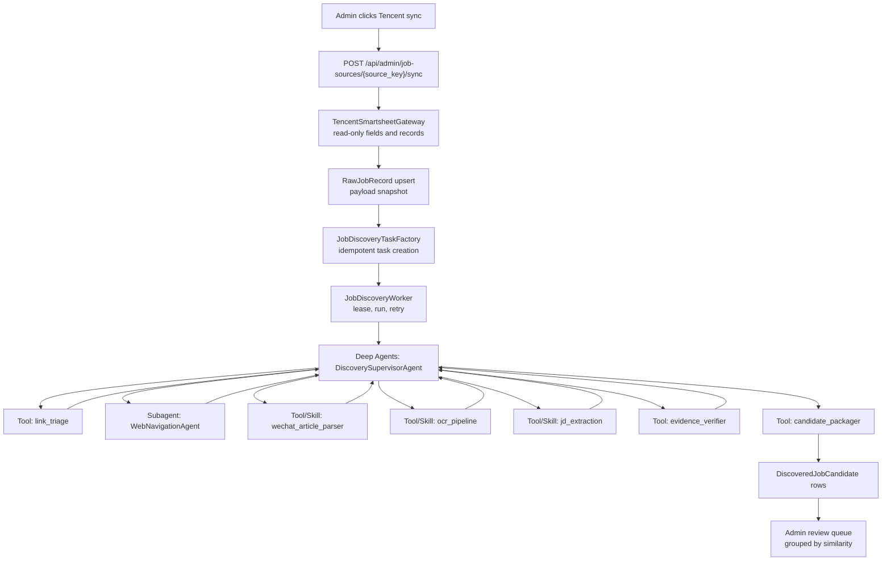

# Job Discovery Agent Implementation Plan

> **For agentic workers:** REQUIRED SUB-SKILL: Use `superpowers:subagent-driven-development` for parallel implementation, or `superpowers:executing-plans` for inline implementation. Execute one task at a time, update each checkbox, and stop for review after each major phase.

## Goal

Implement an asynchronous Job Discovery Agent after the backend read-only Tencent smart sheet sync. The Agent opens company, career-site, normal web, and WeChat article URLs; discovers JD evidence; extracts or OCRs job text; normalizes jobs; and writes candidates into an admin review queue. The sync button must be idempotent, repeated clicks must not create duplicate tasks or duplicate candidates, and similar jobs from the two smart sheets must be grouped for administrator choice instead of auto-merged.

## Answer: Can We Use LangChain Deep Agents?

Yes. Use LangChain's `deepagents` package for the Agent harness, not for the whole workflow.

Deep Agents is a good fit for:

- `DiscoverySupervisorAgent`: an LLM-in-the-loop controller that plans, observes, calls tools, verifies evidence, replans, and terminates.
- `WebNavigationAgent`: a delegated subagent that autonomously uses browser tools to find career pages, job lists, and JD detail pages.
- Long-running context management: Deep Agents has built-in planning, subagents, tool use, and virtual filesystem/context features, and it is built on LangGraph.

Deep Agents should not own:

- Tencent smart sheet read-only sync.
- Database transactions.
- Task idempotency.
- Task leasing and retry.
- Admin review status transitions.
- Similarity grouping and final duplicate decisions.

Those must stay deterministic in FastAPI, SQLAlchemy, Alembic, repositories, and worker code.

Important dependency note: on 2026-07-18, local `pip index versions deepagents` against the configured Tsinghua PyPI mirror returned no matching distribution. The implementation must first verify installation from the official PyPI index. If the package is unavailable from the configured mirror, pin the official GitHub package by commit SHA in `requirements.txt` and document the pin in this plan's execution notes.

## Target Architecture



## Data Model

Add deterministic persistence first so Agent retries are safe.

### New Enums

Add to `backend/app/db/models.py`:

- `JobDiscoveryTaskStatus`: `queued`, `running`, `partial_success`, `succeeded`, `needs_manual_review`, `failed`, `cancelled`.
- `DiscoveredJobCandidateStatus`: `pending_review`, `approved`, `rejected`, `merged`, `needs_manual_review`.
- `DiscoveryBlockReason`: `login_required`, `captcha`, `anti_bot`, `wechat_unavailable`, `permission_denied`, `invalid_url`, `timeout`, `budget_exceeded`, `parse_failed`, `unknown`.

### New Tables

Add Alembic migration under `alembic/versions/`.

`job_discovery_tasks`:

- `id`
- `source_id`
- `raw_record_id`
- `external_record_id`
- `source_key`
- `source_url`
- `url_hash`
- `payload_hash`
- `idempotency_key`
- `agent_version`
- `status`
- `block_reason`
- `attempt_count`
- `max_attempts`
- `lease_owner`
- `lease_expires_at`
- `started_at`
- `finished_at`
- `last_error`
- `budget_json`
- `result_summary_json`
- `created_at`
- `updated_at`

Constraints:

- Unique: `(source_id, external_record_id, url_hash, payload_hash, agent_version)`.
- Unique: `idempotency_key`.
- Index: `(status, lease_expires_at, created_at)`.
- Index: `(raw_record_id)`.

`job_discovery_evidence`:

- `id`
- `task_id`
- `evidence_type`: `page_text`, `screenshot`, `wechat_text`, `wechat_image`, `ocr_text`, `email_instruction`, `browser_trace`
- `url`
- `title`
- `content_hash`
- `text_excerpt`
- `storage_uri`
- `metadata_json`
- `created_at`

Constraints:

- Unique: `(task_id, evidence_type, content_hash)`.
- Index: `(task_id, created_at)`.

`discovered_job_candidates`:

- `id`
- `task_id`
- `source_id`
- `raw_record_id`
- `external_record_id`
- `idempotency_key`
- `similarity_group_key`
- `status`
- `title`
- `company_name`
- `department`
- `description_text`
- `responsibilities`
- `requirements`
- `locations_json`
- `recruitment_types_json`
- `industries_json`
- `apply_url`
- `application_channel_json`
- `deadline_text`
- `referral_code`
- `confidence`
- `evidence_refs_json`
- `normalization_warnings_json`
- `created_at`
- `updated_at`

Constraints:

- Unique: `idempotency_key`.
- Index: `(status, similarity_group_key, created_at)`.
- Index: `(source_id, external_record_id)`.

## Implementation Tasks

### Phase 1: Dependency and Configuration

- [ ] Verify `deepagents` installation source.
  - Run `python -m pip install --index-url https://pypi.org/simple deepagents --dry-run` if supported.
  - If unavailable on PyPI, install from official `langchain-ai/deepagents` GitHub repo by pinned commit SHA.
  - Update `requirements.txt` with either `deepagents==<verified-version>` or `deepagents @ git+https://github.com/langchain-ai/deepagents.git@<sha>`.
- [ ] Add browser and OCR dependencies only as needed:
  - `playwright` for headless browser automation.
  - `pillow` for image slicing.
  - Prefer PaddleOCR only if installation succeeds on Windows; otherwise make OCR provider pluggable and default to `needs_manual_review` when OCR is unavailable.
- [ ] Extend `backend/app/config.py` settings:
  - `JOB_DISCOVERY_ENABLED`
  - `JOB_DISCOVERY_AGENT_VERSION`
  - `JOB_DISCOVERY_MODEL`
  - `JOB_DISCOVERY_MAX_PAGES_PER_TASK`
  - `JOB_DISCOVERY_MAX_CANDIDATES_PER_TASK`
  - `JOB_DISCOVERY_TASK_TIMEOUT_SECONDS`
  - `JOB_DISCOVERY_BROWSER_HEADLESS`
  - `JOB_DISCOVERY_OCR_ENABLED`
- [ ] Add config tests in `tests/unit/test_config.py`.

### Phase 2: Persistence and Repositories

- [ ] Add enums and ORM models to `backend/app/db/models.py`.
- [ ] Add Alembic migration for the three new tables and constraints.
- [ ] Add repository functions in `backend/app/repositories/job_discovery.py`:
  - `create_or_get_task(...)`
  - `claim_next_task(worker_id, lease_seconds)`
  - `mark_task_running(...)`
  - `mark_task_succeeded(...)`
  - `mark_task_partial_success(...)`
  - `mark_task_needs_manual_review(...)`
  - `mark_task_failed(...)`
  - `upsert_evidence(...)`
  - `upsert_candidate(...)`
  - `list_review_groups(...)`
- [ ] Add unit tests for idempotent task creation:
  - Same source, record, URL, payload hash, and agent version returns existing task.
  - Repeated sync runs do not create duplicate tasks.
  - Candidate upsert deduplicates by candidate idempotency key.
  - Task leases prevent two workers from claiming the same task.

### Phase 3: Task Creation After Tencent Sync

- [ ] Add URL extraction helpers to `backend/app/services/job_mappers.py`.
  - `tencent-27-referrals`: extract URL from fields like referral link, official site, article link, or raw URL text.
  - `tencent-intern-referrals`: extract URL from delivery/apply link fields.
  - Preserve the existing deterministic mapper behavior for records that already have complete structured fields.
- [ ] Add `JobDiscoveryTaskFactory` in `backend/app/services/job_discovery/tasks.py`.
  - Normalize URLs.
  - Hash normalized URLs.
  - Compute task idempotency key from `source_id`, `external_record_id`, normalized URL hash, `payload_hash`, and `agent_version`.
  - Create queued tasks only when `JOB_DISCOVERY_ENABLED=true`.
- [ ] Hook the factory into `backend/app/services/job_sync.py` immediately after `RawJobRecord` upsert.
- [ ] Extend the sync response with discovery task counts:
  - `discovery_tasks_created`
  - `discovery_tasks_existing`
  - `discovery_tasks_skipped`
- [ ] Add backend route/schema tests for sync response compatibility.

### Phase 4: Deterministic Tools and Skills

- [ ] Create package `backend/app/services/job_discovery/`.
- [ ] Add shared DTOs in `backend/app/services/job_discovery/schemas.py`:
  - `DiscoveryTaskInput`
  - `TriageResult`
  - `PageEvidence`
  - `WechatArticleResult`
  - `OcrResult`
  - `NormalizedJobCandidate`
  - `DiscoveryRunResult`
- [ ] Implement `tools/link_triage.py`.
  - Detect official site, career site, job detail, WeChat article, email-only, blocked, invalid.
  - Return recommended next action and confidence.
- [ ] Implement `tools/wechat_article_parser.py`.
  - Extract title, text, image URLs, email delivery instructions.
  - Return `needs_manual_review` for inaccessible WeChat pages, login requirements, or non-public content.
- [ ] Implement `tools/ocr_pipeline.py`.
  - Inspect image dimensions.
  - Slice long images with overlap.
  - OCR each slice.
  - Merge text by reading order.
  - Return confidence and warnings.
- [ ] Implement `tools/jd_extraction.py`.
  - Use structured output schema.
  - Extract title, company, responsibilities, requirements, locations, job type, apply method, deadline, and evidence links.
  - Treat email delivery instructions as `application_channel_json` with `gui_eligible=false`.
- [ ] Implement `tools/evidence_verifier.py`.
  - Reject candidates without title/company or without supporting evidence.
  - Flag stale, vague, or non-JD text.
- [ ] Implement `tools/candidate_packager.py`.
  - Build candidate idempotency key from normalized company, title, location, apply URL/email, and evidence hash.
  - Build `similarity_group_key` from canonical company, canonical title, recruitment type, and source family.
- [ ] Add focused unit tests for each tool using local HTML/text/image fixtures.

### Phase 5: Deep Agents Harness

- [ ] Create `backend/app/services/job_discovery/deepagents_runner.py`.
- [ ] Implement `build_discovery_supervisor_agent(settings, tools)` using `create_deep_agent`.
  - Provide model from current project LLM settings.
  - Provide deterministic tools only through wrappers.
  - Provide `response_format=DiscoveryRunResult` or an equivalent Pydantic schema if supported by installed `deepagents`.
  - Provide explicit system prompt: never bypass login, captcha, anti-bot, or permission barriers; mark `needs_manual_review` instead.
- [ ] Define `WebNavigationAgent` as a Deep Agents subagent.
  - Tools: `open_url`, `read_dom`, `extract_links`, `click_link`, `get_visible_text`, `screenshot`, `go_back`.
  - Enforce page budget and domain safety in tool code, not prompt only.
  - Return evidence pages and discovery path, not final database writes.
- [ ] Define supervisor tools:
  - `triage_link`
  - `run_web_navigation`
  - `parse_wechat_article`
  - `run_ocr`
  - `extract_jd_candidates`
  - `verify_evidence`
  - `package_candidates`
  - `finish_with_manual_review`
- [ ] Add integration tests with mocked tool responses:
  - Official homepage -> WebNavigationAgent -> two JD candidates.
  - WeChat text article -> extracted email application channel.
  - WeChat image article -> OCR -> extracted candidate.
  - Captcha/login page -> `needs_manual_review`.
  - Budget exceeded -> `partial_success` or `needs_manual_review`.

### Phase 6: Worker

- [ ] Create `backend/app/services/job_discovery/worker.py`.
  - Poll queued tasks.
  - Claim with lease.
  - Build `DiscoveryTaskInput`.
  - Run `DiscoverySupervisorAgent`.
  - Persist evidence and candidates in one controlled transaction.
  - Mark final task status.
- [ ] Create `scripts/run_job_discovery_worker.py`.
- [ ] Add PowerShell entry point or update existing startup script so local dev can launch:
  - Backend API.
  - Frontend dev server.
  - Job discovery worker when `JOB_DISCOVERY_ENABLED=true`.
- [ ] Add worker tests:
  - Successful task persists candidates.
  - Manual-review task persists block reason.
  - Worker crash leaves task claim recoverable after lease expiry.

### Phase 7: Admin API and Review UI

- [ ] Add admin API schemas:
  - `JobDiscoveryTaskResponse`
  - `DiscoveredJobCandidateResponse`
  - `JobDiscoveryReviewGroupResponse`
  - `JobDiscoveryRetryRequest`
- [ ] Add admin routes:
  - `GET /api/admin/job-discovery/tasks`
  - `GET /api/admin/job-discovery/groups`
  - `POST /api/admin/job-discovery/tasks/{task_id}/retry`
  - `POST /api/admin/job-discovery/candidates/{candidate_id}/approve`
  - `POST /api/admin/job-discovery/candidates/{candidate_id}/reject`
- [ ] On approve, create or update `JobPosting` as `pending_review` or directly reuse the existing review transition depending on current review service contract.
- [ ] Update `frontend/src/features/jobs/AdminJobReview.vue` or add a sibling component for discovery groups.
  - Show source smart sheet.
  - Show task status and block reason.
  - Show evidence links/excerpts.
  - Show similar candidates in one group.
  - Let admin approve one, reject duplicates, or mark manual review.
- [ ] Add frontend tests for:
  - Discovery groups render.
  - Similar candidates are grouped.
  - Retry button is not shown for running tasks.
  - Approve/reject calls correct APIs.

### Phase 8: End-to-End Browser Verification

- [ ] Prepare local fixtures:
  - `tests/fixtures/job_discovery/company_homepage.html`
  - `tests/fixtures/job_discovery/career_list.html`
  - `tests/fixtures/job_discovery/job_detail.html`
  - `tests/fixtures/job_discovery/wechat_text.html`
  - `tests/fixtures/job_discovery/wechat_image.html`
  - `tests/fixtures/job_discovery/captcha.html`
- [ ] Add Playwright E2E coverage:
  - Admin logs in.
  - Admin clicks Tencent sync.
  - Duplicate clicks do not create duplicate tasks.
  - Worker completes fixture task.
  - Admin review queue shows discovered candidates.
  - Similar candidates from both smart sheets appear in one group.
  - Captcha/login URL appears as `needs_manual_review`.
- [ ] Run browser testing against the real local dev server after unit and integration tests pass.

### Phase 9: Documentation and Operational Notes

- [ ] Update or create docs in `docs/`:
  - `job-discovery-agent-workflow.md`
  - `job-discovery-agent-operations.md`
  - `functional-verification-summary-2026-07-18.md`
- [ ] Document:
  - How the two Tencent smart sheets are read.
  - How tasks are created idempotently.
  - How Deep Agents is used.
  - What is an Agent versus a tool/skill.
  - Why login/captcha/anti-bot states become `needs_manual_review`.
  - How similar candidates are grouped for admin decision.
  - How to start backend, frontend, and discovery worker.

## System Prompts

### Discovery Supervisor Agent Prompt

```text
You are the Discovery Supervisor Agent for a campus career assistant.

Goal:
Given a Tencent smart sheet raw record and one source URL, discover job JD evidence, extract standard job candidates, verify evidence, and return a structured result.

Rules:
- Use tools in a loop. Decide the next action from observations.
- Do not bypass login, captcha, anti-bot, permission, or paywall barriers.
- If blocked by login, captcha, anti-bot, unavailable WeChat content, or permission limits, finish as needs_manual_review with a precise reason.
- Do not write to the database. Return structured evidence and candidates only.
- Respect all budgets enforced by tools.
- Prefer evidence from official company, official career site, public WeChat article, or direct recruitment page.
- Email application instructions are valid application channels. Extract email, subject hint, materials, and original instruction.
- If information is insufficient, ask tools for more evidence or finish as needs_manual_review.
- Never invent company, title, location, deadline, or apply method.
```

### Web Navigation Agent Prompt

```text
You are the Web Navigation Agent.

Goal:
Starting from a public URL, find credible job list pages and JD detail pages.

Allowed actions:
- Open pages.
- Read visible text and DOM links.
- Follow navigation links likely related to Careers, Jobs, Join Us, Campus Recruitment, Internships, Recruiting, or Chinese equivalents.
- Capture evidence screenshots and page text.

Rules:
- Stay within the tool-enforced page budget.
- Do not attempt login.
- Do not solve captcha or anti-bot challenges.
- Return discovered JD evidence pages and discovery path.
- Do not extract final standardized jobs; the supervisor will call extraction tools.
```

## Verification Commands

Run after implementation:

```powershell
python -m pytest tests/unit/test_config.py tests/unit/test_tencent_smartsheet.py
python -m pytest tests/unit/test_job_discovery_*.py
python -m pytest tests/integration/test_job_discovery_*.py
npm --prefix frontend test -- --run
npm --prefix frontend run build
python scripts/run_job_discovery_worker.py --once
```

Then run browser verification against local dev:

```powershell
.\start_project.ps1
```

Use the browser tool to verify the admin sync, idempotency, discovery queue, review grouping, approve/reject, and manual-review states.

## Risk Controls

- The LLM Agent cannot call repositories or write to the database directly.
- Browser tools enforce page/time/domain budgets in code.
- Worker lease prevents concurrent duplicate processing.
- Task and candidate unique keys make repeated admin sync clicks safe.
- Blocked pages are never bypassed; they become `needs_manual_review`.
- Similar jobs are grouped but not automatically merged.
- Agent version is included in idempotency so future extraction changes can be re-run deliberately.

## Self-Review

- The plan preserves the user's required Agent definition: the supervisor and web navigation components are LLM loops that autonomously choose tools.
- Components that are not autonomous loops are explicitly tools or skills.
- Deep Agents is used where it adds planning, subagents, tool use, and context handling.
- Deterministic concerns remain outside the Agent harness.
- The sync button idempotency problem is addressed at both task and candidate levels.
- Manual review is the only outcome for login, captcha, anti-bot, permission, or unreachable WeChat pages.
- Email-only WeChat job posts are supported as standard application channels.
- Browser testing is included after backend and frontend implementation.
