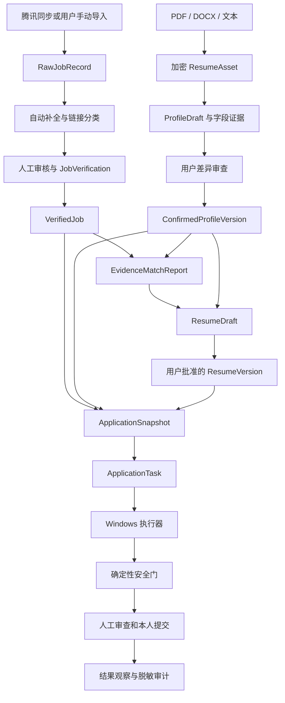

# 校招职业助手 MVP 并行交付与依赖设计

## 0. 文档信息

| 项目 | 内容 |
| --- | --- |
| 日期 | 2026-07-16 |
| 状态 | 总体方案已确认，等待书面规格复核 |
| 目标 | 从当前平台基础推进到完整 MVP，并明确可并行模块、共享契约、阻塞项和集成门禁 |
| 适用团队 | 2–4 名开发者，以及测试、运维和真实网站验收人员 |
| 上游设计 | `2026-07-14-campus-recruitment-career-assistant-design.md` |
| 当前基线 | `platform-foundation-handover-summary.md` 与当前仓库代码 |

## 1. 目标与范围

本设计不重复规划已经交付的平台基础和腾讯智能表只读同步，而是组织剩余 MVP 工作，使职位、档案、分析和本地执行器能够并行建设，并通过明确的共享契约逐步汇合成真实业务闭环。

剩余 MVP 包含五个工作包：

1. 职位补全、审核、手动导入、去重和核验。
2. 结构化人才档案、证据、版本、动态字段和简历资产。
3. 证据化匹配、定制简历、用户批准和不可变投递快照。
4. 云端投递协调、Windows 本地执行器和大疆 Moka 纵向闭环。
5. 小鹏、科大讯飞适配、生产验收、安全测试和灰度。

本设计只确定跨工作包边界、依赖和交付顺序。每个工作包在实施前仍应形成独立的详细实施计划，避免由一个计划同时修改全部子系统。

## 2. 不在本轮范围内

- 自动点击最终提交按钮。
- 批量海投、高并发网站自动化或云端浏览器。
- 绕过验证码、反自动化检测或网站风险控制。
- 公众号图片 OCR、二维码自动解析和扫码代投。
- macOS、多浏览器和移动端执行器。
- 将本地敏感字段同步到云端。
- 在后续业务代码中重做已经完成的认证、Redis checkpoint、加密对象存储、设备配对和腾讯只读同步。

## 3. 当前基线

### 3.1 已完成并作为稳定依赖复用

- MySQL 权威业务数据、Alembic migration 和事务边界。
- Redis 8 checkpoint、限流、配对码和短期 task lease。
- AES-256-GCM 加密的 S3/MinIO 对象存储适配层。
- 学生和管理员认证、会话所有权和管理员创建流程。
- ApplicationTask 权威状态机、actor 权限矩阵和脱敏事件。
- 设备配对、凭据轮换、撤销、heartbeat 和在线状态。
- 两个内置腾讯智能表来源的固定端点只读同步。
- 原始职位快照、分页同步、部分成功、来源映射和 `pending_completion` 查询。
- Docker Compose、Nginx、健康检查和现有自动化测试框架。

### 3.2 现有业务断点

- `JobPostingStatus` 只有 `pending_completion`，无法表达补全、审核、核验、失效和拒绝。
- 分析入口仍从 `data/jobs.json` 加载演示职位，没有消费 MySQL 中的已核验职位。
- LangGraph 仍以非结构化 `resume_text` 为主输入，低分回路会覆盖当前简历文本。
- 没有 Profile、ProfileFieldEvidence、ResumeAsset、ResumeVersion 和 ApplicationSnapshot 的权威实现。
- ApplicationTask 的 `target_job_id` 和 `snapshot_id` 尚未形成完整外键闭环。
- 设备基础 API 已有，但没有完整的任务创建、派发、进度、人工确认和结果上报协议。
- Web 前端仍是单体分析工作台，没有职位、档案、设备和投递任务功能路由。
- 真实职位路由与遗留演示职位路由存在路径重叠，需要在职位工作包中消除。

## 4. 交付策略决策

采用“共享契约先行、三条主线并行、大疆纵向闭环集成”的组织方式。

在第 0 阶段冻结领域实体、API DTO、事件、隐私边界和执行器通信协议。随后并行推进：

- 职位主线：从 `pending_completion` 到已核验职位。
- 档案与分析主线：从简历资产到已确认档案、证据化匹配和投递快照。
- 执行器主线：从模拟任务和模拟招聘页面到可恢复的安全填表引擎。

三条主线不通过共享数据库内部结构相互调用，只通过版本化服务接口、API DTO、不可变快照和脱敏事件汇合。

不采用完全串行方案，因为执行器和真实网站风险会暴露过晚。不采用站点优先方案，因为临时档案和临时任务协议会绕过已经明确的事实确认、快照和隐私边界。

## 5. 全局不变量

以下规则对所有工作包生效：

1. MySQL 是职位、档案、版本、投递快照、任务和审计的唯一业务权威来源。
2. Redis 丢失不得改变任务业务状态、恢复已经取消的任务或造成重复投递。
3. 模型输出只能生成草稿、建议或结构化候选结果，不能直接确认职位、修改主档案或执行浏览器副作用。
4. 只有已核验职位和已确认档案可以进入可信匹配与投递快照。
5. 自动填表和附件上传只能使用用户已批准的不可变投递快照。
6. 敏感字段明文只能存在于 Windows 本地保险库，Web、MySQL、Redis、日志和模型输入不得持有这些明文。
7. 本地执行器永远不获得 `task:submit` scope，也不得模拟最终提交操作。
8. LLM 只能提出字段或动作建议；独立的确定性安全门决定是否允许页面动作。
9. 登录、验证码、风险提示、未知按钮语义和结果不明都必须停机或转人工，不能通过重试绕过。
10. 新增 Executor API 必须同时验证长期设备凭据、task lease、task 绑定和具体 scope。

## 6. 模块边界

| 模块 | 单一职责 | 主要输入 | 稳定输出 | 直接依赖 | 并行属性 |
| --- | --- | --- | --- | --- | --- |
| 职位补全与核验 | 将来源线索变成可解释、可审核、可失效的具体职位 | RawJobRecord、用户链接或 JD | VerifiedJob、来源链、核验记录 | 平台基础、职位契约 | 可与档案和执行器并行 |
| 档案与简历资产 | 将上传文件转成可校对、可版本化的事实档案 | PDF、DOCX、文本、用户修订 | ConfirmedProfileVersion、证据、资产引用 | 对象存储、档案契约 | 可与职位和执行器并行 |
| 匹配分析 | 基于已核验职位和已确认事实生成可追溯建议 | VerifiedJobSnapshot、ConfirmedProfileVersion | EvidenceMatchReport | 职位核验、档案确认 | 实现可用 fixture 并行，集成受两者阻塞 |
| 定制简历 | 仅基于已确认事实生成差异草稿和附件 | MatchReport、ConfirmedProfileVersion | ResumeDraft、ApprovedResumeVersion | 档案、匹配 | 受档案确认阻塞 |
| 投递快照 | 冻结一次投递使用的职位、档案、答案和附件 | 已核验职位、已批准简历、动态答案 | ApplicationSnapshot | 职位、档案、定制简历 | 受三者阻塞 |
| 投递协调器 | 创建、派发和推进任务权威状态 | ApplicationSnapshot、Device | ApplicationTask、脱敏事件、task lease | 快照、设备基础 | 可先使用 fixture snapshot 开发 |
| 执行器核心 | 在专用 Chrome 中观察、填写、回读和恢复 | 脱敏任务、非敏感快照、本地敏感值 | 脱敏进度、安全事件和结果 | 执行器协议 | 可基于模拟服务独立并行 |
| 站点适配器 | 将通用执行器能力映射到具体招聘系统 | 页面结构、通用字段动作 | 站点配置、页面指纹、控件策略 | 执行器核心 | 核心引擎稳定后可按站点并行 |
| Web 工作台 | 提供职位、档案、匹配、设备和任务交互 | 版本化 HTTP API | 用户确认、审核和可视化状态 | 各域 API 契约 | API 契约冻结后按功能并行 |

## 7. 共享领域契约

### 7.1 职位生命周期

职位权威状态统一为：

- `pending_completion`：同步或手动导入成功，但信息不完整。
- `pending_review`：已自动补全，但存在需人工确认的内容。
- `verified`：公司归属、具体职位、JD 和投递入口已核验。
- `expired`：截止日期、官网状态或人工判断表明职位已失效。
- `rejected`：来源错误、归属错误、内容不合规或无法形成可信职位。

扫码和邮箱直投可以成为 `verified` 人工渠道，但必须标记 `gui_eligible=false`。只有 `verified` 且 `gui_eligible=true` 的职位可以创建 GUI 投递快照。

补全结果和人工修改不能覆盖 RawJobRecord。JobVerification 保存策略版本、核验人、核验时间、核验依据和稳定错误码。一个职位允许关联多个 JobSourceLink。

### 7.2 档案与事实确认

解析器输出 `ProfileDraft`，其中每个字段都带：

- 字段语义和结构化值。
- 来源 ResumeAsset 和原文证据位置。
- 解析器或模型版本。
- 置信度。
- `unconfirmed`、`confirmed`、`rejected` 或 `conflicted` 状态。

ProfileDraft 不能直接覆盖主档案。用户完成差异审查后创建新的不可变 ConfirmedProfileVersion。后续匹配和定制简历必须通过明确的 `profile_version_id` 读取事实。

敏感字段只在云端保存语义键、是否配置、适用范围、最后更新时间和不可逆本地引用，不保存明文。

### 7.3 匹配报告

EvidenceMatchReport 至少固定：

- `job_snapshot_id` 和 `profile_version_id`。
- 硬性条件及其满足、缺失或未知结论。
- 引用的 profile evidence ID。
- 优势、缺口、不确定项和风险。
- 0–100 分数及评分规则版本。
- 投递优先级和建议。
- 模型、提示和输出 schema 版本。

缺失信息必须使用 `unknown`，不能自动按不满足处理。分析失败不改变职位、档案或任务状态。

### 7.4 定制简历与投递快照

ResumeDraft 中的每项修改必须引用已确认事实，只允许排序、措辞、摘要和内容取舍。用户批准后生成新的 ApprovedResumeVersion 和 PDF/DOCX 附件。

ApplicationSnapshot 创建后不可修改，至少冻结：

- job posting 和核验版本。
- confirmed profile version。
- approved resume version 和附件对象引用。
- 已确认动态字段答案。
- 云端非敏感字段值与本地敏感字段引用。
- 创建者、创建时间和 schema version。

用户修改任何输入后必须创建新快照，旧快照保留审计但不能被新任务使用。

### 7.5 投递任务状态和进度

保留当前已实现并经过安全测试的 ApplicationTask 权威状态，不直接替换为产品设计中的细粒度页面状态：

- `created`
- `waiting_for_device`
- `dispatched`
- `running`
- `waiting_for_human`
- `ready_for_review`
- `observing_user_submission`
- `submitted_success`
- `submitted_failed`
- `result_unknown`
- `failed`
- `cancelled`

产品设计中的 `PRECHECK`、`NAVIGATING`、`FILLING` 和 `SAVING_PAGE` 作为 `progress_phase`、当前页信息和 ApplicationEvent 表达，不扩张高层业务状态。这样可以保留现有 actor 权限矩阵，同时让 UI 显示更细的执行进度。

### 7.6 执行器通信协议

首版执行器采用 Python、Playwright、Windows DPAPI 或 Credential Manager、本地 Vue 审查界面和签名安装包。

云端只下发：

- task ID、snapshot ID 和允许访问的招聘域名。
- 具体职位 URL。
- 非敏感字段和敏感字段语义需求。
- 已批准附件的短期受控下载能力。
- site adapter ID、版本和熔断状态。

执行器只回传：

- progress phase、页面序号和页面指纹。
- 字段语义、填写策略、回读是否一致和置信等级。
- 缺失项、默认值、低置信度项和安全门拒绝。
- 人工接管、取消、失败和提交结果分类。

执行器不得回传 Cookie、验证码、密码、完整 DOM、完整截图或完整表单值。诊断材料默认保存在本地，只有用户明确同意后才能脱敏上传。

## 8. 端到端数据流

## 9. 并行交付波次

### 波次 0：共享契约和开发边界，3–5 个工作日

必须完成：

- 确认第 7 节实体、状态、ID、版本和 DTO。
- 确认 migration 顺序与跨模块外键归属。
- 确认任务进度事件、task lease scope 和错误码命名。
- 确认执行器进程边界、本地保险库和专用 Chrome 目录。
- 建立模拟招聘站、脱敏任务 fixture 和契约测试骨架。
- 将前端按职位、档案、分析、设备、投递和管理员功能规划路由及 API 类型。

门禁：契约测试和 schema 检查通过后，三条主线才能进入并行开发。

### 波次 1：三条基础主线，第 1–2 周

职位主线：

- 增加完整职位状态、来源链和核验记录。
- 实现补全草稿、人工编辑、确认、拒绝和失效。
- 实现手动链接/JD 导入及统一去重。
- 提供学生职位中心和管理员审核 API。

档案主线：

- 增加 ResumeAsset、Profile、证据和版本模型。
- 实现 PDF、DOCX 和文本解析适配器。
- 实现差异、冲突和用户确认 API。
- 实现普通字段云端存储与敏感字段引用协议。

执行器主线：

- 建立 Windows 执行器项目结构、签名构建边界和配置加载。
- 实现专用 Chrome、设备认证、本地保险库和 heartbeat。
- 使用模拟任务实现页面观察、控件识别、填写、回读和本地检查点。

三个主线互不等待，只消费波次 0 的共享契约。

### 波次 2：分析、快照和协调，第 3–4 周

- 将 LangGraph 输入改为已核验职位快照和已确认档案版本。
- 所有模型节点使用结构化 schema，并保留模型和提示版本。
- 删除覆盖主档案的低分优化行为，改为生成 ResumeDraft。
- 实现证据化匹配、差异审查和 ApprovedResumeVersion。
- 实现不可变 ApplicationSnapshot 和附件生成。
- 实现任务创建、设备选择、派发、领取、进度、人工确认、取消和结果 API。
- 实现执行器确定性动作安全门和模拟页面红队测试。

集成阻塞：真实匹配需要至少一个 verified job 和一个 ConfirmedProfileVersion；真实任务需要 ApprovedResumeVersion 和 ApplicationSnapshot。

### 波次 3：大疆 Moka 纵向闭环，第 5–7 周

- 使用真实大疆授权账号完成登录和人工接管流程。
- 实现 Moka 页面拓扑、常用控件、重复经历组件和附件上传适配。
- 实现单页停止、多页安全中间保存和末页停止。
- 实现缺失字段、网站默认值、低置信度项和异常汇总。
- 实现浏览器侧边审查、跳转高亮、用户取消和结果观察。
- 验证网络中断、Chrome 重启、页面变化和任务恢复不会重复添加经历。

硬门禁：最终提交和歧义组合按钮自动点击次数必须为 0，才能扩大站点范围。

### 波次 4：多站适配，第 8–9 周

在大疆安全门通过后并行开发：

- 小鹏飞书招聘适配。
- 科大讯飞 zhiye.com 适配。
- SiteAdapter 配置版本、历史页面回归和错误率熔断。
- 跨网站字段语义、页面指纹和恢复策略回归。

小红书和汇川技术仍为 Beta，不得影响 P0 核心网站验收。

### 波次 5：生产验收与灰度，第 10–12 周

- 重跑 MySQL、Redis、MinIO、Nginx 代理链和腾讯真实只读门禁。
- 完成学生、管理员、设备和 task lease 越权测试。
- 完成日志、模型输入、诊断上传和前端响应的隐私测试。
- 核心网站各完成至少 30 次授权完整任务，覆盖至少 10 份测试档案。
- 完成 5–10 名真实试点用户的单站逐批灰度。
- 验证发布指标并记录计算口径和样本。

## 10. 阻塞项与解除条件

| 阻塞项 | 阻塞范围 | 解除条件 | 可提前并行的工作 |
| --- | --- | --- | --- |
| 共享领域契约未冻结 | 全部工作包 | DTO、状态、事件、ID 和 migration 顺序通过评审 | 模拟页面和历史样本整理 |
| 职位未核验 | 真实匹配、快照和 GUI 任务 | 至少一个职位进入 `verified` 且来源链完整 | 匹配 fixture 和 UI 开发 |
| 档案未确认 | 真实匹配、定制简历和快照 | 产生 ConfirmedProfileVersion | 解析器和匹配 fixture 开发 |
| 执行器通信协议未冻结 | 云端协调和本地执行器集成 | task DTO、事件和 lease scope 契约测试通过 | 页面观察器和安全门单元测试 |
| 快照未批准 | 真实 ApplicationTask | ApplicationSnapshot 不可变且附件已批准 | 任务状态机 API 使用 fixture 测试 |
| 大疆安全门未通过 | 小鹏、科大讯飞和灰度 | 自动最终提交为 0，歧义按钮为 0，恢复不重复 | 只读页面样本分析 |
| 授权账号和页面样本不足 | 真实网站验收 | 测试账号、档案和脱敏历史样本准备完成 | 模拟页面回归 |
| 真实依赖门禁未重跑 | 生产发布 | 当前 HEAD 的全部 opt-in 门禁通过 | 默认环境单元和契约测试 |

## 11. 异常与恢复设计

### 11.1 职位

- 自动补全失败保留原始记录和稳定错误码，不自动拒绝职位。
- 来源结构变化暂停该来源自动发布，不影响其他来源和已核验职位。
- 部分同步成功不能批量下线未读取记录。
- 去重不确定时创建待审核候选关系，不执行不可逆合并。

### 11.2 档案与模型

- 无文本、格式不支持或结构冲突时保留加密原文件和失败原因。
- 解析和结构化模型最多自动重试一次，仍失败则保留草稿并转人工。
- 模型输出无法通过 schema 验证时不得写入已确认版本。
- 匹配失败不阻止用户查看职位或手动准备材料。
- 定制简历失败不得创建投递快照，也不得修改主档案。

### 11.3 投递协调

- 状态更新和 ApplicationEvent 必须在同一 MySQL 事务中完成。
- 使用 `state_version` 防止并发覆盖。
- Redis 或设备在线状态丢失不能改变任务权威状态。
- 取消由 HUMAN 独占；取消后 Executor 的进度和结果上报必须被拒绝。
- 结果未知保持 `result_unknown`，不得自动再次提交。

### 11.4 本地执行器

- 登录、验证码、账号风险提示和人机验证立即进入人工等待。
- 页面结构变化时重新识别或进入审查，不盲目续跑。
- 网络或进程中断后校验 task、snapshot、URL、adapter version 和页面指纹。
- 点击、添加经历和中间保存等副作用结果不明时不得自动重试。
- 中间保存失败停留当前页，不推进下一页。
- 单页、末页、未知页面和组合按钮全部进入人工审查。

## 12. 测试与验证策略

### 12.1 每个工作包的最低测试层级

- 领域单元测试：状态、校验、去重、版本、隐私过滤和安全门。
- Repository 集成测试：MySQL 事务、行锁、JSON 查询、唯一约束和 migration 往返。
- API 契约测试：认证、所有权、分页、稳定错误码和字段白名单。
- 安全测试：越权、日志泄漏、task lease、敏感字段和最终动作拒绝。
- 前端构建及关键交互测试。

### 12.2 执行器三层测试

1. 模拟页面：覆盖控件、单页/多页、默认值、缺失字段、组合按钮和断线。
2. 历史页面回归：重放脱敏 DOM/无障碍树和页面指纹。
3. 真实网站验收：仅使用授权账号，停在最终人工审查或由真实用户本人提交。

### 12.3 发布门槛

- 已知字段填写正确率至少 98%。
- 符合自动化条件的任务到达审查状态比例至少 95%。
- 缺失字段与网站默认值上报率 100%。
- 具备可恢复现场的任务恢复成功率至少 95%。
- 最终提交和歧义组合按钮自动点击次数为 0。
- 达到错误阈值的站点适配熔断率 100%。

## 13. 前端与代码组织原则

- 不继续把新能力集中到 `frontend/src/App.vue`。
- 前端按 `jobs`、`profiles`、`matching`、`devices`、`applications` 和 `admin` 功能域组织页面、组件、类型和 API 客户端。
- 后端 schema 从路由文件迁移到对应业务域，避免真实职位 API 和遗留分析 API 使用不同的 Job DTO。
- LangGraph 只保留需要模型推理和循环编排的分析流程；职位核验、档案确认、任务状态和动作安全门使用确定性服务。
- 文件解析器、模型调用、对象存储和站点适配器都通过 Protocol 或明确接口注入，便于 fixture、模拟实现和独立测试。

## 14. 人员与周期建议

### 3–4 名开发者

- 开发者 A：职位补全、审核、手动 JD 和管理员后台。
- 开发者 B：档案、简历资产、匹配和投递快照。
- 开发者 C：Windows 执行器、模拟页面和大疆适配。
- 开发者 D：Web 工作台、协调 API、契约测试和跨模块集成。

预计 10–12 周，包括真实网站验收和小规模灰度。

### 2 名开发者

- 一人负责云端职位、档案、分析和协调。
- 一人负责前端、执行器、模拟站和网站适配。
- 两人在契约、快照、安全门和大疆集成处共同评审。

预计 12–16 周。不能通过省略事实确认、投递快照或最终提交安全门压缩周期。

## 15. 后续独立实施计划

本设计通过书面复核后，按以下顺序编写独立实施计划：

1. 共享领域契约与职位补全审核纵向切片。
2. 人才档案与简历生命周期。
3. 证据化匹配、定制简历和投递快照。
4. 云端任务协调与 Windows 执行器核心。
5. 大疆 Moka 纵向闭环。
6. 多站适配、生产验收和灰度。

计划 1 和计划 2 在共享契约任务完成后可以同时执行；计划 4 的执行器模拟部分也可同步启动。计划 3 的真实集成依赖计划 1 和计划 2，计划 5 依赖计划 3 和计划 4，计划 6 依赖计划 5 的安全门验收。

## 16. 本设计完成标准

本设计只有在以下内容被确认后才能进入详细实施计划：

1. 接受共享契约先行、三条主线并行的组织方式。
2. 接受保留现有 ApplicationTask 高层状态，并用 progress phase 表达页面细节。
3. 接受 Python、Playwright、Windows DPAPI/Credential Manager 和本地 Vue 审查界面的执行器基线。
4. 接受 verified job、ConfirmedProfileVersion、ApprovedResumeVersion 和 ApplicationSnapshot 的逐级阻塞关系。
5. 接受大疆安全门先于小鹏和科大讯飞扩站。
6. 接受每个工作包单独形成实施计划，不用一个超大计划同时修改所有子系统。
