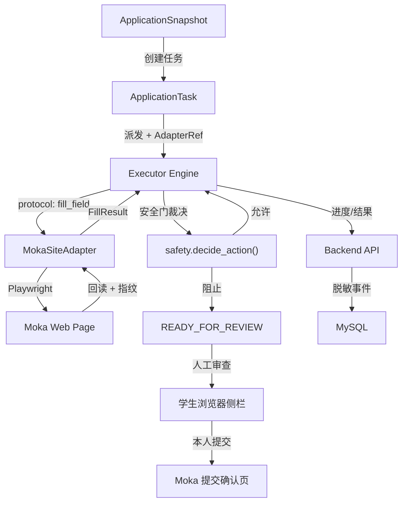

# Wave 3：大疆 Moka 纵向闭环设计

## 0. 文档信息

| 项目 | 内容 |
| --- | --- |
| 日期 | 2026-07-17 |
| 状态 | 设计已校准，待实施 |
| 适用基线 | `db31883`（Alembic head `7b757ef17d3f`），Wave 1/2 全部交付 |
| 上游设计 | `2026-07-16-mvp-parallel-delivery-design.md`（第 9 节波次 3）、`2026-07-16-post-foundation-parallel-workstreams-design.md` |
| 当前交接 | `docs/platform-foundation-handover-summary.md` |
| 预估工期 | 3 周（第 5–7 周） |

## 0.1 本次优化结论

本文以当前代码基线重新校准 Wave 3。结论是：大疆 Moka 不能只作为一个新 `SiteAdapter` 增量实现，它还需要先关闭三类工程前置缺口：

1. **协议缺口**：后端已经有 `executor.v2` 的 `ApplicationSnapshot` payload，但 `executor/protocol.py` 中本地执行器默认 `PROTOCOL_VERSION` 仍是 `executor.v1`，检查点也只保存协议版本而不保存站点适配器版本。
2. **真实站点缺口**：`ExecutorEngine.run()` 当前拒绝非 `localhost/127.0.0.1/::1` 的 `target_url`，这是模拟安全边界；接入 Moka 前必须替换为“已核验职位 + 已注册适配器 + 域名 allowlist”的安全边界。
3. **运维缺口**：后端现有 Executor API 路由是 `/api/executor/tasks`，任务 payload 由 `ExecutorTaskService` 和 `SnapshotExecutorPayloadProvider` 组装；Wave 3 新增的适配器注册、熔断和页面样本能力应接入这条现有链路，而不是另建一套 `application-tasks` 派发协议。

因此 Wave 3 的第一阶段必须是“真实站点执行前置改造”，然后才进入 Moka 控件适配和真实只读验证。

## 1. 背景

Wave 1（A/B/C/D 并行工作流）和 Wave 2（证据化匹配、定制简历、投递快照）已全部交付。当前系统可以从腾讯智能表同步职位，经管理员补全核验后发布到学生职位中心；学生可以上传简历、确认档案、运行证据化匹配、批准定制简历并创建投递快照。Executor 已完成 Windows 本地骨架、模拟招聘页面、确定性安全门和本地检查点，并通过模拟任务验证了填表、回读、恢复和安全停止流程。

当前缺口：Executor 只能操作本地模拟页面，尚未接入任何真实招聘网站。Wave 3 的目标是将 Executor 首次接入真实系统——大疆 Moka 招聘平台，打通从投递快照到真实表单填写的完整业务闭环。

## 2. 目标与非目标

### 2.1 目标

1. 设计并实现通用 `SiteAdapter` Protocol，使 Executor 引擎可以与任意招聘站点适配器交互。
2. 实现大疆 Moka 站点适配器，覆盖：页面拓扑识别、常用控件填写、重复经历组件处理、附件上传。
3. 将当前模拟站点的 loopback 限制升级为真实站点 allowlist：只有 `verified` 职位、`task_kind=application`、`executor.v2` payload、已注册且未熔断的适配器、匹配域名全部满足时才允许打开外部 URL。
4. 实现单页停止、多页安全中间保存和末页停止——最终提交按钮在任何情况下自动点击次数为 0。
5. 验证网络中断、Chrome 重启、页面变更和任务恢复不会重复添加经历条目或重复副作用。
6. 将 Moka 适配器的页面指纹、安全门事件和恢复行为纳入自动化回归测试。
7. 后端新增站点适配器管理 API：注册状态、版本、熔断和页面样本查询。

### 2.2 非目标

- 不自动处理大疆 Moka 的登录、短信验证码或人机验证。登录态由人工完成，Executor 在已登录的浏览器上下文中工作。
- 不自动点击最终提交按钮。末页填写完成后自动停止，转入 `READY_FOR_REVIEW`，由学生本人审查后手动提交。
- 不抓取或缓存 Moka 的完整 DOM 结构到云端。页面指纹和诊断数据仅保存在本地。
- 不实现其他招聘网站适配器（小鹏、讯飞等 —— Wave 4）。
- 不修改已有的 `ApplicationTask` 状态机及 actor 权限矩阵；Wave 3 只在任务 payload、适配器选择和执行器行为上扩展。
- 不删除本地模拟站点。模拟站点继续作为安全门红队和恢复测试夹具。

## 3. 当前基线

### 3.1 已完成并直接复用

- **ApplicationTask 状态机**：`created → waiting_for_device → dispatched → running → waiting_for_human → ready_for_review → observing_user_submission → submitted_success/failed → result_unknown/failed/cancelled`，含完整的 actor 权限矩阵。
- **Executor 引擎**：`executor/engine.py` 中的 `ExecutorEngine`，支持任务领取、字段填写、回读验证、进度上报、断线恢复和故障注入；当前仅允许 loopback URL，需要在 Wave 3 改造成适配器 allowlist。
- **确定性安全门**：`executor/safety.py`，阻止最终按钮、组合按钮、歧义按钮的自动点击。
- **本地检查点**：`executor/checkpoints.py`，保存页面指纹、步骤序号和非敏感字段状态。
- **设备认证与 task lease**：`executor/client.py`，支持 device token、task lease、进度和结果上报。
- **投递快照**：`ApplicationSnapshot` 已包含非敏感字段值、动态答案、本地敏感字段引用和附件 ID；`SnapshotExecutorPayloadProvider` 已能构造 `executor.v2` payload。
- **加密对象存储**：MinIO AES-256-GCM 适配器，支持附件短期受控下载。

### 3.2 需要重构的部分

- `executor/engine.py`：当前与 `BrowserSession.observe()/fill_confirmed()/action_decision()` 形态耦合，并拒绝外部 URL。需要抽象出 `SiteAdapter` Protocol，并把外部 URL 放行条件绑定到后端下发的 `AdapterRef`。
- `executor/protocol.py` 与 `backend/app/api/executor_schemas.py`：当前已有 `ExecutorTaskPayloadV2`，需要以向后兼容方式增加 `adapter: AdapterRef`，而不是新建第三套 payload。
- `executor/checkpoints.py`：检查点需要记录当前使用的 `protocol_version`、`adapter_id`、`adapter_version` 和 `site_page_key`，恢复时校验 MAJOR 版本一致性。
- `backend/app/db/models.py`：`ApplicationTask` 当前只有 `task_kind/simulation_scenario`，需要增加适配器引用字段，或通过 `job_snapshot.apply_url` + adapter registry 在派发时解析并冻结。
- `backend/app/services/executor_v2_provider.py`：当前只从 `ApplicationSnapshot` 生成字段、附件和目标 URL，需要同时注入 `AdapterRef`，并在目标 URL 没有匹配适配器时返回 `executor_payload_unavailable`。

### 3.3 Wave 3 前置门禁

进入真实 Moka 页面前必须先满足：

1. 当前 HEAD 上 MySQL、Redis、MinIO、Nginx 代理链和真实腾讯只读 opt-in 门禁重新跑通。
2. 至少存在一个 `verified`、`gui_eligible=true`、`apply_url` 指向 Moka allowlist 域名的职位。
3. 至少存在一个 `ConfirmedProfileVersion`、一个已批准简历版本和一个 `ApplicationSnapshot`。
4. 本地敏感字段读取能力完成最小闭环：缺失时必须停在人工审查，不能上传明文或猜填。
5. `ExecutorEngine` 对外部 URL 的放行测试覆盖：未注册域名拒绝、熔断适配器拒绝、版本不匹配拒绝、模拟任务仍只能访问 loopback。

## 4. 架构设计

### 4.1 整体结构

```
executor/
├── engine.py              # ExecutorEngine — 重构为消费 SiteAdapter Protocol
├── browser.py             # BrowserSession (Playwright) — 不变
├── safety.py              # 确定性安全门 — 不变
├── checkpoints.py         # 本地检查点 — 扩展 adapter_id/version
├── protocol.py            # v1/v2 协议 + AdapterRef
├── client.py              # API 客户端 — 不变
├── secrets.py             # Windows Credential Manager — 不变
├── adapters/
│   ├── __init__.py
│   ├── base.py            # SiteAdapter Protocol 定义
│   ├── registry.py        # 适配器注册表 + 版本 + 熔断计数
│   └── moka/
│       ├── __init__.py
│       ├── adapter.py     # MokaSiteAdapter — 实现 SiteAdapter Protocol
│       ├── topology.py    # 页面指纹规则 + 页面分类
│       ├── controls.py    # 控件填写策略（文本/下拉/日期/富文本/单选/多选）
│       ├── repeat.py      # "重复经历"段增量填写 + 回读验证
│       ├── attachments.py # 附件上传（简历 PDF/DOCX）
│       └── test_moka.py   # Moka 单元测试 + 模拟页面回归
├── regression/
│   ├── fixtures/          # 脱敏页面快照（HTML）
│   └── test_regression.py # 历史页面回归测试框架
└── mock_site/             # 现有模拟站点 — 保留用于安全门红队测试
```

### 4.2 SiteAdapter Protocol

```python
from typing import Protocol, runtime_checkable
from dataclasses import dataclass, field
from playwright.sync_api import Page


@dataclass
class PageFingerprint:
    url_pattern: str
    dom_hash: str          # SHA256 of simplified DOM
    page_index: int | None # None = unknown
    total_pages: int | None
    has_submit_button: bool
    has_ambiguous_button: bool
    fields_detected: list[str]


class PageClass:
    SINGLE_PAGE = "single_page"
    MULTI_PAGE_FIRST = "multi_page_first"
    MULTI_PAGE_MIDDLE = "multi_page_middle"
    MULTI_PAGE_LAST = "multi_page_last"
    LOGIN_GATE = "login_gate"
    CAPTCHA_GATE = "captcha_gate"
    UNKNOWN = "unknown"


@dataclass
class FillResult:
    field_key: str
    strategy: str          # "direct_input" | "select" | "date_picker" | "rich_text" | "deferred"
    value_written: str
    readback_match: bool
    readback_value: str | None
    confidence: float      # 0.0–1.0


@dataclass
class RepeatSectionResult:
    section_key: str
    entries_before: int    # 填写前已有条目数
    entries_after: int     # 填写后总条目数
    entries_added: int
    dedup_verified: bool   # 回读确认无重复


@dataclass
class UploadResult:
    field_key: str
    file_name: str
    success: bool
    server_response_indicator: str | None


@dataclass
class BlockerInfo:
    blocker_type: str      # "login" | "captcha" | "risk_warning" | "page_changed" | "unknown_button"
    detail: str
    requires_human: bool = True


@runtime_checkable
class SiteAdapter(Protocol):
    adapter_id: str
    supported_domains: list[str]
    version: str           # semver

    def fingerprint_page(self, page: Page) -> PageFingerprint: ...
    def classify_topology(self, fp: PageFingerprint) -> str: ...
    def fill_field(self, page: Page, field_key: str, value: str) -> FillResult: ...
    def handle_repeat_section(
        self, page: Page, section_key: str, entries: list[dict[str, str]],
    ) -> RepeatSectionResult: ...
    def upload_attachment(
        self, page: Page, field_key: str, file_path: str,
    ) -> UploadResult: ...
    def detect_blocker(self, page: Page) -> BlockerInfo | None: ...
    def save_page_progress(self, page: Page) -> bool: ...
```

补充约束：

- `SiteAdapter` 不负责判断任务是否有权访问某站点；权限由后端 `ApplicationTask`、`task lease`、`AdapterRef` 和域名 allowlist 共同决定。
- `fingerprint_page()` 的 `dom_hash` 必须基于脱敏结构树生成：标签、稳定属性、控件类型和页面布局，不包含用户输入值、简历文本、Cookie 或完整 DOM。
- 任何返回给后端的 `detail` 字段都必须经过 `ApplicationService._validate_redacted_value()` 同等级别的白名单检查。

### 4.3 引擎重构要点

`ExecutorEngine` 当前直接在模拟站点上操作。重构后：

- 构造函数接收 `adapter: SiteAdapter` 参数。
- `_fill_fields()` 委托给 `adapter.fill_field()`。
- `_handle_repeat_sections()` 委托给 `adapter.handle_repeat_section()`。
- `_handle_attachments()` 委托给 `adapter.upload_attachment()`。
- `_check_page()` 委托给 `adapter.fingerprint_page()` → `adapter.classify_topology()`。
- 安全门 `decide_action()` 在每次动作前调用，与适配器无关——保持不变。

引擎本身不关心适配器的具体实现，只依赖 Protocol 定义的接口。

### 4.4 Moka 站点适配器

#### 4.4.1 页面拓扑

大疆 Moka 招聘表单的典型结构（需在真实采样后精确调整）：

| 页面序号 | 内容 | 控件类型 | 重复段 |
|---|---|---|---|
| 1 | 基本信息 | 文本、下拉（性别/学历/毕业年份） | 无 |
| 2 | 教育经历 | 文本、日期选择 | 有（多条教育经历） |
| 3 | 实习/工作经历 | 文本、日期选择、富文本（描述） | 有（多条工作经历） |
| 4 | 项目经历 | 文本、富文本 | 有（多条项目经历） |
| 5 | 技能与证书 | 文本、多选标签 | 无 |
| 6 | 附件上传 | 文件选择 | 无（简历/作品集） |
| 末页 | 预览与提交 | 只读预览 | 无 |

#### 4.4.2 控件填写策略

```python
# executor/adapters/moka/controls.py

# 每种控件类型实现独立的填写+回读策略
FILL_STRATEGIES = {
    "text_input":     _fill_text_input,      # fill() + inner_text() 回读
    "select":         _fill_select,          # select_option() + 确认选中值
    "date_picker":    _fill_date_picker,     # fill() 或 click 日历控件
    "rich_text":      _fill_rich_text,       # 定位编辑器 iframe/contenteditable
    "multi_select":   _fill_multi_select,    # 逐个点击选项标签
    "radio":          _fill_radio,           # click label
    "checkbox":       _fill_checkbox,        # click 并回读 checked 状态
    "file_upload":    _fill_file_upload,     # set_input_files() — 不经过系统对话框
    "deferred":       _skip_with_report,     # 无法确定控件 → 上报人工
}
```

每个策略返回 `FillResult`，包含回读一致性检查。回读不一致的字段进入 `READY_FOR_REVIEW` 时汇总展示。

#### 4.4.3 重复经历段处理

这是 Moka 适配器最复杂的部分。关键不变量：**恢复后不得重复添加经历条目**。

```python
# executor/adapters/moka/repeat.py

def handle_repeat_section(page, section_key, entries) -> RepeatSectionResult:
    # 1. 回读当前页面已有条目，生成稳定签名，不只按数量判断
    existing_entries = _read_back_all_entries(page, section_key)
    existing_signatures = {_stable_entry_signature(e) for e in existing_entries}

    # 2. 从检查点读取本任务已经成功确认过的条目签名
    checkpoint_signatures = checkpoint.get_repeat_signatures(section_key)

    # 3. 如果页面已有条目但不在检查点中，视为人工或站点默认内容；
    #    不删除、不覆盖，只避免重复添加同签名内容
    to_add = [
        entry for entry in entries
        if _stable_entry_signature(entry) not in existing_signatures
        and _stable_entry_signature(entry) not in checkpoint_signatures
    ]

    # 4. 逐条添加。每条写入前保存 pending_repeat_signature；
    #    回读成功后再把签名加入 completed_repeat_signatures
    for entry in to_add:
        signature = _stable_entry_signature(entry)
        checkpoint.mark_pending_repeat(section_key, signature)
        _add_single_entry(page, section_key, entry)
        _click_add_button(page, section_key)
        _verify_entry_present(page, section_key, entry)
        checkpoint.mark_completed_repeat(section_key, signature)

    # 5. 回读所有条目，确认目标签名只出现一次
    all_entries = _read_back_all_entries(page, section_key)
    dedup_ok = _verify_target_signatures_unique(all_entries, entries)

    return RepeatSectionResult(
        section_key=section_key,
        entries_before=len(existing_entries),
        entries_after=len(all_entries),
        entries_added=len(to_add),
        dedup_verified=dedup_ok,
    )
```

#### 4.4.4 附件上传

```python
# executor/adapters/moka/attachments.py

def upload_attachment(page, field_key, file_path):
    # 定位 <input type="file"> 元素
    file_input = page.locator(_selector_for(field_key))
    # Playwright 直接注入文件路径，不弹出系统对话框
    file_input.set_input_files(file_path)
    # 等待服务器确认（文件名出现、进度条消失或成功提示）
    _wait_for_upload_complete(page, field_key, timeout_ms=30_000)
    # 回读文件名
    displayed = page.locator(_uploaded_file_indicator(field_key)).text_content()
    return UploadResult(
        field_key=field_key,
        file_name=os.path.basename(file_path),
        success=os.path.basename(file_path) in displayed,
        server_response_indicator=displayed,
    )
```

### 4.5 协议扩展

```python
# executor/protocol.py 与 backend/app/api/executor_schemas.py 新增字段

@dataclass
class AdapterRef:
    adapter_id: str        # "moka.dji"
    version: str           # "1.0.0"
    min_engine_version: str


class ExecutorTaskPayloadV2:
    # 现有字段保持不变 ...
    adapter: AdapterRef    # 新增
```

后端在现有 `/api/executor/tasks/{task_id}` payload 生成链路中，根据 `ApplicationSnapshot.job_snapshot.apply_url` 解析适配器，注入 `AdapterRef`。派发入口仍复用 `assign_and_dispatch_task()` 的设备归属、快照 eligibility 和状态机检查，不新增绕过状态机的 dispatch API。

### 4.7 真实 URL 放行策略

当前引擎的 loopback 检查是模拟阶段安全边界。Wave 3 替换为：

```python
def _target_url_allowed(payload: ExecutorTaskPayloadV2, adapter: SiteAdapter) -> bool:
    hostname = urlsplit(str(payload.target_url)).hostname or ""
    return (
        payload.protocol_version == "executor.v2"
        and payload.adapter.adapter_id == adapter.adapter_id
        and payload.adapter.version.split(".")[0] == adapter.version.split(".")[0]
        and hostname_matches_any(hostname, adapter.supported_domains)
    )
```

`executor.v1` 模拟任务继续只允许 loopback。`executor.v2` 任务如果没有 adapter、adapter 熔断、域名不匹配或版本不兼容，一律 `failed_safe`，不得打开页面。

### 4.6 后端管理 API

新增 `backend/app/api/routes/site_adapters.py`：

| 端点 | 方法 | 说明 |
|---|---|---|
| `/api/admin/site-adapters` | GET | 列出所有适配器及其状态、版本、熔断计数 |
| `/api/admin/site-adapters/{id}` | GET | 单个适配器详情 |
| `/api/admin/site-adapters/{id}/circuit-breaker` | POST | 手动重置熔断状态 |
| `/api/admin/site-adapters/page-samples` | GET | 查询脱敏页面样本元数据 |

## 5. 数据流



## 6. 安全与隐私

1. Executor 不回传 Cookie、验证码、密码、完整 DOM、完整截图或完整表单值到云端。
2. 本地敏感字段（身份证号等）从 Windows Credential Manager 读取，填入表单但不进入云端日志。
3. `task:submit` scope 仍然不存在。末页填写完成后 Executor 停止，不点击提交按钮。
4. 页面指纹使用简化的 DOM 结构哈希（去除文本内容，只保留标签和属性），不上传完整 HTML。
5. 诊断材料（截图、DOM dump）默认保存在本地 `%LOCALAPPDATA%/career-assistant/diagnostics/`，只有用户明确同意后才脱敏上传。
6. 登录态（Cookie）仅存储在本地 Playwright user data directory，不经过任何网络传输。

## 7. 错误处理与恢复

### 7.1 页面变更

- `fingerprint_page()` 返回的 `dom_hash` 与适配器内置指纹不匹配时 → `BlockerInfo(blocker_type="page_changed")` → 任务转入 `READY_FOR_REVIEW`。
- 不盲目使用旧选择器在新页面上操作。

### 7.2 网络中断

- Playwright 操作超时 → 进入重试循环（最多 3 次指数退避）。
- 仍失败 → 保存检查点，等待用户恢复网络后手动恢复。

### 7.3 进程崩溃恢复

- 重启后从本地检查点加载：task_id、adapter_id、adapter_version、页面序号、已完成字段。
- 校验 `adapter_version` 与当前注册版本一致；不一致则拒绝恢复并上报。
- 恢复后首先回读当前页面全部已填写字段，与检查点比对，确认无丢失或重复。

### 7.4 登录态过期

- 操作时检测到登录页面或 401 响应 → `BlockerInfo(blocker_type="login")` → 通知用户重新登录。
- 不自动刷新 token 或重试登录。

### 7.5 适配器熔断

- 单个适配器连续 5 次失败（任何类型错误）→ 后端自动熔断。
- 熔断后该适配器的任务派发返回 503，提示 "site_adapter_circuit_breaker_open"。
- 管理员通过 API 手动重置熔断状态。

## 8. 数据库变更

Wave 3 在已有模型基础上新增站点适配器元数据，并为任务冻结适配器选择。实现时优先保持现有 migration 线性 head，不回写旧迁移。

### 8.1 Migration `202607xx_0009`：站点适配器元数据

```sql
CREATE TABLE site_adapters (
    id VARCHAR(36) PRIMARY KEY,
    adapter_id VARCHAR(64) NOT NULL UNIQUE,
    version VARCHAR(16) NOT NULL,
    supported_domains JSON NOT NULL,
    status VARCHAR(24) NOT NULL DEFAULT 'active',
    error_count INT NOT NULL DEFAULT 0,
    circuit_breaker_open BOOLEAN NOT NULL DEFAULT FALSE,
    last_error_at DATETIME NULL,
    last_error_code VARCHAR(64) NULL,
    created_at DATETIME NOT NULL DEFAULT (UTC_TIMESTAMP()),
    updated_at DATETIME NOT NULL DEFAULT (UTC_TIMESTAMP()) ON UPDATE UTC_TIMESTAMP()
);

-- ApplicationTask 冻结派发时使用的 adapter，引擎恢复时必须校验
ALTER TABLE application_tasks ADD COLUMN adapter_id VARCHAR(64) NULL;
ALTER TABLE application_tasks ADD COLUMN adapter_version VARCHAR(16) NULL;
ALTER TABLE application_tasks ADD COLUMN adapter_status_at_dispatch VARCHAR(24) NULL;
```

## 9. 测试策略

### 9.1 模拟页面回归

- 使用 Moka 脱敏页面快照（HTML fixture），验证字段识别、控件填写、回读验证。
- 覆盖：所有控件类型、单页/多页/末页、重复经历段、附件上传。
- 断言：安全门阻止所有提交按钮、歧义按钮。

### 9.2 恢复测试

- 故障注入：在字段写入后、检查点保存前崩溃（使用现有 `FaultPoint` 机制）。
- 恢复后验证：已填写字段未丢失、未重复填写、检查点版本校验生效。
- 重复经历段恢复：确认条目数等于原始 + 新增，无重复。

### 9.3 真实只读验证

- 使用授权 Moka 测试账号登录。
- 导航到投递表单，识别全部字段。
- 字段识别率 ≥ 95%。
- 自动提交次数 = 0。
- 停止在末页预览，进入 `READY_FOR_REVIEW`。

### 9.4 真实投递灰度

- 限制单任务。
- 学生本人在审查界面确认所有字段。
- 学生本人点击提交。
- Executor 报告 `observing_user_submission` → `submitted_success`。
- 验证：安全门事件日志全部为预期值。

### 9.5 门禁清单

| 测试类型 | 命令/范围 | 通过标准 |
|---|---|---|
| 适配器单元测试 | `pytest executor/adapters/moka/` | 全部通过 |
| 模拟页面回归 | `pytest executor/regression/` | 全部通过 |
| 安全门红队 | `pytest executor/mock_site/` + Moka 安全门 | 0 自动提交 + 0 歧义点击 |
| 恢复测试 | 故障注入 + 恢复验证 | 无数据丢失 + 无重复 |
| 后端 API | `pytest tests/unit/ tests/contract/ tests/security/` | 回归全绿 |
| Executor v2 协议 | `pytest tests/unit/test_executor_protocol_v2.py tests/integration/test_executor_v2_integration.py` | payload 不含敏感字段，AdapterRef 必填 |
| 真实只读 | Moka 测试账号手动验收 | 字段识别 ≥ 95%，0 自动提交 |
| 真实投递 | 单任务灰度 | 安全门事件全部预期值 |
| Ruff | `ruff check executor/adapters/` | 无新违规 |

## 10. 风险与缓解

| 风险 | 概率 | 影响 | 缓解措施 |
|---|---|---|---|
| Moka 页面结构与设计假设不符 | 中 | 高 | 真实采样后再精调适配器；先用只读模式验证字段识别 |
| Moka 前端框架动态渲染导致选择器失效 | 中 | 中 | 优先使用 `data-testid`/`aria-label` 等稳定属性；回退到文本匹配 |
| 重复经历恢复逻辑在真实页面上的竞态 | 低 | 高 | 增量策略 + 回读验证 + 安全门双重保护 |
| 授权账号被风控锁定 | 中 | 中 | 单任务频率限制 + 人工填写间隔模拟（随机延迟 500-2000ms） |
| Windows Credential Manager 不可用 | 低 | 中 | 敏感字段标记为缺失，汇入审查界面由学生手动填写 |

## 11. 完成定义

Wave 3 在以下条件全部满足时完成：

1. MokaSiteAdapter 通过全部模拟页面回归测试。
2. `executor.v2` + `AdapterRef` + 外部 URL allowlist 的安全门通过；未注册域名、熔断适配器和版本不匹配均不会打开页面。
3. 真实 Moka 只读验证：导航到表单 → 识别全部字段 → 停止在末页预览，0 自动提交。
4. 真实 Moka 单任务投递灰度：学生审查后本人提交，安全门事件全部预期值。
5. 恢复测试通过：网络中断、进程崩溃后恢复，无数据丢失、无重复经历。
6. 后端站点适配器管理 API 可用，熔断逻辑正确触发和恢复。
7. 全量默认回归 `pytest tests/unit/ tests/contract/ tests/security/` 保持全绿。
8. 零越权、零日志泄漏、零敏感字段上传。

## 12. 实施计划输出

本设计批准后生成一份实施计划：
- `2026-07-17-wave3-dji-moka-vertical-slice-plan.md`
