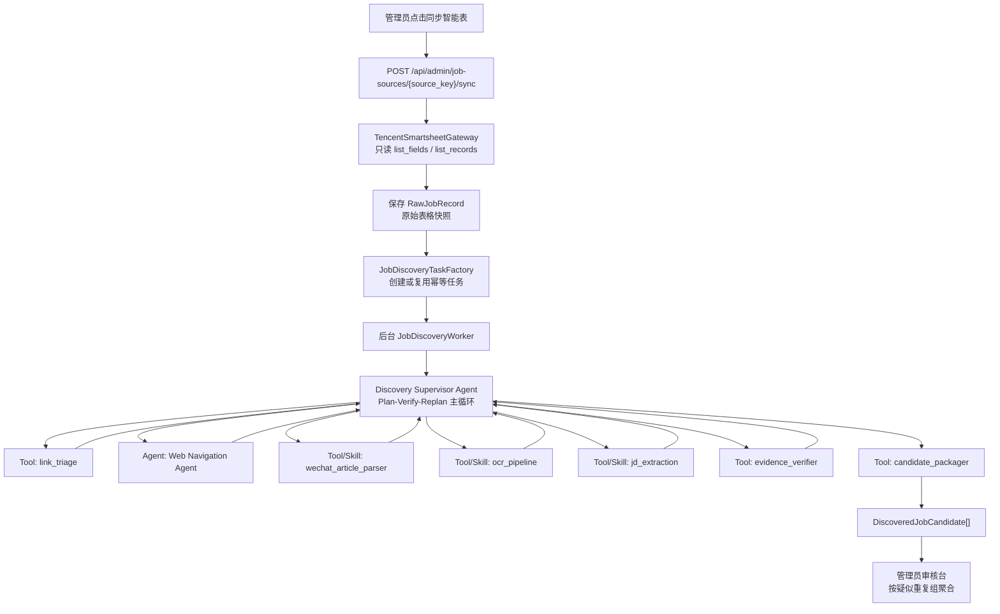
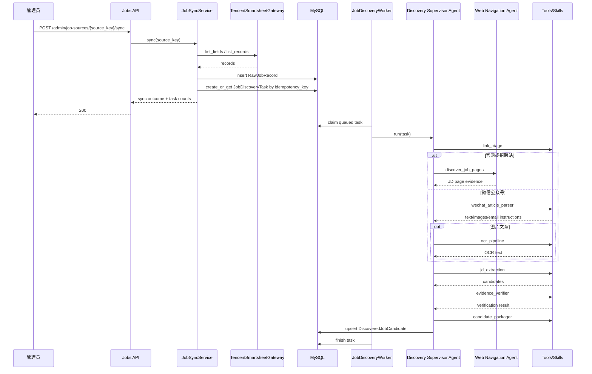

# 岗位发现多 Agent 设计

## 1. 文档信息

| 项目 | 内容 |
| --- | --- |
| 日期 | 2026-07-18 |
| 状态 | 已确认设计方向，等待用户复核 |
| 所属工作包 | 腾讯智能表岗位同步增强 |
| 目标 | 在腾讯智能表只读同步之后，用真正的 Agent 系统从官网或微信公众号链接中发现岗位 JD，标准化后进入管理员审核台 |

## 2. 背景

当前职位同步链路已经可以从两个腾讯智能表只读同步原始记录，保存 `RawJobRecord`，并通过确定性 Mapper 将字段完整的记录转换为待审核岗位。真实数据中很多 URL 不是直接岗位投递链接，而是公司官网、招聘首页、公众号文章、公众号图片长图或邮箱投递说明。

现有 Mapper 只能处理智能表已有字段，无法自主打开链接、探索岗位页、读取公众号文章、处理图片 OCR 或从复杂 JD 文本中抽取标准字段。因此需要在“后端只读腾讯智能表”之后插入一个异步岗位发现 Agent 系统。

## 3. Agent 定义与边界

本设计采用以下 Agent 定义：

> Agent 是 LLM 在循环中自主使用工具的系统。它根据目标、观察、中间结果和失败原因决定下一步动作，并能验证、重规划或终止。

因此，本设计不会把所有 LLM 调用都称为 Agent。只有具备自主循环和工具选择能力的组件才是 Agent；固定输入输出的分类、OCR、抽取、校验和入库转换都定义为 tool 或 skill。

## 4. 范围

### 4.1 包含

- 在智能表同步后创建或复用异步 `JobDiscoveryTask`。
- 同步按钮幂等，重复点击不得重复创建任务或候选岗位。
- 后端服务器端 Headless Browser Agent 打开官网、招聘站和微信公众号链接。
- 官网链接自动探索到岗位列表和岗位详情页。
- 微信公众号文本文章自动抽取正文。
- 微信公众号图片文章检测长图、重叠切分、本地 OCR 和文本合并。
- 邮箱投递说明自动提取，并转换为可审核的投递渠道。
- LLM 驱动的 JD 结构化抽取，配合 schema 校验和修复重试。
- 相似岗位进入同一个审核组，由管理员做取舍，不跨来源自动合并。
- 登录、验证码、反爬、不可访问页面直接挂起为 `needs_manual_review`。

### 4.2 不包含

- 自动绕过登录、验证码、人机验证、反爬或权限限制。
- 自动登录微信公众号或第三方招聘网站。
- 自动发布岗位到学生端。
- 自动跨来源合并相似岗位。
- 本地 GUI Agent 作为第一版主链路。
- 对腾讯智能表执行任何写操作。

## 5. 总体架构

确定性工作流负责任务创建、幂等、状态机、超时、事务和审计。真正的 Agent 负责网页探索和决策。



## 6. 真正的 Agent

### 6.1 Discovery Supervisor Agent

`Discovery Supervisor Agent` 是主 Agent。它持有任务目标、预算、已观察证据、当前候选和失败原因，并在循环中自主决定下一步调用哪个工具或子 Agent。

职责：

- 判断 URL 类型和当前信息是否足够。
- 决定走官网探索、公众号解析、OCR 或直接结构化抽取。
- 根据工具输出决定是否继续探索、重试、挂起或结束。
- 管理页面访问预算、岗位产出预算和任务时间预算。
- 遇到登录、验证码、反爬、权限错误时标记 `needs_manual_review`。
- 调用 `evidence_verifier` 后决定重抽取、丢弃低可信候选或入库。

循环范式：

```text
Observe: 读取任务、URL、表格上下文、已有证据和预算。
Think: 当前缺少什么信息，下一步最有价值的动作是什么。
Act: 调用 tool 或 Web Navigation Agent。
Observe: 接收页面、正文、OCR、候选、错误或验证结果。
Verify: 判断是否足够可信，是否需要重规划。
Finish: 产出候选、挂起人工审核或失败终止。
```

### 6.2 Web Navigation Agent

`Web Navigation Agent` 是第二个真正的 Agent。它专注官网、招聘官网和普通招聘站的多步探索。

它可以自主使用浏览器工具：

- 打开页面。
- 读取 DOM。
- 提取链接。
- 点击导航。
- 搜索页面内文本。
- 打开岗位列表。
- 进入岗位详情页。
- 截图保存证据。
- 返回上一页。

它的目标不是抽取最终标准字段，而是找到可信 JD 证据：

```text
目标：从公司官网或招聘站找到实习、校招或岗位详情页。
观察：首页、导航、链接文本、页面标题和正文。
行动：点击“加入我们”“校园招聘”“Careers”“实习”等候选入口。
验证：页面是否出现岗位列表、岗位详情、职责、要求或投递方式。
产出：JD 页面 URL、页面文本、截图证据和发现路径。
```

限制：

- 每条智能表 URL 最多访问 20 个页面。
- 最多产出 50 个岗位候选。
- 单个发现任务最长运行 5 分钟。
- 超限后保存已发现候选，并将任务标记为 `partial_success` 或 `needs_manual_review`。

## 7. Tools 与 Skills

### 7.1 `link_triage` Tool

固定输入输出，不是 Agent。

输入：

- 原始 URL。
- 重定向链。
- 页面标题。
- 首屏 HTML 或可见文本。
- 可选截图摘要。

输出：

- `url_type`：`company_homepage`、`career_site`、`job_detail`、`wechat_article`、`wechat_image_article`、`email_only`、`blocked`、`invalid`。
- `confidence`。
- `reason`。
- `recommended_next_action`。

### 7.2 `wechat_article_parser` Skill

固定解析微信公众号页面，不是 Agent。

职责：

- 抽取文章标题、发布时间、作者和正文文本。
- 判断是否包含图片式招聘信息。
- 收集图片 URL 或截图引用。
- 提取邮箱投递说明，例如邮箱、邮件主题格式、附件要求。
- 识别登录、权限、不可访问、页面失效等阻塞原因。

邮箱投递说明标准结构：

```json
{
  "type": "email",
  "email": "hr@example.com",
  "subject_hint": "校招-姓名-岗位",
  "materials": ["简历", "成绩单"],
  "raw_instruction": "请将简历发送至..."
}
```

入库时邮箱投递可转换为 `mailto:` 渠道，并强制 `gui_eligible=false`。完整说明保存在候选证据中，供管理员审核。

### 7.3 `ocr_pipeline` Skill

确定性 OCR 流程，不是 Agent。

职责：

- 读取图片尺寸。
- 判断是否为长图。
- 对长图按高度重叠切分，避免切断文字。
- 调用本地 OCR 引擎，第一版优先 PaddleOCR，Tesseract 可作为降级。
- 按阅读顺序合并文本。
- 去除重叠区域重复文本。
- 保存图片切片证据、OCR 置信度和警告。

### 7.4 `jd_extraction` Skill

LLM-powered structured extraction，不是 Agent。

它可以使用 LLM，但职责固定：从文本和上下文中抽取岗位候选。

输入：

- 智能表上下文。
- 页面 URL。
- 官网 JD 文本。
- 微信公众号正文。
- OCR 文本。
- 邮箱投递说明。

输出：

- `NormalizedJobCandidate[]` 或结构化失败原因。

内部流程：

```text
规则预清洗
LLM 抽取结构化岗位数组
Pydantic schema 校验
带校验错误重试修复
仍失败则返回 needs_manual_review
```

### 7.5 `evidence_verifier` Tool

验证器，不是 Agent。

职责：

- 检查公司名、岗位名、投递链接或邮箱是否能在证据中找到。
- 检查 JD 是否包含职责、要求、地点、类型等足够信息。
- 防止把公司介绍、公众号标题或活动通知误判为岗位。
- 防止把多个岗位混成一个岗位。
- 输出 `verified`、`needs_manual_review` 或 `reject` 及原因码。

### 7.6 `candidate_packager` Tool

确定性转换工具，不是 Agent。

职责：

- 生成候选幂等键。
- 生成相似组键。
- 绑定证据引用。
- 生成待入库 payload。
- 过滤低可信或已存在候选。

## 8. 幂等设计

管理员重复点击同步按钮是预期行为，系统必须防止重复创建后台任务和候选岗位。

### 8.1 任务幂等键

```text
JobDiscoveryTask.idempotency_key =
source_id
+ external_record_id
+ raw_payload_hash
+ discovery_agent_version
```

行为：

- 已存在 `queued` 或 `running`：返回已有任务状态，不创建新任务。
- 已存在 `succeeded`：复用已有候选，不重新执行。
- 已存在 `needs_manual_review`：返回挂起状态和原因。
- `raw_payload_hash` 变化：创建新任务版本。
- `discovery_agent_version` 变化：允许创建新任务版本。
- 管理员显式“重新发现”可创建新任务，但必须记录 actor、原因和新版本。

### 8.2 候选幂等键

同一任务内不重复创建同一岗位候选。

优先使用：

```text
task_id + canonical_job_url
```

当没有独立岗位 URL 时，使用：

```text
task_id + normalized_company_title_location_hash
```

跨来源不自动合并，只计算疑似相似组。

## 9. 相似岗位审核聚合

两个智能表可能包含相似或重复岗位。第一版采用保守策略：

- 不跨来源自动合并。
- 不自动删除疑似重复岗位。
- 相似岗位进入同一个审核组，由管理员取舍。

相似组键可由以下字段生成：

```text
normalized_company_name
+ normalized_title
+ normalized_locations
+ recruitment_types
```

审核台展示：

```text
疑似重复组：腾讯 / 后端开发实习 / 上海
  - 来源 A：实习内推汇总，第 37 行，官网 JD
  - 来源 B：27 届内推信息，第 102 行，公众号文章

管理员操作：
  - 发布其中一个
  - 合并字段后发布
  - 保留多个
  - 全部拒绝
```

## 10. 状态机

`JobDiscoveryTaskStatus`：

- `queued`
- `running`
- `succeeded`
- `partial_success`
- `needs_manual_review`
- `failed`
- `cancelled`

`DiscoveredJobCandidateStatus`：

- `pending_review`
- `verified`
- `rejected`
- `merged`

登录、验证码、反爬、公众号不可访问、页面权限不足等情况统一进入 `needs_manual_review`，并保存：

- 当前 URL。
- 页面标题。
- 截图引用。
- 阻塞原因码。
- Agent 已完成的观察摘要。

## 11. 数据流



## 12. 错误处理

稳定原因码：

- `login_required`
- `captcha_required`
- `anti_bot_blocked`
- `wechat_access_blocked`
- `page_not_found`
- `navigation_budget_exceeded`
- `candidate_limit_exceeded`
- `ocr_failed`
- `llm_extraction_failed`
- `evidence_not_found`
- `insufficient_job_detail`
- `application_channel_missing`

处理规则：

- 阻塞类错误进入 `needs_manual_review`。
- 单个候选失败不影响同任务其他候选。
- 任务已产出部分候选但后续超限，标记 `partial_success`。
- Worker 崩溃后由租约超时接管。
- 错误响应、日志和审计不得包含完整页面正文、OCR 全文、令牌或敏感 Cookie。

## 13. 安全与合规

- 只读腾讯智能表，不执行写工具。
- Headless Browser 不绕过登录、验证码、人机验证或访问限制。
- 不保存浏览器 Cookie、登录态或用户密码。
- 不自动提交表单、投递简历或发送邮件。
- 邮箱投递只提取说明并进入审核，不自动发送邮件。
- OCR 和页面截图作为证据资产存储时需要对象存储加密。
- LLM 抽取输入应尽量使用最小必要文本，避免发送无关隐私内容。
- 所有 Agent 行动写入脱敏审计日志，包括工具名、URL 域名、状态、原因码和任务 ID。

## 14. 测试策略

### 14.1 单元测试

- `link_triage` URL 类型分类。
- 公众号正文、图片、邮箱投递说明解析。
- 长图重叠切分边界。
- OCR 文本合并去重。
- JD 抽取 schema 校验和修复重试。
- 证据校验防止无证据字段入库。
- 任务幂等键和候选幂等键稳定性。
- similarity group key 稳定性。

### 14.2 服务测试

- 重复点击同步按钮只创建一个 `JobDiscoveryTask`。
- 已运行任务重复触发返回已有状态。
- 原始记录 hash 变化创建新任务版本。
- Agent 任务产出多个岗位候选。
- 跨来源相似岗位不合并，但进入同一审核组。
- 登录、验证码和反爬页面进入 `needs_manual_review`。
- 邮箱投递说明转换为 `mailto:` 渠道且 `gui_eligible=false`。

### 14.3 浏览器集成测试

- 静态招聘官网 fixture：从首页发现岗位列表和详情页。
- 微信公众号文本 fixture：抽取正文并生成岗位候选。
- 微信公众号图片 fixture：切图 OCR 后生成岗位候选。
- 长图 fixture：验证 overlap 防止断字。
- blocked fixture：验证挂起人工审核。

### 14.4 后台任务测试

- Worker claim lease。
- Worker 超时释放。
- 并发 Worker 不重复执行同一任务。
- 部分成功任务保留已产出候选。
- 任务审计不泄露正文、OCR 全文或敏感令牌。

## 15. 完成定义

- 管理员同步两个腾讯智能表后，含 URL 的原始记录会创建或复用发现任务。
- 重复点击同步按钮不会重复创建任务或候选岗位。
- 官网链接可以在预算内发现岗位页并提取 JD。
- 公众号文本和图片文章可以被解析为结构化岗位候选。
- 邮箱投递岗位可以提取为人工投递渠道。
- 登录、验证码、反爬、不可访问页面会挂起为 `needs_manual_review`。
- 相似岗位在审核台聚合展示，但不会自动合并。
- 只有管理员核验后的岗位进入学生职位中心和岗位匹配。
