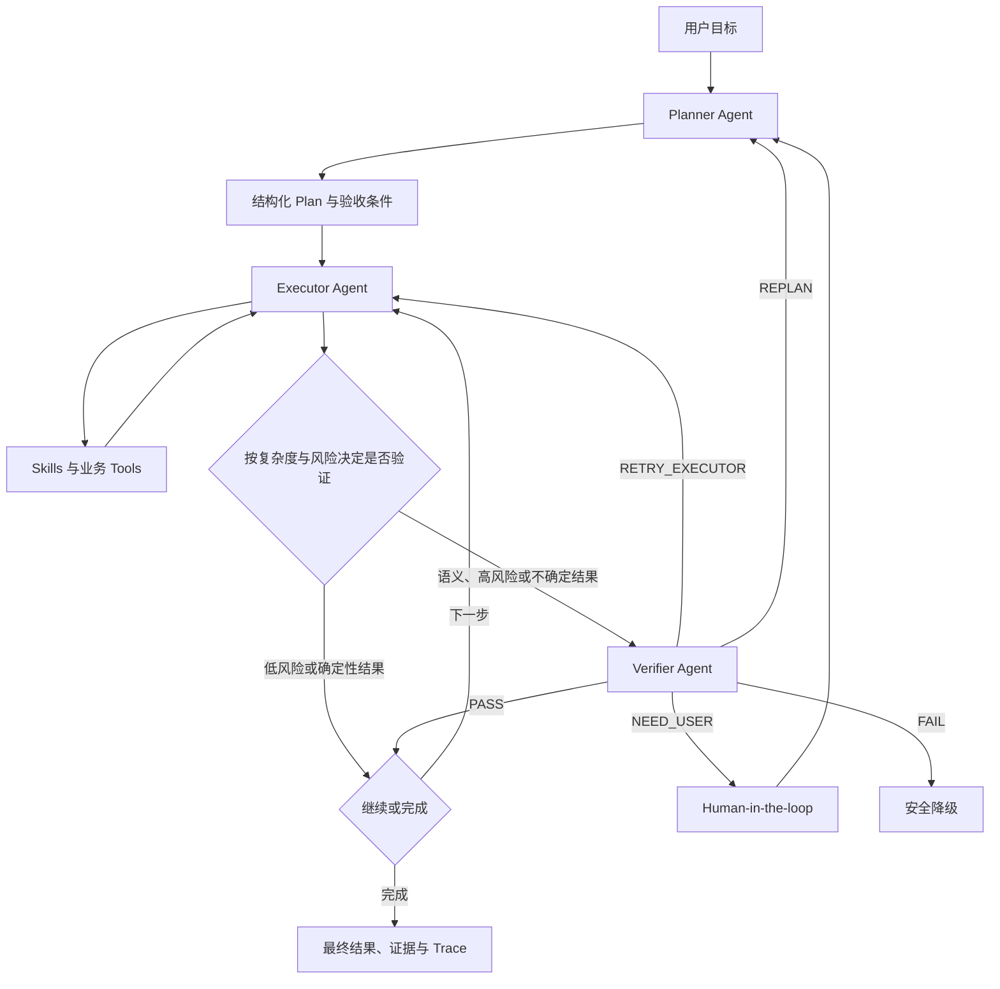

# 个人求职助手：自适应三 Agent PEV 与轻量 Harness 设计

日期：2026-08-01

状态：设计方向已确认，书面设计等待用户审阅

目标岗位定位：AI 应用开发 70% + Agent 平台工程 30%

## 1. 决策摘要

项目从“多用户校园招聘运营平台”收缩为“轻量多用户个人求职助手”。主分支只保留一套清晰的产品与运行时架构：

- 三个真实 Agent：Planner、Executor、Verifier。
- 四个业务 Skill：job-discovery、job-matching、resume-tailoring、career-planning。
- 自研、业务专用的轻量 Agent Harness，不以 LangGraph 或 Deep Agents 作为主运行时。
- 根据任务复杂度和风险，自适应调用两个或三个 Agent；不强制每一步都经过 Verifier。
- 确定性代码负责安全边界、状态持久化、工具校验和运行预算，但不替 Agent 做任务决策。
- MySQL 是业务与 Agent Run 的唯一权威状态；Redis 用于短期事件、缓存和并发协调；MinIO 保存工件与证据。
- 校园招聘管理、腾讯文档同步、设备配对、Windows Executor 和旧 Agent 路径在创建归档 Tag 或分支后退出主分支。

这套架构的目标不是展示最多的 Agent 或框架，而是展示可运行、可恢复、可评测、可观察、可解释的 Agent 产品工程。

## 2. 产品目标与边界

### 2.1 核心用户

支持注册登录的轻量多用户产品。每位用户拥有独立的：

- 求职档案与已确认事实；
- 目标岗位和偏好；
- 简历版本与定制结果；
- 推荐岗位与匹配报告；
- 求职计划、面试准备和投递记录；
- Agent Run、计划、步骤、证据和历史反馈。

### 2.2 核心闭环

1. 用户上传简历并确认可使用的事实证据。
2. 用户描述目标岗位、地点、阶段和约束。
3. 系统发现岗位并生成可追溯的个性化推荐。
4. 用户选择目标岗位，系统给出证据化匹配与差距分析。
5. 系统在不编造经历的前提下生成简历修改建议和新版本。
6. 系统生成阶段求职计划、面试准备和下一步行动。
7. 用户记录投递进展，反馈结果用于更新偏好和后续计划。

### 2.3 非目标

主分支不再承担：

- 校园招聘职位运营和管理员人工审核平台；
- 腾讯智能表作为产品入口；
- 学生提交职位、管理员核验和反馈运营闭环；
- 自动完成或提交求职申请；
- 设备配对、Windows GUI Executor 和真实站点自动投递；
- 为了展示框架而保留多套 Supervisor、Strategy、Adapter 或 PEV 回滚路径；
- 构建可复用于任意行业的通用 Agent 框架。

## 3. Agent 的硬性定义

本项目中的 Agent 必须是能够围绕目标自主感知信息、做出决策、调用工具执行任务，并根据结果继续调整行动的系统。

每个 Agent 都必须具备：

- 独立目标与角色边界；
- 独立的上下文视图和运行状态；
- 独立工具白名单；
- “感知 → 决策 → 调用工具 → 观察结果 → 调整行动”的循环；
- 独立预算、退出条件和失败策略；
- 根据反馈重试、改变方法或发起 Handoff 的能力；
- 完整且可评测的工具调用与状态变化轨迹。

以下实现不算 Agent：

- 一次固定 Prompt 的 LLM 调用；
- 固定输入输出的生成节点；
- 只执行规则判断的状态机节点；
- 预先写死全部 Skill 调用顺序的流水线。

确定性规则可以作为 Agent 的工具、安全护栏或运行时限制，但不能冒充 Planner、Executor 或 Verifier。

## 4. 总体架构



所有正式任务先进入 Planner。Planner 可以为简单请求生成单步计划；复杂请求生成带依赖和验收条件的多步计划。Executor 是唯一能调用业务 Skills 的 Agent。Verifier 只读并独立验证，不能修改业务结果。

Harness 负责运行生命周期、权限、持久化和 Handoff，但不替 Agent 选择 Skill、判断结果是否充分或决定具体纠错方法。

## 5. 自适应降级模型

系统拥有三个 Agent，但一次 Run 不要求三个 Agent 全部参与。

| 等级 | 典型请求 | 参与方式 | 验证策略 |
|---|---|---|---|
| L1 简单低风险 | 查询投递状态、读取已有结果 | Planner 单步计划 → Executor | Schema、权限、状态机等确定性校验 |
| L2 单能力生成 | 针对一个 JD 修改简历 | Planner 单步计划 → Executor | 确定性事实校验；有语义风险时调用 Verifier |
| L3 多步骤任务 | 找岗位并完成匹配和计划 | Planner 多步计划 → Executor | 关键里程碑或最终结果调用 Verifier |
| L4 高风险或高不确定 | 多来源岗位研究、事实冲突、重要简历版本 | Planner → Executor → Verifier | 每个关键步骤验证，可暂停等待用户 |

降级只减少不必要的 Agent 参与和验证频率，不把 Agent 降级成一次 LLM 调用。被调用的 Agent 仍运行完整感知、工具和反馈循环。

## 6. 三个 Agent

### 6.1 Planner Agent

目标：理解用户目标和约束，生成可执行、可验证、预算受控的计划；收到 REPLAN 后定位原计划失败原因并生成新版本。

可感知信息：

- 用户请求和当前对话摘要；
- 已确认用户档案、偏好和目标；
- 当前简历、岗位、投递记录和历史反馈；
- Skill Registry 中的能力、输入输出和限制；
- 既有 Run 的错误、Verifier 反馈和预算余量。

允许工具：

- `read_profile_snapshot`；
- `retrieve_career_memory`；
- `read_job_workspace`；
- `read_application_history`；
- `describe_available_skills`；
- `check_required_context`；
- `request_user_input`。

禁止能力：

- 不直接调用业务 Skill；
- 不修改简历、岗位、计划或投递数据；
- 不把缺失用户事实自行补全为假设。

Plan 至少包含：

- `goal`；
- `complexity_level`；
- `steps[]`，每步包含 `id`、`objective`、`skill`、`dependencies`、`inputs`、`acceptance_criteria`、`risk_level` 和 `can_parallelize`；
- `verification_policy`；
- `max_total_tool_calls`、`max_replans` 和时间预算；
- `missing_context` 和是否需要用户输入。

Planner 可以读取信息、多轮修正计划，并以 `PLAN_READY`、`NEED_USER` 或 `CANNOT_PLAN` 退出。

### 6.2 Executor Agent

目标：完成当前计划，通过观察 Skill 和工具结果自主选择后续行动、参数调整、重试方法和 Handoff。

可感知信息：

- 已批准或可执行的 Plan；
- 当前步骤和依赖步骤的结构化结果；
- 用户授权范围、剩余预算和重试历史；
- Skill 输出、工具错误、证据引用和 Verifier 反馈。

允许工具：

- `invoke_skill`，仅能调用注册的四个 Skill；
- `read_artifact`；
- `read_evidence`；
- `persist_artifact`；
- `record_application_event`；
- `request_user_input`；
- 受限的并行执行工具。

Executor 必须：

- 在每次工具调用后观察结果；
- 根据错误类别调整参数、换用同一 Skill 的其他策略或请求 Handoff；
- 不绕过 Planner 指定的目标和验收条件；
- 不越权修改其他用户数据；
- 不自动提交申请或绕过登录、验证码、反爬和人工确认。

StepResult 至少包含：

- `step_id`、`status`；
- `structured_output`；
- `artifact_refs`、`evidence_refs`；
- `tool_trace_refs`；
- `error_code`、`retryable`；
- `remaining_uncertainties`；
- `suggested_next_action`。

Executor 可以以 `STEP_COMPLETED`、`REQUEST_VERIFICATION`、`REQUEST_REPLAN`、`NEED_USER` 或 `FAILED` 退出当前步骤。

### 6.3 Verifier Agent

目标：独立判断 StepResult 是否满足用户目标、Plan 验收条件、事实证据和安全要求，并给出可操作的纠错意见。

可感知信息：

- 用户原始目标；
- Plan、当前步骤和验收条件；
- Executor 结果、工具 Trace、工件和证据；
- 历史重试与上一轮 Verifier 反馈；
- 当前预算和安全策略。

允许工具：

- `read_plan`；
- `read_step_result`；
- `read_evidence`；
- `compare_resume_facts`；
- `check_job_evidence`；
- `run_quality_rubric`；
- `inspect_tool_trace`；
- 只读的 Schema、安全、覆盖率和权限校验工具。

Verifier 不允许调用会修改业务状态的工具。它可以继续取证、多轮检查并输出闭合 Verdict：

- `PASS`：满足验收条件；
- `RETRY_EXECUTOR`：Plan 仍正确，但执行方法、参数、证据或质量需要改进；
- `REPLAN`：任务拆解、依赖或假设已经失效；
- `NEED_USER`：缺少用户事实、偏好、授权或人工判断；
- `FAIL`：安全阻断、预算耗尽或目标当前不可完成。

`RETRY_EXECUTOR` 必须包含具体失败条件和建议改进方向；`REPLAN` 必须包含原计划无效的证据，不能只返回笼统的“重新规划”。

## 7. Handoff 与循环限制

Handoff 通过结构化消息完成，Agent 之间不共享完整原始消息历史，只共享完成任务所需的最小上下文、工件引用和错误摘要。

路由规则：

- PASS：完成当前步骤，Executor 选择下一个就绪步骤；
- RETRY_EXECUTOR：Executor 保留原步骤目标，结合反馈调整执行方法；
- REPLAN：Planner 保留已通过的结果，只替换尚未完成或已判无效的计划部分；
- NEED_USER：持久化 Run 并暂停，用户回复后恢复到 Planner；
- FAIL：保存已完成部分、失败原因和安全建议后结束。

默认预算：

- 单步骤最多 2 次 Executor 重试；
- 整个 Run 最多 1 次完整 Replan；
- Verifier 对同一结果最多 2 轮取证；
- 每个 Run 必须有总模型调用、工具调用、时间和 Token 预算；
- 达到任一硬预算后，不再让 LLM 决定是否继续，Harness 直接安全终止。

这些默认值必须可配置，但不能由 Agent 在运行中自行扩大。

## 8. 四个业务 Skill

### 8.1 job-discovery

职责：岗位搜索、公司调研、招聘页面浏览、JD 提取、标准化、去重和证据封装。

合并现有 company-research。浏览、解析、覆盖率、URL 安全和反爬识别作为该 Skill 的内部工具。Skill 可以包含受限 LLM 抽取步骤，但这些步骤不是额外的顶层 Agent，也不能拥有跨步骤自主权。

### 8.2 job-matching

职责：基于已确认用户事实和标准化 JD，生成匹配得分、证据引用、优势、差距、风险和排序理由。

事实匹配和硬条件使用确定性规则；语义相似、潜力判断和解释生成使用模型。输出必须区分事实、推断和建议。

### 8.3 resume-tailoring

职责：针对一个目标 JD 生成事实约束下的简历 Diff、验证 Diff、生成新简历工件并等待用户确认。

禁止直接改写成无证据经历。每项变更必须引用已确认事实；没有证据时只能调整表达、排序、摘要或明确提出需要用户补充的信息。

### 8.4 career-planning

职责：根据目标岗位、差距、时间预算和求职阶段生成阶段计划、周计划、面试准备、复盘与下一步行动。

合并现有 interview-prep。计划必须包含优先级、截止时间、完成条件和复盘节点，不能只生成泛化建议。

### 8.5 非 Skill 能力

- application-tracking：确定性业务 Service 和状态机工具；
- 用户档案与事实版本：权威业务数据；
- 求职记忆检索：上下文服务；
- 文件生成、存储和下载：基础设施工具；
- 权限、幂等、限流和审计：平台能力。

## 9. 轻量 Agent Harness

### 9.1 设计原则

Harness 是业务专用运行时，不建设通用 Agent 框架。它只实现本项目三个 Agent 所需的最小能力。

主要接口：

```text
AgentRuntime
  run(agent, input, budget, tools) -> AgentOutcome

ModelGateway
  generate(messages, tools, response_schema, model_policy) -> ModelTurn

ToolRegistry
  describe(agent) -> tool schemas
  invoke(agent, tool_call, run_context) -> ToolResult

RunStore
  create_run / append_turn / save_plan / save_step / append_event / pause / resume

EventSink
  publish(run_id, event) -> SSE/Redis event
```

每个 Agent 的运行循环：

1. 从 RunStore 加载自己的最小上下文。
2. 调用模型获得结构化决策或工具调用。
3. 校验工具名、参数、权限和预算。
4. 执行工具并把 ToolResult 作为新观察写回 Agent 上下文。
5. Agent 根据结果继续决策，直到输出 Handoff、最终结果或耗尽预算。
6. 每个 Turn 和状态变化持久化后再进入下一轮。

### 9.2 Harness 不负责的决策

Harness 不决定：

- Planner 应如何拆解任务；
- Executor 应选择哪个 Skill 或如何修正参数；
- Verifier 应收集哪些证据；
- 结果语义是否满足目标；
- RETRY_EXECUTOR 和 REPLAN 之间的业务判断。

Harness 只在权限、预算、Schema、不可恢复基础设施错误和安全硬门上进行确定性拒绝。

### 9.3 不以 LangGraph 为主运行时

当前项目已有 MySQL 权威状态、Worker lease、Redis、审计和业务状态机。主运行时使用普通 Python、`asyncio`、Pydantic 和模型 SDK，避免再维护一套 LangGraph checkpoint 权威状态。

LangGraph 和 Deep Agents 从主生产依赖退出。可以在归档分支或小型对照实验中保留 LangGraph baseline，用同一评测集比较成功率、延迟、调用次数、成本和恢复行为。

如果未来出现大量跨日暂停、动态大规模子图、复杂 time-travel 或 Harness 开始重复实现通用 checkpoint 语义，再通过既有接口评估替换为 LangGraph。

## 10. 状态、持久化与上下文

### 10.1 权威记录

以下概念模型一对一落为权威表；已有不可变工件表能够满足 AgentArtifact 合约时复用原表并增加类型映射，不再建立第二份工件权威数据：

- AgentRun：用户目标、状态、复杂度、预算、当前 Handoff 和最终结果；
- AgentPlan：版本、步骤 DAG、验收条件和 Replan 原因；
- AgentStep：步骤状态、输入引用、结果引用、尝试次数和 Verdict；
- AgentTurn：所属 Agent、模型决策摘要、工具调用引用和耗用指标；
- AgentEvent：流式进度、暂停、恢复、安全拒绝和错误事件；
- AgentArtifact：简历、岗位集合、报告、计划和证据的不可变引用。

MySQL 是这些记录的唯一权威。Redis 不保存不可恢复的业务状态。

### 10.2 上下文分层

- 会话上下文：当前请求和压缩后的对话摘要；
- 用户事实上下文：确认过的教育、经历、项目、技能和偏好；
- 任务上下文：Plan、当前步骤、已完成结果和错误；
- 工件上下文：只传引用和摘要，需要时通过工具读取；
- 长期记忆：用户反馈、历史选择和成功/失败模式。

结构化事实始终从 MySQL 精确读取。非结构化简历、项目材料和历史对话可以增加派生检索索引，但索引不是权威数据，必须能够从原始工件重建。

## 11. 错误处理与安全

错误分为：

- 瞬时基础设施错误：Harness 按固定退避重试，不消耗 Agent 的业务重试次数；
- Agent 可修复错误：工具结果返回稳定 error code，由 Agent 观察后调整行动；
- Plan 失效错误：Verifier 或 Executor 请求 REPLAN；
- 用户可修复错误：暂停并请求信息或授权；
- 安全阻断：立即停止相关动作，保留可安全返回的已完成结果；
- 未知错误：记录安全摘要，不把密钥、Token、原始敏感内容写入 Trace。

安全硬门：

- 不存在自动最终提交工具；
- 不绕过登录、验证码、反爬或权限墙；
- 用户只能访问自己的档案、Run、工件和投递数据；
- 工具按 Agent 和 Run 双重授权；
- 所有写操作幂等并记录审计；
- 简历生成不得增加无事实引用的经历；
- 高风险写操作必须 Human-in-the-loop；
- Agent 无权提高自身预算或更改安全策略。

## 12. 响应速度与成本策略

- Planner 对简单请求生成单步计划，避免复杂分解；
- Verifier 仅在 Plan 策略、风险等级、Executor 不确定性或确定性校验结果触发时参与；
- 独立步骤使用受限并行，依赖步骤保持顺序；
- 大型页面、简历和证据写入工件存储，只向模型提供摘要和按需读取工具；
- Planner、Executor、Verifier 可以配置不同模型策略，但不能共享隐式模型状态；
- 记录每个 Agent 的首 Token 延迟、总延迟、模型调用数、工具调用数和 Token 使用；
- 快速响应优化必须以评测结果为依据，不能通过跳过安全门或事实校验获得。

## 13. 评测与验收

### 13.1 Agent 身份验收

每个 Agent 至少有一组集成 Trace 证明：

1. 感知上下文；
2. 自主选择工具；
3. 调用工具；
4. 观察成功或失败结果；
5. 根据观察改变后续行动；
6. 输出结构化结果或 Handoff。

只有一次模型调用的测试不能证明 Agent 成立。

### 13.2 分层评测

- Run 级：工具选择、参数、权限和单步输出；
- Trace 级：是否以合理路径完成目标、是否出现无意义循环；
- Thread 级：跨轮次是否保留用户意图、纠正错误并完成求职目标；
- Skill 级：结构化输出、事实约束、覆盖率和失败降级；
- 业务级：推荐有效性、简历采纳率、计划完成率和用户反馈。

### 13.3 核心指标

- 任务成功率；
- 无事实支持内容率；
- 工具调用成功率；
- Planner 计划可执行率；
- Verifier 有效拦截率和误拒率；
- RETRY 后修复率；
- REPLAN 后恢复率；
- 平均和 P95 延迟；
- 每 Run 模型调用数、Token 和成本；
- 无限循环、越权调用和安全门绕过数量，目标为零。

### 13.4 LangGraph 对照实验

保留小型 LangGraph baseline 时，使用完全相同的输入、工具、模型和评测标准，比较：

- 最终成功率；
- 轨迹合理性；
- 延迟和模型调用数；
- 持久化与恢复正确率；
- 实现代码量和维护复杂度。

对照结果用于架构复盘，不作为主产品运行依赖。

## 14. 前端体验

主界面围绕一个对话与任务工作区，而不是多个管理员后台页面：

- 对话区：用户提出目标、补充信息和确认结果；
- Plan 卡片：展示 Planner 生成的目标、步骤、依赖和状态；
- Agent 活动卡片：显示当前 Agent、工具、进度、重试和 Handoff；
- 工件区：岗位集合、匹配报告、简历版本和求职计划；
- 证据抽屉：按需查看事实引用、JD 来源和验证结果；
- Human-in-the-loop：批准、编辑、拒绝或补充信息；
- 投递看板：确定性状态机驱动，不由 Agent 自动推进。

默认只展示用户能理解的进度和证据，不展示隐藏推理文本、密钥、原始模型消息或内部敏感字段。

## 15. 现有代码处置

### 15.1 保留并收敛

- FastAPI、Vue 3、MySQL、Redis、MinIO、Docker Compose；
- 认证、用户隔离、档案事实版本和加密对象存储；
- Job Discovery 中经过验证的浏览、抽取、证据、覆盖率和安全工具；
- 匹配、简历事实约束、投递状态机和审计能力；
- API → Service → Repository 分层。

### 15.2 合并

- company-research → job-discovery；
- interview-prep → career-planning；
- resume Skill 脚本与后端 generator 的重复实现 → 单一核心实现；
- Skill Runtime 和后端 Service 的重复数据契约 → 共享 Pydantic 合约。

### 15.3 归档后删除

- `src/` 旧 LangGraph CLI Demo；
- 默认不执行的 Supervisor、Web Navigation、旧 PEV、Strategy Router 和回滚路径；
- 校园招聘管理员审核、腾讯文档同步、学生职位提交和平台运营页面；
- 设备配对、Executor API 和 Windows Executor；
- 不再使用的配置项、迁移兼容代码、测试和文档。

删除前创建可恢复的 Git Tag 或归档分支；主分支不保留仅用于展示历史复杂度的死代码。

## 16. 后续子项目与实施顺序

本文件是程序级架构设计，不直接展开成一份覆盖全仓库的巨型实施计划。后续按以下四个有明确边界的子项目分别完成设计确认、实施计划和交付：

1. Agent Harness Foundation：共享合约、ModelGateway、ToolRegistry、RunStore、AgentRuntime，以及三个 Agent 的最小真实反馈循环。
2. Career Skills Consolidation：四个 Skill 的统一契约、现有能力迁移、重复生成实现消除和 Skill 评测。
3. Personal Assistant Product Loop：MySQL/Redis/MinIO 接入、恢复、SSE、对话与任务工作区、HITL 和端到端用户闭环。
4. Legacy Retirement and Portfolio：归档、旧平台与旧运行时删除、LangGraph baseline 对照、文档、演示和作品集包装。

第一个进入详细设计和实施计划的子项目必须是 Agent Harness Foundation。它只证明三个 Agent、Handoff、自适应降级和持久化边界成立，不同时迁移业务 Skill 或重做前端。

### 16.1 全局实施顺序约束

实施计划必须按照以下顺序拆分，不能先大规模删除再建立替代路径：

1. 建立共享 Agent、Plan、Step、Verdict 和 Skill 合约。
2. 建立 ModelGateway、ToolRegistry、RunStore 和最小 AgentRuntime。
3. 用受控假工具证明三个 Agent 的完整反馈循环和自适应降级。
4. 迁移四个 Skill，并消除重复生成实现。
5. 接入 MySQL 持久化、Redis/SSE、MinIO 和恢复流程。
6. 建立前端对话、Plan、活动和工件主工作区。
7. 建立离线评测、Trace 评测和 LangGraph baseline 对照。
8. 创建归档 Tag 或分支后，删除旧平台和旧运行时路径。
9. 运行安全、所有权、恢复、成本和端到端验收。

## 17. 完成标准

设计的实现只有同时满足以下条件才算完成：

- 产品主分支只有一套默认 Agent 运行路径；
- Planner、Executor、Verifier 均通过真实 Agent 反馈循环验收；
- 简单任务不调用 Verifier，复杂任务能触发 Verifier 和 REPLAN；
- Executor 能在工具失败后自主调整行动；
- Verifier 能区分 RETRY_EXECUTOR、REPLAN、NEED_USER 和 FAIL；
- Run 可在进程中断后从 MySQL 恢复；
- 四个 Skill 形成从推岗到计划的完整用户闭环；
- 不存在自动最终投递、跨用户访问或无证据简历事实；
- 前端能展示计划、进度、工件、证据和人工确认；
- 离线评测覆盖成功、重试、重规划、阻断和恢复路径；
- README、架构图、演示视频和简历描述都只讲当前默认架构。

## 18. 参考资料

- Anthropic, Building Effective Agents: https://www.anthropic.com/engineering/building-effective-agents
- Anthropic, Harness design for long-running application development: https://www.anthropic.com/engineering/harness-design-long-running-apps
- OpenAI, A practical guide to building agents: https://openai.com/business/guides-and-resources/a-practical-guide-to-building-ai-agents/
- LangGraph overview: https://docs.langchain.com/oss/python/langgraph/overview
